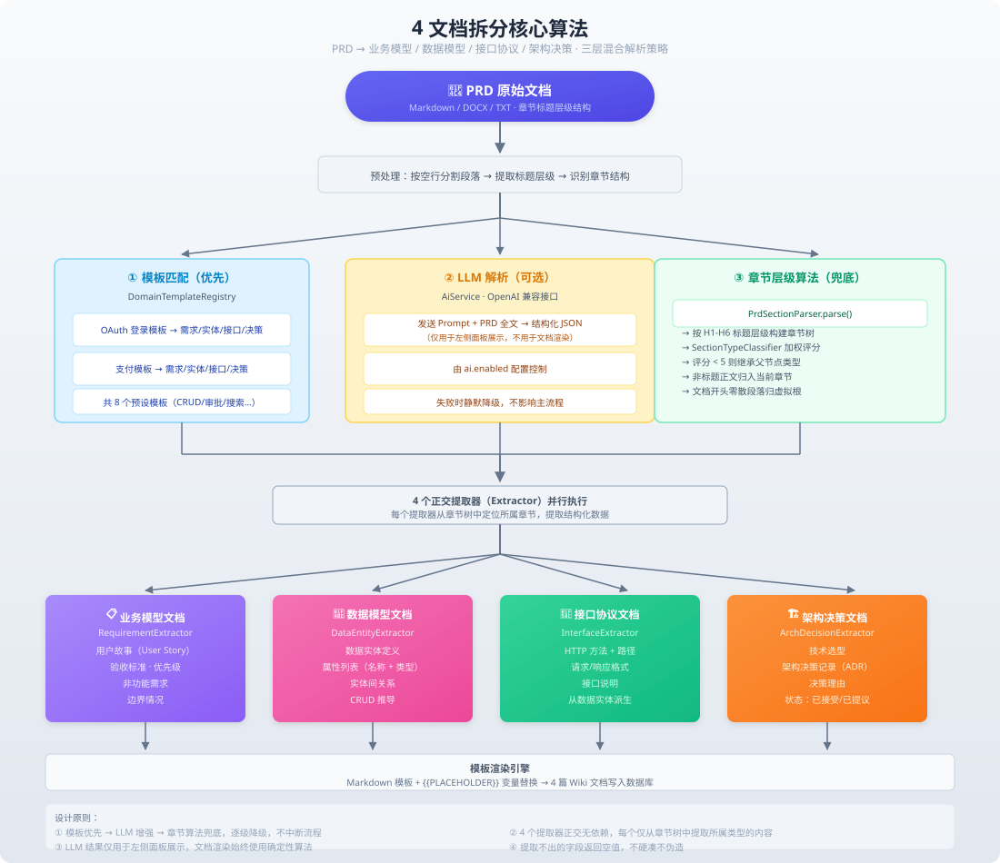

# 4 文档核心拆分算法

> 本文档详细描述 PRD 智能解析平台如何将一份自然语言编写的 PRD 文档自动拆分为 4 篇结构化文档，涵盖三层混合解析策略、章节树构建、分类器加权评分、提取器的实现细节。

---

## 概述

PRD 智能解析平台的核心能力是将非结构化的 PRD 文档自动拆分为 4 篇结构化文档：

| 文档 | 英文标识 | 内容 |
|------|---------|------|
| 📋 **业务模型** | `business-model` | 用户故事、需求列表、优先级 |
| 💾 **数据模型** | `data-model` | 实体定义、属性、关系 |
| 🔌 **接口协议** | `interface-protocol` | API 路径、方法、请求/响应格式 |
| 🏗️ **架构决策** | `architecture-decision` | 技术选型、架构设计约束 |

对应的算法流程图如下：



---

## 一、三层混合解析策略

系统采用**三层混合解析策略**，按优先级依次尝试，确保在任何情况下都能输出结构化的 4 文档：

```
① 模板匹配（优先级最高）
    → 匹配成功 → 直接返回预构建结果，跳过后续步骤
    → 匹配失败 → 进入下一层

② LLM 解析（可选，由 ai.enabled 控制）
    → 解析成功 → 结果仅用于前端展示，不作为文档渲染依据
    → 解析失败/未启用 → 跳过，进入下一层

③ 章节层级算法（兜底，始终执行）
    → 解析 PRD 章节结构 → 构建章节树 → 分类提取 → 生成 4 文档
```

### 1.1 模板匹配（DomainTemplateRegistry）

**目标**：当 PRD 内容匹配预设的领域模板时，快速输出结构化结果。

**文件**：`DomainTemplateRegistry.java`（555 行）

**内置 8 个模板**：

| 模板 | 关键词匹配（≥3 个命中） | 内容 |
|------|----------------------|------|
| OAuth 登录 | 登录、OAuth、Token、认证、授权 | 用户故事、实体、接口、ADR |
| 支付 | 支付、订单、退款、交易、结算 | 用户故事、实体、接口、ADR |
| 审批 | 审批、流程、节点、派单、转交 | 用户故事、实体、接口、ADR |
| 通知 | 通知、消息、推送、模板、订阅 | 用户故事、实体、接口、ADR |
| CRUD | 增删改查、列表、详情、编辑、删除 | 用户故事、实体、接口、ADR |
| 文件上传 | 上传、下载、文件、附件、存储 | 用户故事、实体、接口、ADR |
| 搜索 | 搜索、查询、筛选、排序、分页 | 用户故事、实体、接口、ADR |
| 数据导出 | 导出、报表、下载、Excel、CSV | 用户故事、实体、接口、ADR |

**匹配逻辑**：扫描 PRD 全文，统计每个模板的关键词命中数。第一个命中 ≥3 个关键词的模板即为匹配模板，直接返回预构建的 `PrdParseResult`（包含完整的需求、实体、接口、架构决策列表）。

### 1.2 LLM 解析（可选）

**目标**：利用大语言模型深度理解 PRD 内容，提取结构化信息。

**控制开关**：`ai.enabled`（环境变量 `AI_ENABLED`，默认 `false`）

**文件**：`AiService.java`

**关键设计决策**：LLM 解析结果**仅用于前端展示**（`saveLlmResult()` 独立保存），不参与 4 文档的渲染。这意味着 LLM 的成功或失败不影响最终的 4 篇文档输出——即使 LLM 调用失败，系统仍然通过章节层级算法生成一致的文档。

### 1.3 章节层级算法（兜底，始终执行）

这是**最核心的算法**，分为 4 个步骤：

---

## 二、章节层级算法详解

### 2.1 Step 1: 构建章节树（PrdSectionParser）

**文件**：`PrdSectionParser.java`（110 行）

**输入**：PRD 原始文本（Markdown）

**输出**：章节树 `List<SectionNode>`

**算法**：

```
1. 按空行分割 PRD 内容为段落（paragraphs）
2. 对每个段落检测标题级别（detectHeadingLevel）：
   - Markdown 标题：`# 一级标题`、`## 二级标题`
   - 数字标题：`1.`、`1.1`、`1.2.3`
   - 中文标题：`一、`、`（一）`、`1、`
3. 用 SectionTypeClassifier 给每个标题打分，确定文档类型
4. 低分标题（<5）继承父节点类型
5. 非标题段落附加到当前标题节点
6. 如果没有任何标题，创建合成章节"需求概述"
```

**章节节点结构**（`SectionNode.java`）：

```java
public class SectionNode {
    private String title;           // 章节标题
    private int level;              // 标题层级（1-6）
    private String docType;         // 文档类型（business-model / data-model / interface-protocol / architecture-decision）
    private List<SectionNode> children;  // 子章节
    private List<String> paragraphs;     // 该章节下的段落内容
}
```

### 2.2 Step 2: 章节分类器（SectionTypeClassifier）

**文件**：`SectionTypeClassifier.java`（158 行）

**目标**：为每个章节标题分配一个文档类型（4 类之一）。

**加权评分算法**：每个文档类型有一组关键词和对应的权重分数。系统计算每个标题在所有 4 个类型上的得分，选择得分最高的作为该标题的类型。

**关键词权重表**：

| 文档类型 | 高权重关键词（+3） | 中权重关键词（+2） | 低权重关键词（+1） |
|---------|-----------------|-----------------|-----------------|
| 📋 **业务模型** | 功能、需求、用户故事、场景 | 业务流程、功能点、用户场景 | 概述、简介、范围 |
| 💾 **数据模型** | 数据、实体、字段、库表、ER | 模型、属性、关系、字段定义 | 结构、设计 |
| 🔌 **接口协议** | 接口、API、REST、端点 | 请求、响应、路径、参数 | 协议、通信 |
| 🏗️ **架构决策** | 架构、技术选型、部署、方案 | 设计、约束、非功能、安全 | 性能、可靠性 |

**评分规则**：
- 命中高权重关键词：+3 分
- 命中中权重关键词：+2 分
- 命中低权重关键词：+1 分
- 得分 < 5 分的标题：继承父节点的文档类型
- 得分最高的类型即为该章节的文档类型

### 2.3 Step 3: 4 个正交提取器

章节树构建完成后，4 个并行的提取器分别从树中提取各自关心的内容：

| 提取器 | 文件 | 扫描的节点类型 | 提取策略 |
|--------|------|--------------|---------|
| **RequirementExtractor** | `RequirementExtractor.java` | `business-model` | 功能章节→聚合需求；背景章节→跳过；其他→每段一条需求 |
| **DataEntityExtractor** | `DataEntityExtractor.java` | `data-model` + `business-model` | 第一阶段：解析表格提取实体+属性；第二阶段：从业务模型节点正则提取候选实体 |
| **InterfaceExtractor** | `InterfaceExtractor.java` | `interface-protocol` + `data-model` | 第一阶段：严格提取 `/api/` 路径；第二阶段：从实体推导 CRUD 接口 |
| **ArchDecisionExtractor** | `ArchDecisionExtractor.java` | `architecture-decision` | 非功能标题→提取 ADR；兜底：从第一个业务节点生成 ADR |

#### RequirementExtractor（需求提取器）

**提取逻辑**：
1. 扫描所有 `docType = "business-model"` 的章节节点
2. 对每个节点，检查标题是否包含 "功能"、"需求"、"用户故事"、"场景" 等关键词：
   - 是 → 将该节点的所有段落合并为一条需求
   - 否（如"简介"、"背景"、"范围"）→ 跳过
3. 其他类型的节点（如 interface-protocol）→ 每段作为一条需求
4. 每条需求生成一个 `REQ-{key}-{seq}` 格式的 ID

#### DataEntityExtractor（数据实体提取器）

**两阶段提取**：

**第一阶段**：从 `data-model` 节点提取确认实体
- 扫描节点中的表格（Markdown 表格）
- 表头包含 "字段"、"属性"、"列名" 等关键词 → 解析为实体属性
- 表头包含 "实体"、"表名" 等 → 解析为实体定义
- 通过 `isMeaningfulEntityName()` 过滤无意义候选（如"序号"、"操作"、"备注"）

**第二阶段**：从 `business-model` 节点提取候选实体
- 正则匹配 `X中心`、`X系统`、`X平台` 等模式
- 提取结果标记为 `proposed`（候选），需要人工确认

#### InterfaceExtractor（接口提取器）

**两阶段提取**：

**第一阶段**：从 `interface-protocol` 节点提取确认接口
- 严格匹配 `/api/` 路径格式
- 提取 HTTP 方法（GET/POST/PUT/DELETE）
- 提取路径参数（`{id}`、`{name}` 等）

**第二阶段**：从实体推导候选接口
- 如果第一阶段没有找到任何接口，但有实体
- 为每个实体推导 CRUD 接口：
  ```
  GET    /api/{entity}s          → 列表
  POST   /api/{entity}s          → 创建
  GET    /api/{entity}s/{id}     → 详情
  PUT    /api/{entity}s/{id}     → 更新
  DELETE /api/{entity}s/{id}     → 删除
  ```

#### ArchDecisionExtractor（架构决策提取器）

**提取逻辑**：
1. 扫描 `architecture-decision` 节点
2. 标题包含 "性能"、"安全"、"可靠性"、"可观测" 等非功能关键词 → 生成 `proposed` ADR
3. 每个 ADR 包含模板化的决策描述（如"系统需满足 XXX 性能要求，目标响应时间 YYY"）
4. 兜底：如果没有任何 AD 节点，从第一个 `business-model` 节点生成一个通用 ADR

### 2.4 Step 4: 候选状态机制

系统使用**双重候选状态**来区分确定与推测的内容：

| 状态 | 含义 | 来源 |
|------|------|------|
| `confirmed`（已确认） | 从 PRD 原文直接提取，可信度高 | 模板匹配 / 章节算法直接提取 |
| `proposed`（候选） | 规则推导生成，需要人工确认 | 正则提取 / 实体推导 CRUD / 兜底生成 |

**候选条目在 UI 中的展示**：
- 校验面板中，`proposed` 条目显示橙色徽标
- 用户点击"确认"按钮后，状态变为 `confirmed`
- 只有 `confirmed` 的条目才会被 ChangeComposer 使用

---

## 三、文档生成

### 3.1 生成流程（`generateDocuments()`）

```
persisted data (DB)
    ↓
读取 4 类数据（需求/实体/接口/ADR）
    ↓
渲染 4 篇文档（renderDocumentFromTemplate）
    ├── ① 项目级模板（DB 中 templateRepository 查找）
    │   → 替换 {{REQUIREMENTS}} / {{ENTITIES}} / {{INTERFACES}} / {{DECISIONS}} 占位符
    ├── ② 语义章节匹配
    │   → 匹配 ## 标题，填充对应内容
    └── ③ 硬编码兜底（hardcodedDocument）
        → 标准 Markdown 格式输出
    ↓
每篇文档附带原始 PRD 段落（collectOriginalParagraphs / reverseMatchParagraphs）
    ↓
返回 4 篇 DocumentSummary
```

### 3.2 文档 ID 规则

| 文档类型 | 文档 ID 格式 |
|---------|------------|
| 业务模型 | `doc-bm-{projectKey}` |
| 数据模型 | `doc-dm-{projectKey}` |
| 接口协议 | `doc-ip-{projectKey}` |
| 架构决策 | `doc-ad-{projectKey}` |

### 3.3 原始内容回溯

每篇文档都包含 `originalPrdContent` 字段，记录了该文档对应的原始 PRD 段落。这是通过 `reverseMatchParagraphs()` 方法实现的——遍历章节树，找到该文档类型的节点，收集其下的所有段落文本。

---

## 四、设计原则

| 原则 | 说明 |
|------|------|
| **宁缺毋滥** | 推导不出的内容留空，不编造。`proposed` 条目需要人工确认 |
| **正交分离** | 4 个提取器互不依赖，各自独立提取 |
| **LLM 非权威** | LLM 结果仅用于展示，不参与文档渲染，确保 LLM 成功/失败产出一致 |
| **模板优先** | 匹配模板时跳过 LLM 和章节算法，最快路径 |
| **可追溯** | 每个条目都关联到原始 PRD 段落，支持回溯验证 |
| **幂等** | 同一 PRD 多次解析，结果一致（确定性算法） |

---

## 五、与 Change 的关系

4 篇文档是 ChangeComposer 的输入来源。Change 从这 4 篇文档中提取需求、实体、接口、架构决策，合成 Change.md。详见 [Change 核心算法](change-core-algorithm.md)。