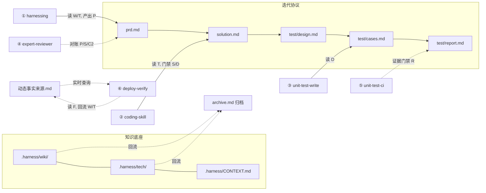

# 吸收落地使用指南：新资产 × 6 阶段流水线联动

> 本文档说明《AI 驱动研发体系的实践和思考》吸收进 tayama-harness-skills 后，
> **新增了哪些资产、各自怎么用、如何与既有的 6 阶段业务流水线联动**。
>
> 规划背景见 [吸收清单](absorb-list.md)，流水线定义见 [6 阶段流水线](6-stage-pipeline.md) 与 `.harness/rules/开发流程规范.md`。

---

## 1. 本次更改总览

吸收动作分四类落地，全部以 `.harness/` 为载体，由 `apply-harness` 生成到目标项目：

| 类别 | 新增资产 | 落点 |
|------|---------|------|
| **A. 机器可读迭代协议** | `prd.md` / `solution.md` / `test/design.md` / `test/cases.md` / `test/report.md` | `.harness/iterations/` |
| **B. 分层知识库** | wiki（业务）+ tech（技术链路）+ `CONTEXT.md`（术语） | `.harness/wiki/`、`.harness/tech/` |
| **C. 实时事实入口** | `动态事实来源.md` + `skill-dependencies.json` | `.harness/` |
| **D. 治理与冷启动** | `legacy-bootstrap`、`knowledge-health` 两个新技能 + 归档回流机制 | `.harness/skills/` |

同时，**6 个流水线技能被焊入了对新资产的消费点**（见 §4），这是"联动"的核心。

---

## 2. 如何使用各项新资产

### 2.1 机器可读迭代协议（iterations/，可选增强）

**定位**：复杂需求才启用；简单需求继续走单文件 `change.md`。启用后，阶段产物可被机器对账。

**五份产物与流转方向**：

```
prd.md (REQ/AC)
   └─▶ solution.md (REQ→任务/观测点)
          └─▶ test/design.md (AC→测试方法/证据类型)
                 └─▶ test/cases.md (TC，归属 AC)
                        └─▶ test/report.md (真实执行证据)
```

**编号体系**：`REQ`（需求）→ `AC`（验收，归属 REQ）→ `TC`（用例，归属 AC）。

**怎么启动**（实例化由 `harnessing` 在需求确认时执行）：
1. 复制 `.harness/iterations/_TEMPLATE/` → `.harness/iterations/<ITER-ID>/`
2. 在 `change.md` frontmatter 增加 `iteration: <ITER-ID>`（**不替代 change.md，二者并行**）
3. 依次填 `prd.md` → `solution.md` → `test/design.md` → `test/cases.md` → `test/report.md`

**阶段间接口门禁**（上游变更，下游必须同步，见 `开发流程规范.md §2.2`）：

| 上游 | 下游 | 强制检查 |
|------|------|---------|
| `prd.md` REQ/AC 变更 | `solution.md` | 每条 REQ 有任务承接、每条 AC 有观测点 |
| `solution.md` 未确认 | 编码 | **禁止进入编码** |
| `test/design.md` 未确认 | 编码 | **禁止进入编码** |
| `test/report.md` 无真实证据 | 发布 | **禁止进入发布** |
| 上游 AC 变更 | `test/cases.md` | 每条 AC ≥1 TC，无孤立 TC |

### 2.2 分层知识库（wiki / tech / CONTEXT）

**wiki** — 业务概念/规则/口径/流程/异常，面向产品/运营/测试/Agent。
**tech** — 跨系统链路/接口数据关系/新旧切换/废弃状态/观测方式，面向开发/Agent。
**CONTEXT.md** — 术语定义（Ubiquitous Language）。

**编写纪律**（见 `知识库治理规则.md`）：
- **不复制代码**：只写"调哪个接口/方法 + 链路位置"，不逐方法重述
- **source 必填**：每个文件 frontmatter 必须填事实来源
- **相对路径链接**：禁用绝对路径
- **tech 反连 wiki**：用 `wiki_ref` 关联业务知识，形成"业务规则 ↔ 技术链路 ↔ 源码"双向检索

### 2.3 动态事实来源（.harness/动态事实来源.md）

**定位**：稳定上下文进 Git，**动态事实**（工作项状态/测试环境/日志/DB/配置/指标）从权威系统经 MCP/CLI **实时查询**，在 Agent 执行时汇合。

**怎么用**：把工作项平台、环境平台、日志平台、DB、配置中心的连接方式（MCP 工具名或 CLI 命令）填进清单表。填写约定：优先 MCP，无 MCP 降级 CLI；凭证走环境变量不落 Git；查不到就如实标注"动态事实不可得"，不臆造。

### 2.4 依赖声明（skill-dependencies.json）

**定位**：公共能力**声明依赖而非复制**进每个项目，便于统一升级。

**怎么用**：在 `dependencies` 数组里声明 `name / source / version / compatible / reason`。项目 Skill 只保留业务编排，公共 Skill 由来源仓库统一维护。

### 2.5 两个新技能

| 技能 | 触发时机 | 干什么 |
|------|---------|--------|
| `/legacy-bootstrap` | 老项目接入 Harness | ① submodule 关联 src/ ② raw/ 挂材料 ③ 清洗 SKILL 抽知识 ④ 采访稿补人脑知识 |
| `/knowledge-health` | 定期体检 / 发现知识矛盾 | 扫 wiki+tech，检重复主题/冲突 status/失效链接/无来源结论/复制代码，🟡自动修、🔴留人裁决 |

---

## 3. 归档回流：知识飞轮的闭环

每个变更 `done` 后执行 `archive.md` 的**知识回流清单**，把本次迭代确认的长期知识回流：

| 类型 | 回流到 |
|------|--------|
| 业务规则/口径 | `.harness/wiki/` |
| 跨系统链路/观测方式 | `.harness/tech/` |
| 架构决策（难逆转/权衡） | `.harness/wiki/架构决策.md`（ADR） |
| 术语/别名 | `.harness/CONTEXT.md` |

> 知识建设是产品迭代的**副产物**，不必先建成完美知识库——冷启动出首版，之后每个迭代回流，越用越完善。

---

## 4. 与 6 阶段流水线的联动（核心）

新资产**不改变 6 阶段顺序**，而是**焊入每个阶段的输入/产出/门禁**，让知识资产贯穿全流程：

| 阶段 | 技能 | 消费的新资产 | 门禁变化 |
|------|------|-------------|---------|
| ① 需求分析 | `harnessing` | 读 `wiki/*`（业务规则）+ `tech/*`（技术链路）；复杂需求落 `prd.md` | 规格明确、AC 可测试、≥3 边界 |
| ② 编码实现 | `coding-skill` | 读 `tech/*`；**iterations 门禁**（solution/design 未确认禁编码） | 失败测试转绿 + 符合规范 |
| ③ 单测编写 | `unit-test-write` | 从 `test/design.md` 提取 AC/边界建测试点映射 | 覆盖率 ≥80% + AC/边界/降级全覆盖 |
| ④ 专家评审 | `expert-reviewer` | **对账 REQ/AC/TC**（每条 REQ 有任务、每条 AC 有 TC、无孤立 TC） | 0 个 🔴 |
| ⑤ CI 门禁 | `unit-test-ci` | **证据门禁**（`test/report.md` 无真实执行证据 → 退回 ③） | 静态分析 + 架构约束 + 全量测试全绿 |
| ⑥ 部署验证 | `deploy-verify` | 读 `动态事实来源.md` 回查真实状态；通过后同步 `wiki/`+`tech/` | 冒烟 + 健康检查 + 回滚预案 |

**收口**：`archive.md` 知识回流 → `harness-retro` 统计知识回流率 → 触发 `/knowledge-health` 体检（知识漂移信号）。

### 联动图



### 联动带来什么

1. **规格可对账**：需求不是一句话就消失，而是落 `prd.md` 的 REQ/AC，一路被 solution/test 反向引用。
2. **编码有上下文**：写代码前必读 wiki（业务规则）+ tech（技术链路），不再是"只看代码猜业务"。
3. **评审有依据**：评审不再凭感觉，而是逐条对账"AC 有没有测试、TC 有没有归属"。
4. **验证有真相**：部署验证不再只看服务起来没，而是回查环境/指标/工作项的**动态事实**。
5. **知识有回流**：每个迭代结束，确认的长期知识回流 wiki/tech，知识库随代码一起演进。

---

## 5. 边界与裁剪（重要）

- **iterations 协议是可选增强**，不强制：简单需求继续用单文件 `change.md`，6 阶段照跑。
- **知识库不追求一次建全**：冷启动（legacy-bootstrap）出首版即可，之后滚动回流。
- **动态事实来源是可选项**：不填也能跑，只是 ⑥ 退化为"无动态事实可得，转人工核验"。
- **skill-dependencies.json 是升级路径**：现有 apply-harness 仍走复制分发，声明式是给"想统一升级公共能力"的团队的增强项。
