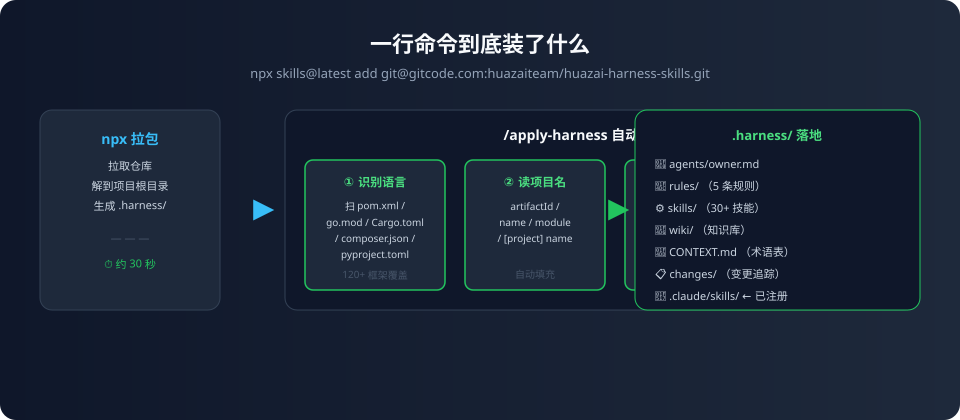
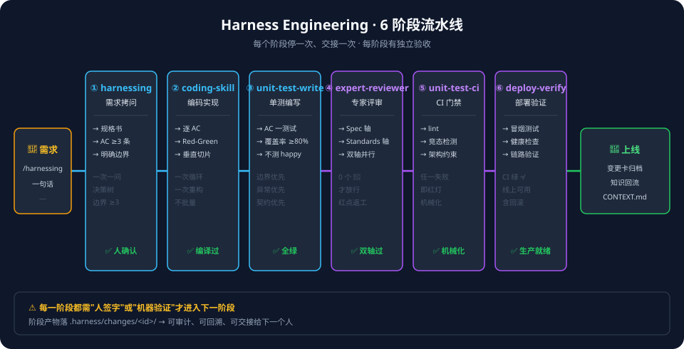
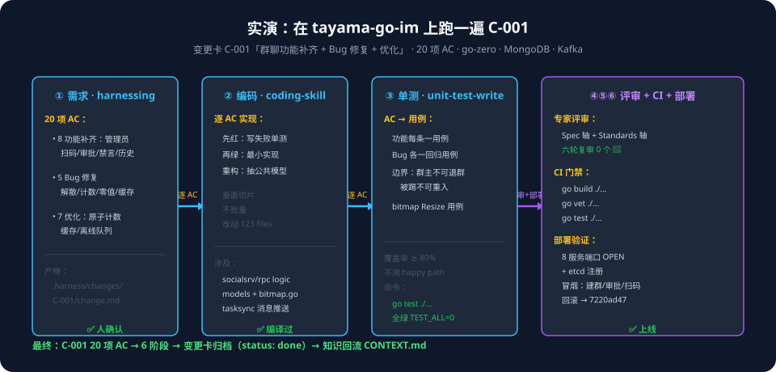
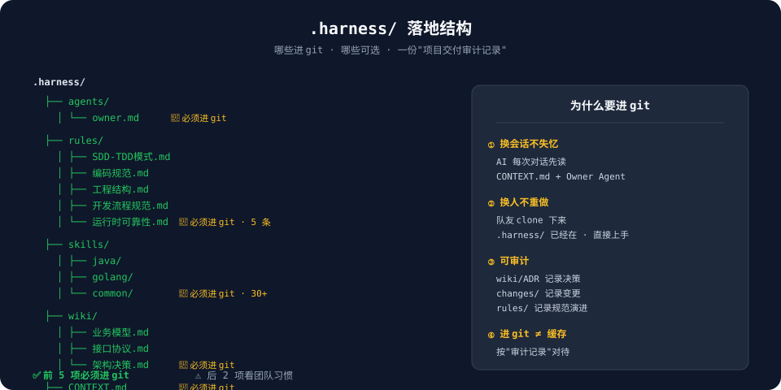
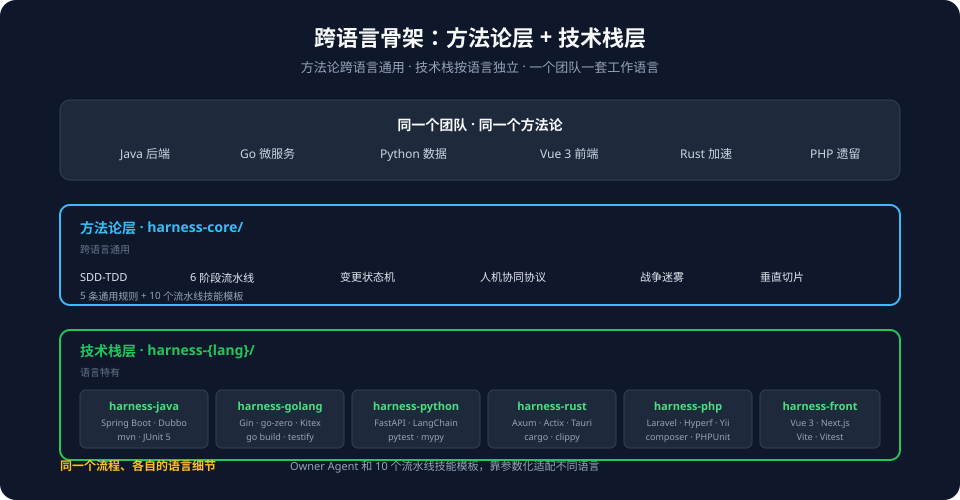
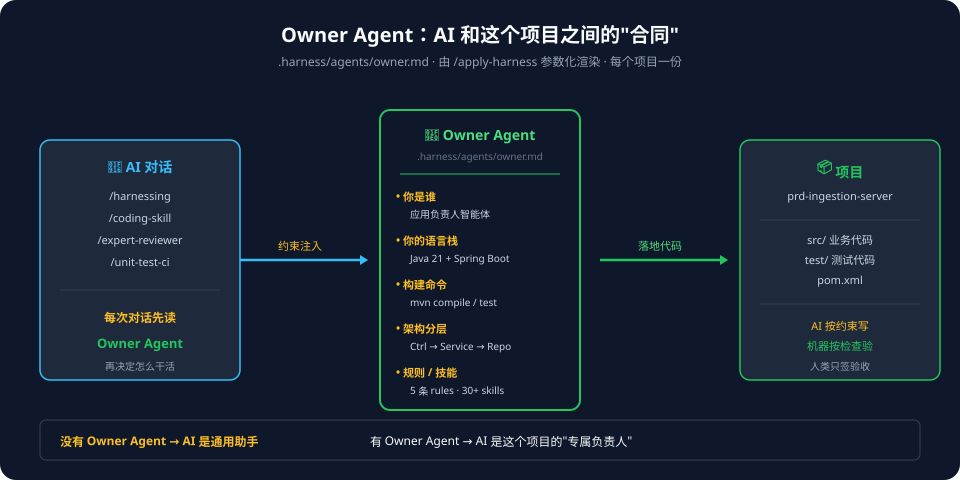

# 从图纸到落地：harness-skills 在真实项目里的一次跑通

> 本文对应仓库：https://gitcode.com/huazaiteam/huazai-harness-skills  
> 全文约 9000 字，含 6 张示意图。建议配 8–12 分钟读完，或收藏后按文末的"照着走一遍"直接动手。

---

## 写在前面

前面的几篇都在讲图纸——Harness Engineering 是什么、6 阶段流水线怎么流转、Owner Agent 凭什么被叫作"灵魂"、SDD-TDD 和战争迷雾怎么配合。

今天换方向：**把这套东西落到你自己手上那个跑了两三年的老项目里。**

读完你应该能：
- 装上它，并且知道"装上了"和"真能用"是两件事
- 知道从哪条命令起手
- 跑通第一个功能
- 明白为什么有"一步"绝对不能跳

中间我会专门拎出**那个最容易跳过、跳过就塌方的环节**，因为它直接关系前面几篇讲的所有东西到底是不是空转。

---

## 你一定会先冒出来的几个问题

第一次接触 Harness Engineering 的人，通常脑子里先冒出这几句：

> *"是先把单测补齐吗？"*  
> *"文档要不要先写全？"*  
> *"一个跑了两三年、代码堆了一堆、谁都不太敢乱动的老项目，接进来是不是第一天就得先还技术债？"*  
> *"30 多个技能、6 阶段流水线，是不是得先学一遍才能上手？"*

先把答案给你：**都不用。装上只要一行命令，一分钟的事。**

真正会卡住你的，是装完之后那个**"然后呢"**——我第一次接入一个老项目时，对着 `.harness/` 目录里一屏文件，愣了半分钟不知道先敲哪条。装好了，但不会用，这种"装好了的错觉"是最浪费时间的。

这一篇就是来回答那个"然后呢"的：**你该从哪条命令起手，中间哪一步绝对不能跳，装完之后怎么确认它真的活了。**

---

## 一、装上：一行命令到底装了什么

### 1.1 装

```bash
# 在任意项目根目录执行
npx skills@latest add git@gitcode.com:huazaiteam/huazai-harness-skills.git
```

仓库在 gitcode.com，且是私有的，所以用 SSH URL。如果你的仓库已公开，也可以用 HTTPS：

```bash
npx skills@latest add https://gitcode.com/huazaiteam/huazai-harness-skills.git
```

这一行跑完，`npx` 会把整个技能包拉下来、解到你**当前项目的根目录**，落成一个 `.harness/` 目录。

就这一个落点。

<figure>

<figcaption>图 1 · 一行命令到底装了什么</figcaption>
</figure>

### 1.2 装完两步确认

```bash
# ① 看目录是否落地
ls .harness/

# ② 在 AI 对话里敲斜杠（Claude Code / Cursor / Windsurf / Copilot 等）
/apply-harness
```

`.harness/` 里能看到 `agents/`、`rules/`、`skills/`、`changes/`、`wiki/`、`CONTEXT.md`，说明包就位了。

> **一个关键的"项目级"属性**：这个脚手架天生跟着仓库走，不是跟着机器走。团队里其他人 clone 下来，拿到的就是和你同一份 `.harness/`；你手上同时开几个项目，互相也不会踩。不需要像全局装那样想"这台机器共用还是这个仓库独占"——因为它**就是项目级的**。

---

## 二、你的起点在哪？其实只有一条起手命令

装完之后 `.harness/skills/` 下铺开了 30 多个斜杠命令，第一次看着确实唬人。

但**你只需要认一个**——挑哪个，取决于你手上是什么：

| 你的起点 | 第一条命令 |
|---|---|
| 全新项目，代码还没写 | `/apply-harness` |
| 已有项目，代码一大堆 | `/apply-harness` |

对，都是它。原因在它的**四步自动化流程**里：

1. **扫描项目根目录**，识别语言和框架——`pom.xml` 就去看 `spring-boot-starter-parent`，`go.mod` 就去读 `module`，`Cargo.toml` 去看依赖，`composer.json` 去读 `name` 字段，`pyproject.toml` 去看安装了 django 还是 fastapi…… **Java / Python / Go / Rust / PHP / Frontend，120+ 主流框架都在它的识别表里**，从 Spring Boot、Quarkus、Dubbo、Spring Cloud Alibaba、Spring AI，到 FastAPI、Django、LangChain、PyTorch，到 Gin、go-zero、Kitex、GoFrame、eino，到 Axum、Actix、Tauri、Dioxus，到 Laravel、Symfony、WordPress，到 Vue 3、Next.js、Angular、Svelte——全部覆盖。
2. **读取项目名**，`pom.xml` 的 `<artifactId>`、`package.json` 的 `name`、`go.mod` 的 `module`，它都认识。
3. **参数化渲染 `owner.md`**——把语言、框架、构建工具、测试框架、lint 工具、覆盖率工具、架构分层描述、Mock 库等 30 多个参数填进 Owner Agent 模板。
4. **复制规则 + 渲染技能模板 + 复制组件技能**，最后把整包注册到当前 AI 工具能识别的技能目录里。

**它全程只生成 `.harness/` 下的规范文件，一行业务代码都不碰。** 这就是"老项目敢不敢接"这条命门的一半答案。

---

## 三、别跳过这一步：把技能真正"注册"进你的 AI 工具

> ⚠️ **这一节是全篇最重要的一段，请务必看完再跳过任何内容。**

`/apply-harness` 跑完之后，`.harness/skills/` 下确实躺着一堆 `SKILL.md`——`harnessing/`、`coding-skill/`、`unit-test-write/`、`expert-reviewer/`…… 看着整齐。

但如果你现在在 AI 对话里敲 `/harnessing`，大概率会提示**"找不到这个命令"**。

为什么？

因为 `.harness/skills/` 只是技能的**仓库**，还不是你的 AI 工具能识别的**已注册技能目录**。AI 工具（Claude Code / Cursor / Windsurf / Copilot / Reasonix / 通义灵码 / Qoder……）各自有一个它能识别的"技能文件夹"，技能只有落进那个文件夹，斜杠命令才会真正弹出来。

这一步就叫 `/install-skill`，而实际上 `/apply-harness` 里的 **Step 5.5 已经替你把这一步做了**——它按 18 种检测条件去猜你用的是哪个 AI 工具，然后自动把 `.harness/skills/` 下的技能复制过去：

| 检测条件 | 推断工具 | 目标目录 |
|---|---|---|
| `REASONIX` 环境变量或 `.reasonix/` 目录 | Reasonix | `.reasonix/skills/` |
| `CLAUDE_CODE` 环境变量或 `.claude/` 目录 | Claude Code | `.claude/skills/` |
| `.cursor/` 目录 | Cursor | `.cursor/skills/` |
| `.windsurf/` 目录 | Windsurf | `.windsurf/workflows/` |
| `.github/` 目录 | GitHub Copilot | `.github/skills/` |
| `.lingma/` 目录 | 通义灵码 | `.lingma/` |
| `.vscode/` 目录（1.98+） | VS Code Agent Skills | `.vscode/agent-skills/` |
| …… 共 18 种 | | |

**但这条自动注册不是万能的**——如果你用的是表外的工具、环境变量没设、目录结构它猜不到，它就会跳过。这时候你需要手动跑一次：

```
/install-skill
```

它会把 `.harness/skills/` 下的技能扫一遍，复制到当前 AI 工具能识别的技能目录里，然后弹出一张摘要：

```
╔══════════════════════════════════════════╗
║   ✅ 技能已安装到 <工具名>               ║
╠══════════════════════════════════════════╣
║  目标目录: .claude/skills/               ║
║  已安装:   30+ 个技能                    ║
║  /harnessing        ✅ 可调用            ║
║  /coding-skill      ✅ 可调用            ║
║  /unit-test-write   ✅ 可调用            ║
║  /expert-reviewer   ✅ 可调用            ║
║  /unit-test-ci      ✅ 可调用            ║
║  /deploy-verify     ✅ 可调用            ║
║  ...                                    ║
╚══════════════════════════════════════════╝
```

### 3.1 为什么这一步是命门

前面几篇讲 Harness Engineering 讲得最多的，是"人机协同协议"：**人类设计约束，AI 写代码，机器验证**。

但所有这一切的前提是——**AI 工具真得认识这些技能**。

跳过 `/install-skill`（或自动注册没成功）会发生什么？

- `.harness/` 目录看着齐齐全全，像装好了
- 但你敲 `/harnessing` 没反应，只能退化成"靠一段自然语言描述让 AI 猜你想干嘛"
- **猜，就意味着 SDD-TDD 的第一环断了**——AI 没有明确告诉你"现在该干啥、验收条件是什么、哪些是边界"，就开始写代码
- 第一环断了，后面的 coding-skill、unit-test-write、expert-reviewer 全部跟着塌

所以它的纪律只有一条：**装完 `/apply-harness`，先确认斜杠命令能弹出来，弹不出来就跑 `/install-skill`，不要等。**

> **判断是否真的注册成功的唯一方法**：在 AI 对话里敲 `/harnessing `，能弹出命令候选列表 → 成功；提示"unknown command"或类似 → 没成功。别信 `ls .harness/skills/` 的结果，那是仓库，不是注册表。

一条没注册的斜杠命令，比"你干脆不用脚手架"更坏——前者会让你产生"已经装好了"的错觉，后者至少你清楚自己还在裸奔。

---

## 四、跑第一个功能：从一句需求开始

地基立好，正式开工只需要一句话。比如我手上正好有个现成的 Java 项目——`prd-ingestion-server`（一个 PRD 前置转换后端，Spring Boot 3.4.4 + Java 21 + MySQL + MinIO + Spring Security + JWT），我就用它在下面实演一遍：

```
/harnessing  给 PRD 导入接口加上"文件类型白名单"校验
```

然后它顺着 6 阶段流水线往下走，每到一个阶段停一次、交接一次：

<figure>

<figcaption>图 2 · Harness Engineering 6 阶段流水线</figcaption>
</figure>

展开说，每一步具体在干什么：

- **① `/harnessing`** — 把"加文件类型白名单"从一句模糊的话打磨成规格说明书：3 条以上验收条件（AC）、明确的边界、错误码、日志规范。比如：AC-1 "白名单之外的文件类型，接口返回 400 + `FILE_TYPE_NOT_ALLOWED`"；AC-2 "白名单内的 docx、pdf、doc 正常入库，文件保存到 MinIO"；AC-3 "非法文件类型的请求在 actuator 日志里打 WARN 级别，带 traceId"。
- **② `/coding-skill`** — 按 AC 列表逐个实现，**垂直切片**：一个 AC 一次 Red-Green-Refactor，不批量。先写失败测试、再写最小实现、再重构。
- **③ `/unit-test-write`** — 每条 AC 一个测试，覆盖率 ≥80%，**不测 happy path**（happy path 测试是浪费）。三个白名单外的、三个白名单内的、一个边界（大小写敏感的文件类型）。
- **④ `/expert-reviewer`** — 双轴评审：**Spec 轴**看代码是否满足所有 AC，**Standards 轴**看是否符合 `.harness/rules/` 下的编码规范（Spring Boot 的 Controller 分层、异常处理、traceId 透传）。**0 个 🔴 才放行**，有一个红点就必须返工。
- **⑤ `/unit-test-ci`** — 机械化执行：`mvn test`、`mvn compile`、`mvn checkstyle:check`、`mvn pmd:check`，再加竞态检测、架构约束（比如"Controller 不得直接依赖 Repository"）。任一检查失败即红灯。
- **⑥ `/deploy-verify`** — "CI 绿"≠"线上可用"。跑冒烟测试（白名单外的文件真的会被拦？）、健康检查（`/actuator/health`）、关键链路验证（上传→MinIO→DB）、回滚确认。

<figure>

<figcaption>图 3 · 在 prd-ingestion-server 上实演：需求 → 6 阶段 → 部署验证</figcaption>
</figure>

修 bug 是同一个节奏，换成 `/diagnosing-bugs`；想看当前进展，`/harness-status`；想定期体检，`/arch-review`。

日常你就用这几个。**剩下二十多个**（`/redis-cache-wrapper`、`/database-migration-toolkit`、`/kafka-toolkit`、`/security-toolkit`、`/k8s-release-toolkit`……）是封装好的**即插即用组件**，需要时才往下钻——比如给 `prd-ingestion-server` 加 MinIO 分片上传时，直接 `/oss-toolkit`，不用自己从零写。

---

## 五、磁盘上多出来的东西，哪些要进 git

跑完 `/apply-harness`，`.harness/` 下多出这么几样：

<figure>

<figcaption>图 4 · `.harness/` 落地结构</figcaption>
</figure>

逐一说说它们是什么、要不要进 git：

| 路径 | 内容 | 进 git？ |
|---|---|---|
| `.harness/agents/owner.md` | Owner Agent 定义："这个应用是谁、怎么工作、怎么决策" | ✅ **必须进** |
| `.harness/rules/` | 5 条规则（SDD-TDD / 编码规范 / 工程结构 / 开发流程 / 运行时可靠性） | ✅ **必须进** |
| `.harness/skills/` | 30+ 个技能定义（流水线 + 通用辅助 + 场景辅助 + 17 组件） | ✅ **必须进** |
| `.harness/CONTEXT.md` | 领域语言词典（AI 与人类之间的共享术语表） | ✅ **必须进** |
| `.harness/wiki/` | 领域知识库（业务模型 / 接口协议 / 数据模型 / 架构决策 ADR） | ✅ **必须进** |
| `.harness/changes/` | 变更追踪模板 | ⚠️ 看团队习惯 |
| `.harness/iterations/` | 机器可读迭代协议（PRD / 方案 / 测试设计） | ⚠️ 看团队习惯 |

**前五项必须进 git，别加进 `.gitignore`。**

它们看着像脚手架生成的"缓存"——一目录点开头的机器产出，很容易让人顺手忽略。但它们**不是缓存，是交接物**。换个会话、换台机器、换个人接手，能说清"这个项目怎么用 Harness 工作的、术语怎么定、规则是什么"的，只有它们。

不进 git，团队里其他人 clone 下来，拿到的是一个空的 `.harness/` 目录——等于每人每次都要重新从零开始一遍 `/apply-harness`。

仓库文档里给它定性是"**项目交付审计记录**"——按审计记录对待，就不会想着忽略了。

---

## 六、老项目接入的两条纪律

如果你是从老项目接进来的（绝大多数人都是），两条纪律值得提前知道：

**第一，只生规范，不动代码。**

`/apply-harness` 跑完，`src/` 下的一行代码都没变，变的只有 `.harness/`。这让"能不能接入"从问题变成了"要不要接入"。

**第二，增量接入。**

存量代码统一标成"已接入基线"，只有新功能才走完整 6 阶段流水线。不要求你先把历史债还清。

第二条是命门中的命门。我见过太多流程工具死在第一天——一接入就报出几百个存量不合规，人一看这个数字就放弃了。把存量圈起来放过，只管新增，流程才有活到第二天的可能。

---

## 七、跨语言：这才是这个脚手架真正的骨架

这也是我想单独拿出来讲的部分。参考文档里只有一种语言的玩法，但我们这个脚手架从第一天起就把**跨语言**写进了骨架——这不是营销话术，是真的会改变你怎么用它的地方。

同一个团队手里，常见的是：
- Java 后端（Spring Boot / Spring Cloud Alibaba / Dubbo）
- Go 微服务（Gin / go-zero / Kitex）
- Python 数据脚本（FastAPI / LangChain / PyTorch）
- Vue 3 / React 前端
- 偶尔还掺点 Rust 性能敏感模块

每个项目都想用同一套方法——SDD-TDD、6 阶段流水线、Owner Agent、变更状态机——但具体到"编码规范、工程结构、测试命令、代码规范"，Java 和 Go 完全不是一回事：
- Java 的 lint 是 `checkstyle` + `pmd`，Go 是 `golangci-lint`，Rust 是 `clippy`
- Java 的测试是 JUnit 5，Go 是 `go test + testify`，Rust 是 `cargo test + rstest`
- Java 的架构分层是 `controller → service → repository`，Go 是 `handler → service → repository`，Kratōs 是 `api → service → biz → data`

脚手架在这层做了**两层拆分**：

<figure>

<figcaption>图 5 · 方法论层跨语言通用，技术栈层语言特有</figcaption>
</figure>

**方法论层（跨语言通用）**：SDD-TDD、6 阶段、人机协同协议、上下文交接、变更状态机——落在 `harness-core/` 的 5 条通用规则和 10 个流水线技能模板里。

**技术栈层（语言特有）**：`harness-java/`、`harness-golang/`、`harness-python/`、`harness-rust/`、`harness-php/`、`harness-front/` 各自有自己的规则（编码规范 / 工程结构）、专属技能（Java 的 `java-code-review`、`spring-api-convention`、`mybatis-toolkit`、`openfeign-toolkit`）和**框架参数表**——Spring Boot 的 `BUILD_CMD` 是 `mvn compile`，Gin 是 `go build ./...`，Vue 3 是 `npm run build`。

这意味着一个团队可以**用同一套工作语言**管理 Java、Go、前端所有项目——不是"每个项目套不同的流程"，而是"同一个流程、各自的语言细节"。

这也是为什么 `/apply-harness` 要费那么大劲去识别语言 + 框架——它不是在做"配置选择器"，而是在**给 Owner Agent 和后续所有技能注入正确的"语言参数"**，让这些参数在渲染 `owner.md` 和 10 个流水线技能时，自动生成对这个项目正确的构建命令、测试命令、lint 命令、Mock 库、架构分层描述。

---

## 八、Owner Agent：为什么叫它"灵魂"

前面一直提 Owner Agent，但没展开。这里补一段，因为它决定了"AI 到底按什么规矩干活"。

Owner Agent 是一段定义"这个应用是谁、怎么工作、怎么决策"的 Markdown 文件，落在 `.harness/agents/owner.md`。它是由 `/apply-harness` 的 Step 3 从模板**参数化渲染**出来的——每个项目都有自己的 Owner Agent，不是模板拷过来就完事。

<figure>

<figcaption>图 6 · Owner Agent 是 AI 和这个项目之间的"合同"</figcaption>
</figure>

它里面定义了：
- **你是谁**：这个项目的 Owner Agent，负责 `prd-ingestion-server` 的全部开发
- **你的语言栈**：Java 21 + Spring Boot 3.4.4 + Maven + JUnit 5 + Mockito
- **你的构建命令**：`mvn compile` / `mvn test` / `mvn checkstyle:check`
- **你的架构分层**：`Controller → Service → Repository`，依赖单向
- **你的规则**：`.harness/rules/` 下的 5 条规则
- **你的技能**：`.harness/skills/` 下的 30+ 个技能
- **你的开发协议**：SDD-TDD、垂直切片、战争迷雾、变更状态机

以后每次在 AI 对话里敲一个斜杠命令，AI 都会先读 Owner Agent——"哦，我在 `prd-ingestion-server` 项目里，用 Java 21 + Spring Boot，架构是三层，lint 用 checkstyle + pmd"——然后按这个约束去工作。

**Owner Agent 是 AI 和这个项目之间的"合同"**。没有它，AI 就是通用助手，按通用规矩干活；有了它，AI 是这个项目的"专属负责人"，按这个项目的规矩干活。

---

## 九、什么时候不该用它

也说说边界，免得误用。

一次性脚本、跑完就删的 demo、纯文档仓库——**这些别用**，流程的成本收不回来。

它是给**要活很久、要被人接手、要对质量负责**的项目准备的。

判断标准很简单：**这个项目三个月后还有人会打开吗？** 会，就值得；不会，别折腾。

---

## 十、照着走一遍

把上面这些压成一张单子，你可以直接照做：

1. **装**：
   ```bash
   npx skills@latest add git@gitcode.com:huazaiteam/huazai-harness-skills.git
   ```
2. **验目录**：`ls .harness/`，确认 `agents/`、`rules/`、`skills/`、`wiki/`、`CONTEXT.md` 都在
3. **起手**：在 AI 对话里敲 `/apply-harness`，让它自动识别语言和框架、生成规范
4. **立地基**：确认 `/harnessing ` 能弹出命令 → 如果弹不出，跑 `/install-skill` —— **这一步别跳，它决定后面所有斜杠命令是真能用还是死的**
5. **开工**：`/harnessing` 写一句话需求，然后 6 阶段自动往下走
6. **看进展**：`/harness-status` 随时看走到哪了
7. **提交**：把 `.harness/agents/`、`.harness/rules/`、`.harness/skills/`、`.harness/CONTEXT.md`、`.harness/wiki/` 一起 commit 进去

第 4 步是唯一一个"看起来可以先放放、实际上放不得"的。其余按顺序照走就行。

---

## 十一、最后一句

如果这篇只留一句话给你带走，我希望是这句：

> **先注册，再开工——顺序反了，后面所有的流水线都是摆设。**

---

## 下一篇预告

下一篇我会讲这个系列真正的重点：**怎么让这套东西自己一轮一轮往下跑，不用你守着。**

会讲透：
- 收敛循环（`harness-loop-run`）的机制
- 几条不可协商的护栏
- 我自己在真实项目里踩过的那几次坑——包括一次 Token 消耗失控，最后是被一条硬预算接住的

---

想自己试一下，一行就够：

```bash
npx skills@latest add git@gitcode.com:huazaiteam/huazai-harness-skills.git
```

仓库：https://gitcode.com/huazaiteam/huazai-harness-skills

觉得有用的话，给个 star 是对我最大的支持 ⭐

这一篇是按我自己接入项目的真实顺序写的，如果有疑问欢迎留言讨论。如果你照着走通了，回来告诉我一声；卡在哪儿了也告诉我，我补进下一版。
