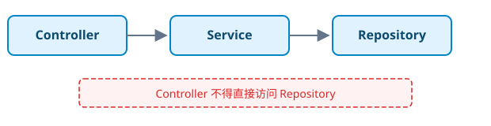

# 工程纪律即架构

> 人类设计约束，AI 编写代码，机器验证质量。
> —— Harness Engineering 的信条

## 一、一个被忽视的问题

### 1.1 AI 写代码的"质量悖论"

2024 年，GitHub 的一项调查显示：使用 Copilot 的开发者**代码产出速度提升了 55%**，但代码审查的**拒绝率上升了 20%**。

这不是 Copilot 的问题，这是所有 AI 编程工具的共同特征。AI 本质上是一个**超高效的"新人工程师"**——它写代码的速度堪比 10 年经验的高级工程师，但工程判断力只相当于实习第一天。

来看一个真实的例子。在一次 tayama-trip-plan 的迭代中，AI 需要实现一个"用户行程导出"功能。它用 30 秒写完了代码，但：

```java
// AI 写的代码
public void exportTrip(Long userId, HttpServletResponse response) {
    List<Trip> trips = tripRepository.findByUserId(userId);
    // ... 导出逻辑
}
```

看起来没问题？但仔细看：

1. **没有分页**——如果用户有 10000 个行程，这个 API 会把数据库撑爆
2. **没有事务**——导出过程中数据变更会导致不一致
3. **没有异常处理**——IO 异常会直接返回 500 给用户
4. **没有权限校验**——调用者真的是这个用户吗？

这些不是"AI 学不会"的东西，而是**AI 不知道"在这个项目中应该这么做"**。它不知道这个项目有"所有查询必须分页"的架构约束，不知道"所有 IO 操作必须有 try-catch"的编码规范，不知道"所有 API 必须有权限校验"的安全策略。

```svg
<svg xmlns="http://www.w3.org/2000/svg" viewBox="0 0 800 350" font-family="'SF Pro Display','Segoe UI','Microsoft YaHei',sans-serif">
  <defs>
    <linearGradient id="bg01" x1="0" y1="0" x2="0" y2="1"><stop offset="0%" stop-color="#0b1220"/><stop offset="100%" stop-color="#020617"/></linearGradient>
    <filter id="sh01"><feDropShadow dx="0" dy="4" stdDeviation="5" flood-color="#000" flood-opacity="0.4"/></filter>
  </defs>
  <rect width="800" height="350" fill="url(#bg01)" rx="10"/>
  <text x="400" y="30" text-anchor="middle" fill="#e2e8f0" font-size="28" font-weight="700">AI 写代码的"质量悖论"</text>
  <!-- 速度曲线 -->
  <polyline points="80,280 200,180 320,110 440,70 560,50 680,40" fill="none" stroke="#22c55e" stroke-width="3" stroke-dasharray="8,4"/>
  <text x="680" y="35" text-anchor="end" fill="#86efac" font-size="11" font-weight="700">速度 (x10)</text>
  <!-- 质量曲线 -->
  <polyline points="80,270 200,250 320,260 440,290 560,310 680,320" fill="none" stroke="#ef4444" stroke-width="3"/>
  <text x="680" y="335" text-anchor="end" fill="#fca5a5" font-size="11" font-weight="700">质量 (下降20%)</text>
  <!-- 标注 -->
  <text x="400" y="170" text-anchor="middle" fill="#f59e0b" font-size="16" font-weight="700">✕</text>
  <text x="400" y="190" text-anchor="middle" fill="#fde68a" font-size="11">速度 x10 · 质量下降 20%</text>
  <text x="400" y="210" text-anchor="middle" fill="#94a3b8" font-size="10">净收益？还是净亏损？</text>
  <!-- 横轴 -->
  <line x1="70" y1="290" x2="720" y2="290" stroke="#475569" stroke-width="1"/>
  <text x="400" y="310" text-anchor="middle" fill="#64748b" font-size="10">AI 介入程度 →</text>
</svg>
```

**核心问题**：当速度提升了 10 倍，但质量下降了 20%，我们到底是赚了还是亏了？

答案取决于你如何定义"质量"。如果质量是"代码能跑"，那速度的收益远大于质量的损失。但如果质量是"代码可维护、可测试、可部署"，那 20% 的质量下降会以技术债的形式在未来 10 倍地偿还。

### 1.2 传统工程纪律为什么失效

传统软件工程中，工程纪律通过以下方式传递：

1. **Code Review**——Senior 工程师在 Review 中指出"这里应该分页""那里应该加事务"
2. **架构文档**——ADR、架构图、Wiki，描述"为什么这么做"
3. **编码规范**——Checkstyle、ESLint、gofmt 等工具强制执行的规则
4. **团队文化**——"我们团队的习惯是……"

这些方式在人类团队中运行得很好，但面对 AI 时全部失效：

**Code Review 对 AI 无效**：AI 每次对话都是"新人"，它不知道上次 Review 说的"这里应该分页"。每次 Review 的结论只在当前对话中有效，下一条对话就忘了。

**架构文档对 AI 无效**：AI 不会主动去读架构文档。除非你显式告诉它"去读 docs/architecture.md"，否则它对项目的架构约束一无所知。

**编码规范工具对 AI 部分有效**：Checkstyle 这样的工具可以事后检查，但无法在生成代码的过程中指导 AI。AI 生成了 3000 行的 Service 类之后，Checkstyle 再报"类太长"——晚了。

**团队文化对 AI 完全无效**：AI 没有"团队归属感"。

```svg
<svg xmlns="http://www.w3.org/2000/svg" viewBox="0 0 800 300" font-family="'SF Pro Display','Segoe UI','Microsoft YaHei',sans-serif">
  <defs>
    <linearGradient id="bg02" x1="0" y1="0" x2="0" y2="1"><stop offset="0%" stop-color="#0b1220"/><stop offset="100%" stop-color="#020617"/></linearGradient>
    <filter id="sh02"><feDropShadow dx="0" dy="4" stdDeviation="5" flood-color="#000" flood-opacity="0.4"/></filter>
  </defs>
  <rect width="800" height="300" fill="url(#bg02)" rx="10"/>
  <text x="400" y="30" text-anchor="middle" fill="#e2e8f0" font-size="28" font-weight="700">传统工程纪律 vs AI 的适配性</text>
  <rect x="40" y="55" width="160" height="40" rx="8" fill="#f59e0b" opacity="0.15" stroke="#f59e0b" stroke-width="1.5" filter="url(#sh02)"/>
  <text x="120" y="80" text-anchor="middle" fill="#fde68a" font-size="12" font-weight="700">Code Review</text>
  <rect x="220" y="55" width="160" height="40" rx="8" fill="#ef4444" opacity="0.15" stroke="#ef4444" stroke-width="1.5" filter="url(#sh02)"/>
  <text x="300" y="80" text-anchor="middle" fill="#fca5a5" font-size="12" font-weight="700">✗ 对 AI 无效</text>
  <rect x="40" y="110" width="160" height="40" rx="8" fill="#f59e0b" opacity="0.15" stroke="#f59e0b" stroke-width="1.5" filter="url(#sh02)"/>
  <text x="120" y="135" text-anchor="middle" fill="#fde68a" font-size="12" font-weight="700">架构文档</text>
  <rect x="220" y="110" width="160" height="40" rx="8" fill="#ef4444" opacity="0.15" stroke="#ef4444" stroke-width="1.5" filter="url(#sh02)"/>
  <text x="300" y="135" text-anchor="middle" fill="#fca5a5" font-size="12" font-weight="700">✗ 对 AI 无效</text>
  <rect x="40" y="165" width="160" height="40" rx="8" fill="#f59e0b" opacity="0.15" stroke="#f59e0b" stroke-width="1.5" filter="url(#sh02)"/>
  <text x="120" y="190" text-anchor="middle" fill="#fde68a" font-size="12" font-weight="700">Lint 工具</text>
  <rect x="220" y="165" width="160" height="40" rx="8" fill="#f59e0b" opacity="0.15" stroke="#f59e0b" stroke-width="1.5" filter="url(#sh02)"/>
  <text x="300" y="190" text-anchor="middle" fill="#fde68a" font-size="12" font-weight="700">△ 部分有效</text>
  <rect x="40" y="220" width="160" height="40" rx="8" fill="#f59e0b" opacity="0.15" stroke="#f59e0b" stroke-width="1.5" filter="url(#sh02)"/>
  <text x="120" y="245" text-anchor="middle" fill="#fde68a" font-size="12" font-weight="700">团队文化</text>
  <rect x="220" y="220" width="160" height="40" rx="8" fill="#ef4444" opacity="0.15" stroke="#ef4444" stroke-width="1.5" filter="url(#sh02)"/>
  <text x="300" y="245" text-anchor="middle" fill="#fca5a5" font-size="12" font-weight="700">✗ 完全无效</text>
  <text x="500" y="105" text-anchor="middle" fill="#94a3b8" font-size="11" font-weight="700">核心差距</text>
  <text x="500" y="125" text-anchor="middle" fill="#64748b" font-size="10">传统工程纪律依赖"人的记忆"</text>
  <text x="500" y="145" text-anchor="middle" fill="#64748b" font-size="10">AI 每次对话都是从零开始</text>
  <text x="500" y="165" text-anchor="middle" fill="#64748b" font-size="10">需要的是"可编程的纪律"</text>
  <text x="500" y="185" text-anchor="middle" fill="#64748b" font-size="10">不是"写在墙上的规则"</text>
</svg>
```

### 1.3 代码质量的六个维度

在深入讨论"工程纪律"之前，我们需要先定义：当我们说"代码质量"时，到底在说什么？

在不同的上下文里，"代码质量"的含义完全不同：

- **对业务方**："代码质量 = 功能正常 + 不崩"
- **对架构师**："代码质量 = 可维护 + 可扩展"
- **对 SRE**："代码质量 = 可观测 + 可恢复"
- **对安全团队**："代码质量 = 无漏洞 + 合规"

为了统一语言，我们定义代码质量的六个维度：

```svg
<svg xmlns="http://www.w3.org/2000/svg" viewBox="0 0 800 400" font-family="'SF Pro Display','Segoe UI','Microsoft YaHei',sans-serif">
  <defs>
    <linearGradient id="bg6d" x1="0" y1="0" x2="0" y2="1"><stop offset="0%" stop-color="#0b1220"/><stop offset="100%" stop-color="#020617"/></linearGradient>
    <filter id="sh6d"><feDropShadow dx="0" dy="4" stdDeviation="5" flood-color="#000" flood-opacity="0.4"/></filter>
  </defs>
  <rect width="800" height="400" fill="url(#bg6d)" rx="10"/>
  <text x="400" y="25" text-anchor="middle" fill="#e2e8f0" font-size="28" font-weight="700">代码质量的六个维度</text>
  <text x="400" y="45" text-anchor="middle" fill="#64748b" font-size="10">每个维度对应不同的关注者和验证方式</text>
  <!-- 1 -->
  <rect x="30" y="65" width="230" height="90" rx="10" fill="#0ea5e9" opacity="0.12" stroke="#0ea5e9" stroke-width="1.5" filter="url(#sh6d)"/>
  <text x="145" y="88" text-anchor="middle" fill="#7dd3fc" font-size="12" font-weight="700">1. 功能正确性</text>
  <text x="145" y="108" text-anchor="middle" fill="#94a3b8" font-size="9">代码是否按规格工作</text>
  <text x="145" y="124" text-anchor="middle" fill="#94a3b8" font-size="9">验证：单元测试</text>
  <text x="145" y="140" text-anchor="middle" fill="#64748b" font-size="8">关注者：业务方</text>
  <!-- 2 -->
  <rect x="285" y="65" width="230" height="90" rx="10" fill="#22c55e" opacity="0.12" stroke="#22c55e" stroke-width="1.5" filter="url(#sh6d)"/>
  <text x="400" y="88" text-anchor="middle" fill="#86efac" font-size="12" font-weight="700">2. 可维护性</text>
  <text x="400" y="108" text-anchor="middle" fill="#94a3b8" font-size="9">代码是否容易修改</text>
  <text x="400" y="124" text-anchor="middle" fill="#94a3b8" font-size="9">验证：圈复杂度/行数</text>
  <text x="400" y="140" text-anchor="middle" fill="#64748b" font-size="8">关注者：开发者</text>
  <!-- 3 -->
  <rect x="540" y="65" width="230" height="90" rx="10" fill="#f59e0b" opacity="0.12" stroke="#f59e0b" stroke-width="1.5" filter="url(#sh6d)"/>
  <text x="655" y="88" text-anchor="middle" fill="#fde68a" font-size="12" font-weight="700">3. 可测试性</text>
  <text x="655" y="108" text-anchor="middle" fill="#94a3b8" font-size="9">代码是否容易测试</text>
  <text x="655" y="124" text-anchor="middle" fill="#94a3b8" font-size="9">验证：依赖注入/Mock</text>
  <text x="655" y="140" text-anchor="middle" fill="#64748b" font-size="8">关注者：QA</text>
  <!-- 4 -->
  <rect x="30" y="175" width="230" height="90" rx="10" fill="#8b5cf6" opacity="0.12" stroke="#8b5cf6" stroke-width="1.5" filter="url(#sh6d)"/>
  <text x="145" y="198" text-anchor="middle" fill="#c4b5fd" font-size="12" font-weight="700">4. 可扩展性</text>
  <text x="145" y="218" text-anchor="middle" fill="#94a3b8" font-size="9">代码是否容易扩展</text>
  <text x="145" y="234" text-anchor="middle" fill="#94a3b8" font-size="9">验证：架构约束</text>
  <text x="145" y="250" text-anchor="middle" fill="#64748b" font-size="8">关注者：架构师</text>
  <!-- 5 -->
  <rect x="285" y="175" width="230" height="90" rx="10" fill="#ef4444" opacity="0.12" stroke="#ef4444" stroke-width="1.5" filter="url(#sh6d)"/>
  <text x="400" y="198" text-anchor="middle" fill="#fca5a5" font-size="12" font-weight="700">5. 安全性</text>
  <text x="400" y="218" text-anchor="middle" fill="#94a3b8" font-size="9">代码是否有漏洞</text>
  <text x="400" y="234" text-anchor="middle" fill="#94a3b8" font-size="9">验证：安全扫描</text>
  <text x="400" y="250" text-anchor="middle" fill="#64748b" font-size="8">关注者：安全团队</text>
  <!-- 6 -->
  <rect x="540" y="175" width="230" height="90" rx="10" fill="#06b6d4" opacity="0.12" stroke="#06b6d4" stroke-width="1.5" filter="url(#sh6d)"/>
  <text x="655" y="198" text-anchor="middle" fill="#67e8f9" font-size="12" font-weight="700">6. 可观测性</text>
  <text x="655" y="218" text-anchor="middle" fill="#94a3b8" font-size="9">代码是否可诊断</text>
  <text x="655" y="234" text-anchor="middle" fill="#94a3b8" font-size="9">验证：日志/指标</text>
  <text x="655" y="250" text-anchor="middle" fill="#64748b" font-size="8">关注者：SRE</text>
  <!-- 底部 -->
  <rect x="80" y="290" width="640" height="50" rx="10" fill="#0f172a" stroke="#334155" stroke-width="1" filter="url(#sh6d)"/>
  <text x="400" y="313" text-anchor="middle" fill="#e2e8f0" font-size="11" font-weight="700">传统工程纪律往往只覆盖 1-2 个维度，Harness 覆盖全部 6 个维度</text>
  <text x="400" y="331" text-anchor="middle" fill="#64748b" font-size="9">因为 AI 不像人类开发者那样"自带"某个维度的理解——它需要明确的纪律来覆盖每个维度</text>
  <text x="400" y="380" text-anchor="middle" fill="#475569" font-size="10">"AI 不会自动关心代码是否安全，除非纪律告诉它应该关心"</text>
</svg>
```

传统工程纪律往往只覆盖 1-2 个维度——比如 Checkstyle 覆盖"可维护性"，单元测试覆盖"功能正确性"。但 Harness 覆盖全部 6 个维度，因为 AI 不像人类开发者那样"自带"某个维度的理解——它需要明确的纪律来覆盖每个维度。

**为什么需要覆盖全部 6 个维度？**

因为在 AI 辅助开发中，这 6 个维度是"正交"的。一个代码可能功能完全正确但不可维护，可能可维护但不安全，可能安全但不可观测。AI 不会自动"补齐"某个维度——如果纪律只覆盖了 3 个维度，AI 就会在另外 3 个维度上随意发挥。

### 1.4 AI 代码质量问题的根源分析

为什么 AI 写的代码质量普遍低于人类开发者？这个问题看似简单，但背后有深刻的根本原因。

**原因一：AI 没有"上下文记忆"**

人类开发者在一个项目中工作 6 个月后，会积累大量的"隐性知识"：这个项目的数据库连接池配置了 20 个连接、这个 API 的调用方期望 200ms 内返回、这个团队的习惯是 Service 返回 Optional 而不是 null。这些知识从来没有被写下来，但它们指导着每一个编码决策。

AI 没有这些"隐性知识"。每次对话，AI 都是"第一天上班的新人"。它不知道"这个项目习惯怎么做"，只知道"通用做法是什么"。

**原因二：AI 的"模式匹配"优于"因果推理"**

AI 本质上是一个模式匹配引擎——不是逻辑推理引擎。它更擅长"见过类似的情况，所以这样做"而不是"分析了这个场景的因果链，所以这样做"。

当 AI 需要写一个"用户注册"的功能时，它会匹配训练数据中所有"用户注册"的模式，然后输出一个"标准"的实现。但如果这个项目需要"先发确认邮件，再创建用户记录"（而不是"先创建用户，再发邮件"），AI 的模式匹配就不会自动发现这个差异。

**原因三：AI 没有"压力感知"**

人类开发者写代码时，会"感觉"到某个地方不对劲："这个类太长了，应该拆一下"、"这个方法的参数太多了，应该封装一下"。这种"压力感知"来自于多年的编码经验和对"坏味道"的直觉。

AI 没有这种"压力感知"。它不会"感觉"到 3000 行的 Service 类有问题，不会"感觉"到 20 个参数的方法需要重构。它准确地按照指令生成代码，不多想，也不少想。

```svg
<svg xmlns="http://www.w3.org/2000/svg" viewBox="0 0 800 260" font-family="'SF Pro Display','Segoe UI','Microsoft YaHei',sans-serif">
  <defs>
    <linearGradient id="bg_rt" x1="0" y1="0" x2="0" y2="1"><stop offset="0%" stop-color="#0b1220"/><stop offset="100%" stop-color="#020617"/></linearGradient>
    <filter id="sh_rt"><feDropShadow dx="0" dy="4" stdDeviation="5" flood-color="#000" flood-opacity="0.4"/></filter>
  </defs>
  <rect width="800" height="260" fill="url(#bg_rt)" rx="10"/>
  <text x="400" y="30" text-anchor="middle" fill="#e2e8f0" font-size="28" font-weight="700">AI 代码质量问题的三个根源</text>
  <rect x="30" y="55" width="230" height="80" rx="10" fill="#ef4444" opacity="0.12" stroke="#ef4444" stroke-width="1.5" filter="url(#sh_rt)"/>
  <text x="145" y="78" text-anchor="middle" fill="#fca5a5" font-size="12" font-weight="700">无上下文记忆</text>
  <text x="145" y="98" text-anchor="middle" fill="#94a3b8" font-size="9">每次对话都是"新人"</text>
  <text x="145" y="114" text-anchor="middle" fill="#94a3b8" font-size="9">没有"隐性知识"</text>
  <text x="145" y="130" text-anchor="middle" fill="#f87171" font-size="9">✗ 需要纪律补充</text>
  <rect x="285" y="55" width="230" height="80" rx="10" fill="#f59e0b" opacity="0.12" stroke="#f59e0b" stroke-width="1.5" filter="url(#sh_rt)"/>
  <text x="400" y="78" text-anchor="middle" fill="#fde68a" font-size="12" font-weight="700">模式匹配非推理</text>
  <text x="400" y="98" text-anchor="middle" fill="#94a3b8" font-size="9">匹配"通用"而非"特定"</text>
  <text x="400" y="114" text-anchor="middle" fill="#94a3b8" font-size="9">不分析因果链</text>
  <text x="400" y="130" text-anchor="middle" fill="#f87171" font-size="9">✗ 需要纪律约束</text>
  <rect x="540" y="55" width="230" height="80" rx="10" fill="#0ea5e9" opacity="0.12" stroke="#0ea5e9" stroke-width="1.5" filter="url(#sh_rt)"/>
  <text x="655" y="78" text-anchor="middle" fill="#7dd3fc" font-size="12" font-weight="700">无压力感知</text>
  <text x="655" y="98" text-anchor="middle" fill="#94a3b8" font-size="9">不"感觉"代码有问题</text>
  <text x="655" y="114" text-anchor="middle" fill="#94a3b8" font-size="9">不主动重构</text>
  <text x="655" y="130" text-anchor="middle" fill="#f87171" font-size="9">✗ 需要纪律引导</text>
  <rect x="80" y="160" width="640" height="50" rx="10" fill="#0f172a" stroke="#334155" stroke-width="1" filter="url(#sh_rt)"/>
  <text x="400" y="183" text-anchor="middle" fill="#e2e8f0" font-size="11" font-weight="700">三个根源都指向同一个方向：AI 需要"外在的纪律"来弥补"内在的不足"</text>
  <text x="400" y="201" text-anchor="middle" fill="#64748b" font-size="9">工程纪律不是压迫 AI 的枷锁，而是帮助 AI 发挥最大价值的脚手架</text>
  <text x="400" y="248" text-anchor="middle" fill="#475569" font-size="10">"AI 不需要被约束——它需要被引导。"</text>
</svg>
```

**三个根源都指向同一个方向**：AI 需要"外在的纪律"来弥补"内在的不足"。工程纪律不是压迫 AI 的枷锁，而是帮助 AI 发挥最大价值的脚手架。

## 二、重新定义"工程纪律"

### 2.1 工程纪律的三个层次

从 tayama-trip-plan 的实际经验中，我提炼出工程纪律的三个层次。这不是一个理论框架，而是通过"AI 犯了什么错、我们怎么修"的迭代中总结出来的。

```svg
<svg xmlns="http://www.w3.org/2000/svg" viewBox="0 0 800 380" font-family="'SF Pro Display','Segoe UI','Microsoft YaHei',sans-serif">
  <defs>
    <linearGradient id="bg03" x1="0" y1="0" x2="0" y2="1"><stop offset="0%" stop-color="#0b1220"/><stop offset="100%" stop-color="#020617"/></linearGradient>
    <filter id="sh03"><feDropShadow dx="0" dy="4" stdDeviation="5" flood-color="#000" flood-opacity="0.4"/></filter>
  </defs>
  <rect width="800" height="380" fill="url(#bg03)" rx="10"/>
  <text x="400" y="30" text-anchor="middle" fill="#e2e8f0" font-size="28" font-weight="700">工程纪律的三个层次</text>
  <!-- 规则层 -->
  <rect x="60" y="55" width="200" height="70" rx="10" fill="#0ea5e9" opacity="0.12" stroke="#0ea5e9" stroke-width="2" filter="url(#sh03)"/>
  <text x="160" y="80" text-anchor="middle" fill="#7dd3fc" font-size="13" font-weight="700">规则层</text>
  <text x="160" y="100" text-anchor="middle" fill="#94a3b8" font-size="10">告诉 AI"行为边界"</text>
  <text x="160" y="116" text-anchor="middle" fill="#64748b" font-size="9">方法≤50行 | 禁止字段注入</text>
  <!-- 流程层 -->
  <rect x="300" y="55" width="200" height="70" rx="10" fill="#8b5cf6" opacity="0.12" stroke="#8b5cf6" stroke-width="2" filter="url(#sh03)"/>
  <text x="400" y="80" text-anchor="middle" fill="#c4b5fd" font-size="13" font-weight="700">流程层</text>
  <text x="400" y="100" text-anchor="middle" fill="#94a3b8" font-size="10">告诉 AI"先做什么后做什么"</text>
  <text x="400" y="116" text-anchor="middle" fill="#64748b" font-size="9">RED→GREEN→REFACTOR</text>
  <!-- 门禁层 -->
  <rect x="540" y="55" width="200" height="70" rx="10" fill="#22c55e" opacity="0.12" stroke="#22c55e" stroke-width="2" filter="url(#sh03)"/>
  <text x="640" y="80" text-anchor="middle" fill="#86efac" font-size="13" font-weight="700">门禁层</text>
  <text x="640" y="100" text-anchor="middle" fill="#94a3b8" font-size="10">验证 AI 是否遵守了规则</text>
  <text x="640" y="116" text-anchor="middle" fill="#64748b" font-size="9">双轴评审 | 机械化 CI</text>
  <!-- 箭头 -->
  <line x1="160" y1="125" x2="160" y2="155" stroke="#0ea5e9" stroke-width="1.5"/>
  <line x1="400" y1="125" x2="400" y2="155" stroke="#8b5cf6" stroke-width="1.5"/>
  <line x1="640" y1="125" x2="640" y2="155" stroke="#22c55e" stroke-width="1.5"/>
  <line x1="160" y1="155" x2="640" y2="155" stroke="#475569" stroke-width="1.5"/>
  <line x1="400" y1="155" x2="400" y2="175" stroke="#475569" stroke-width="1.5"/>
  <polygon points="400,182 393,173 407,173" fill="#94a3b8"/>
  <!-- 问题 -->
  <rect x="100" y="195" width="600" height="50" rx="10" fill="#1e1b4b" stroke="#818cf8" stroke-width="1" filter="url(#sh03)"/>
  <text x="400" y="218" text-anchor="middle" fill="#c7d2fe" font-size="12" font-weight="700">没有规则 → AI 不知道行为边界</text>
  <text x="400" y="236" text-anchor="middle" fill="#94a3b8" font-size="10">没有流程 → AI 不知道正确的顺序</text>
  <text x="400" y="254" text-anchor="middle" fill="#94a3b8" font-size="10">没有门禁 → AI 是否遵守了规则无法验证</text>
  <!-- 答案 -->
  <rect x="100" y="275" width="600" height="50" rx="10" fill="#052e16" stroke="#22c55e" stroke-width="1" filter="url(#sh03)"/>
  <text x="400" y="298" text-anchor="middle" fill="#86efac" font-size="12" font-weight="700">三层叠加 = 工程纪律基础设施</text>
  <text x="400" y="316" text-anchor="middle" fill="#64748b" font-size="10">规则告诉 AI 什么是对的 · 流程告诉 AI 怎么做 · 门禁验证 AI 是否真的做到了</text>
  <!-- 底部 -->
  <text x="400" y="365" text-anchor="middle" fill="#475569" font-size="11">"仅靠规则层，AI 知道"应该做什么"但不知道"怎么做"和"做没做对""</text>
</svg>
```

**规则层**告诉 AI"你的行为边界是什么"。比如"方法不超过 50 行"、"禁止使用 `@Autowired` 字段注入"、"依赖方向必须是 Controller → Service → Repository"、"所有 API 必须有权限校验"。这些规则是**静态的**——一旦定义，不随执行过程变化。

**流程层**告诉 AI"先做什么、后做什么"。比如"先写编译失败的测试(RED) → 再写最小实现(GREEN) → 最后在测试保护下重构(REFACTOR)"。这些流程是**动态的**——它们定义了 AI 的工作步骤。

**门禁层**验证 AI 是否真的遵守了规则。"代码审查必须通过双轴评审"、"CI 流水线必须全部通过"、"覆盖率不能低于 80%"——这些是**不可协商的底线**。

为什么是这三层，而不是两层或四层？

- **两层不够**：规则 + 门禁缺少"怎么做"的指引。AI 知道"测试覆盖率要 ≥ 80%"，但不知道应该先写什么测试、后写什么代码。
- **四层太多**：在"规则"和"流程"之间插入"原则"层会导致重叠。比如"优先使用组合而非继承"——它既是规则也是原则，分层太多反而模糊。

### 2.2 从"规则"到"纪律"的关键一跳

"规则"和"纪律"的区别是什么？

**规则是静态的文本**：写在 CLAUDE.md 里、贴在 Wiki 上、记在脑子里。AI 可以读到它，但不能执行它，不能验证它。

**纪律是动态的执行**：是可编程的、可验证的、可追溯的。

看一个例子：

**规则写法**（CLAUDE.md）：
```
所有方法不得超过 50 行。
查询必须分页。
禁止使用 @Autowired 字段注入。
```

**纪律写法**（Harness Skill）：
```
在执行 /coding-skill 时：
1. 每条规则是 AI 的内在约束——AI 在生成代码时自动遵守
2. 生成完成后，/expert-reviewer 会对照规则逐条检查
3. 如果违反规则，生成 review.md 中的问题记录
4. 修复后重新运行，直到 0 个严重问题
```

区别在于：

1. **规则是可执行的**：AI 在生成代码时就知道"方法不能超过 50 行"，而不是事后才知道
2. **规则是可验证的**：审查阶段逐条核对，而非"我觉得应该没问题"
3. **规则是可追溯的**：每次违反都被记录，可以分析"哪些规则 AI 最容易违反"

### 2.3 为什么"规则"必须变成"参数"

在 tayama-trip-plan 中，最初的规则是硬编码的：

```
方法不得超过 50 行。
```

这条规则看起来是通用的，但它的"实现"是 Java 专属的——`checkstyle` 的 `ExecutableStatementCount` 检查。当我把同样的规则改到 Go 项目时，发现 Go 的 `golint` 根本没有"方法行数"这个检查器，需要换用 `gocyclo` + `lll` 的组合。

这就是"规则"和"实现"的分离：

- **规则**（跨语言通用）："方法不得超过 50 行"
- **实现**（语言绑定）：Java 用 `checkstyle`，Go 用 `gocyclo`，Python 用 `pylint`，前端用 `eslint` 的 `max-lines` 规则

这个分离，就是参数化机制的起点。我们把"规则是什么"（语义）和"规则怎么执行"（工具）解耦，通过 `{{CODE_STYLE_CMD}}` 这样的占位符让同一套规则适应不同语言。

### 2.4 纪律的"粒度"：从宏观到微观

纪律不是"要么全有，要么全无"的。它有不同的粒度，对应不同的层级：

```svg
<svg xmlns="http://www.w3.org/2000/svg" viewBox="0 0 800 300" font-family="'SF Pro Display','Segoe UI','Microsoft YaHei',sans-serif">
  <defs>
    <linearGradient id="bg7d" x1="0" y1="0" x2="0" y2="1"><stop offset="0%" stop-color="#0b1220"/><stop offset="100%" stop-color="#020617"/></linearGradient>
    <filter id="sh7d"><feDropShadow dx="0" dy="4" stdDeviation="5" flood-color="#000" flood-opacity="0.4"/></filter>
  </defs>
  <rect width="800" height="300" fill="url(#bg7d)" rx="10"/>
  <text x="400" y="30" text-anchor="middle" fill="#e2e8f0" font-size="28" font-weight="700">工程纪律的四个粒度</text>
  <rect x="40" y="55" width="720" height="40" rx="8" fill="#0ea5e9" opacity="0.12" stroke="#0ea5e9" stroke-width="1.5" filter="url(#sh7d)"/>
  <text x="80" y="80" fill="#7dd3fc" font-size="11" font-weight="700">L1: 项目级</text>
  <text x="260" y="80" fill="#94a3b8" font-size="10">用什么语言、框架、构建工具 → 自动检测</text>
  <rect x="40" y="105" width="720" height="40" rx="8" fill="#8b5cf6" opacity="0.12" stroke="#8b5cf6" stroke-width="1.5" filter="url(#sh7d)"/>
  <text x="80" y="130" fill="#c4b5fd" font-size="11" font-weight="700">L2: 架构级</text>
  <text x="260" y="130" fill="#94a3b8" font-size="10">分层架构、依赖方向、包结构 → 架构约束</text>
  <rect x="40" y="155" width="720" height="40" rx="8" fill="#f59e0b" opacity="0.12" stroke="#f59e0b" stroke-width="1.5" filter="url(#sh7d)"/>
  <text x="80" y="180" fill="#fde68a" font-size="11" font-weight="700">L3: 方法级</text>
  <text x="260" y="180" fill="#94a3b8" font-size="10">方法长度、圈复杂度、参数数量 → 编码规范</text>
  <rect x="40" y="205" width="720" height="40" rx="8" fill="#22c55e" opacity="0.12" stroke="#22c55e" stroke-width="1.5" filter="url(#sh7d)"/>
  <text x="80" y="230" fill="#86efac" font-size="11" font-weight="700">L4: 表达式级</text>
  <text x="260" y="230" fill="#94a3b8" font-size="10">命名规范、空值处理、异常处理 → 代码风格</text>
  <text x="400" y="285" text-anchor="middle" fill="#475569" font-size="10">L1 自动检测 · L2-L4 参数化配置 · 每个粒度有独立的门禁</text>
</svg>
```

**L1（项目级）**决定了"这个项目用什么语言和框架"，由自动检测系统完成。不需要人工配置，也不需要写规则——系统检测到 `pom.xml` 就知道是 Java + Maven。

**L2（架构级）**决定了"这个项目的代码结构是什么样子的"，是参数化的核心。不同框架的架构约束不同——Spring Boot 的分层架构和 Dubbo 的服务化架构完全不同。

**L3（方法级）**决定了"每个方法应该怎么写"，是编码规范的核心。方法长度 ≤ 50 行、圈复杂度 ≤ 10、参数数量 ≤ 5——这些在大多数语言和框架中是通用的。

**L4（表达式级）**决定了"每一行代码应该怎么写"，是代码风格的核心。命名规范、空值处理、异常处理模式——这些高度依赖语言特性。

为什么需要四个粒度？因为**不同粒度的纪律需要不同的验证方式**：

- L1 的验证是"检测到正确的框架"——一次性的
- L2 的验证是"架构约束检查"——每次变更都检查
- L3 的验证是"静态分析"——每次编译时检查
- L4 的验证是"代码审查"——每次提交时检查

### 2.5 从"经验"到"参数"：工程的标准化

在理解"纪律的三个层次"之后，我们来看一个更实际的问题：如何把"经验"变成"参数"？

在传统软件开发中，经验是以"人"为载体的。一个高级工程师在项目中积累了 5 年的经验，他知道"这个框架的版本兼容性"、"这个库的已知问题"、"在这个项目中应该怎么写"。当这个人离开项目时，这些经验也离开了。

在 AI 辅助开发中，经验必须以"参数"为载体。因为 AI 没有"人"的载体，它的经验必须在每次对话中被"注入"。

**"经验参数化"的过程：**

```svg
<svg xmlns="http://www.w3.org/2000/svg" viewBox="0 0 800 220" font-family="'SF Pro Display','Segoe UI','Microsoft YaHei',sans-serif">
  <defs>
    <linearGradient id="bg_exp" x1="0" y1="0" x2="0" y2="1"><stop offset="0%" stop-color="#0b1220"/><stop offset="100%" stop-color="#020617"/></linearGradient>
    <filter id="sh_exp"><feDropShadow dx="0" dy="4" stdDeviation="5" flood-color="#000" flood-opacity="0.4"/></filter>
  </defs>
  <rect width="800" height="220" fill="url(#bg_exp)" rx="10"/>
  <text x="400" y="30" text-anchor="middle" fill="#e2e8f0" font-size="28" font-weight="700">经验参数化的四个步骤</text>
  <rect x="30" y="55" width="170" height="60" rx="8" fill="#0ea5e9" opacity="0.12" stroke="#0ea5e9" stroke-width="1.5" filter="url(#sh_exp)"/>
  <text x="115" y="80" text-anchor="middle" fill="#7dd3fc" font-size="11" font-weight="700">① 识别经验</text>
  <text x="115" y="100" text-anchor="middle" fill="#94a3b8" font-size="9">"这个项目用 Spring Boot 3.2"</text>
  <line x1="200" y1="85" x2="218" y2="85" stroke="#475569" stroke-width="1.5"/>
  <polygon points="223,85 215,80 215,90" fill="#94a3b8"/>
  <rect x="228" y="55" width="170" height="60" rx="8" fill="#8b5cf6" opacity="0.12" stroke="#8b5cf6" stroke-width="1.5" filter="url(#sh_exp)"/>
  <text x="313" y="80" text-anchor="middle" fill="#c4b5fd" font-size="11" font-weight="700">② 抽象为参数</text>
  <text x="313" y="100" text-anchor="middle" fill="#94a3b8" font-size="9">{{FRAMEWORK_VERSION}} = 3.2</text>
  <line x1="398" y1="85" x2="416" y2="85" stroke="#475569" stroke-width="1.5"/>
  <polygon points="421,85 413,80 413,90" fill="#94a3b8"/>
  <rect x="425" y="55" width="170" height="60" rx="8" fill="#f59e0b" opacity="0.12" stroke="#f59e0b" stroke-width="1.5" filter="url(#sh_exp)"/>
  <text x="510" y="80" text-anchor="middle" fill="#fde68a" font-size="11" font-weight="700">③ 注入纪律</text>
  <text x="510" y="100" text-anchor="middle" fill="#94a3b8" font-size="9">AI 写代码时自动使用</text>
  <line x1="595" y1="85" x2="613" y2="85" stroke="#475569" stroke-width="1.5"/>
  <polygon points="618,85 610,80 610,90" fill="#94a3b8"/>
  <rect x="625" y="55" width="150" height="60" rx="8" fill="#22c55e" opacity="0.12" stroke="#22c55e" stroke-width="1.5" filter="url(#sh_exp)"/>
  <text x="700" y="80" text-anchor="middle" fill="#86efac" font-size="11" font-weight="700">④ 门禁验证</text>
  <text x="700" y="100" text-anchor="middle" fill="#94a3b8" font-size="9">审查是否遵守</text>
  <rect x="80" y="140" width="640" height="40" rx="10" fill="#0f172a" stroke="#334155" stroke-width="1" filter="url(#sh_exp)"/>
  <text x="400" y="163" text-anchor="middle" fill="#e2e8f0" font-size="11" font-weight="700">经验的载体从"人"变成"参数"——人走了，参数还在</text>
  <text x="400" y="178" text-anchor="middle" fill="#64748b" font-size="9">参数化是可复用的关键：同一个参数可以在不同语言、不同框架之间共享</text>
</svg>
```

**经验参数化的核心价值**：经验的载体从"人"变成"参数"。人走了，参数还在。项目换了语言，参数的语义不变，只需要换实现。

## 三、"工程纪律即架构"的含义

### 3.1 传统架构的局限性

传统软件架构中，"架构"是类图、组件图、部署图——**静态的、设计阶段的产物**。架构文档在项目启动时由架构师编写，然后随着代码演化逐渐失活。半年后，架构文档和实际代码之间的差距，往往比文档和空白页之间的差距还大。

而"工程纪律"是编码规范、代码审查流程——**动态的、持续执行的过程**。它随着项目的演化不断调整，没有"设计阶段"和"维护阶段"的区分。

在传统软件工程中，两者是**不同团队负责的不同事物**——架构师管架构，Tech Lead 管纪律。

但在 AI 辅助开发中，这个区分不再有意义。因为：

**AI 既读架构文档，也读工程纪律**——在它面前，两者都是"上下文"。如果架构文档说"依赖方向是 Controller → Service → Repository"，但纪律没有约束这个方向，AI 就会写出 Controller 直接调用 Repository 的代码。

**架构约束如果没有纪律的支撑，就是空话。**"分层架构"这个架构决策，如果没有"禁止跨层调用"的纪律约束，就是一句空话。

### 3.2 工程纪律即架构：一个具体的例子

来看一个具体的例子。在 tayama-trip-plan 中，有一个架构决策：

> **决策**：使用"Service → Repository"的分层架构，Controller 不得直接访问 Repository。

这个决策在架构文档中是这样写的：

```svg

```

在传统项目中，这个约束通过以下方式执行：

1. **约定**：团队成员知道"不能跨层调用"
2. **Code Review**：Review 中发现跨层调用就打回
3. **架构测试**：用 ArchUnit 这样的工具做自动化检查

在 AI 辅助开发中，这个约束变成了：

**规则层**（告诉 AI）：
```
依赖方向必须遵守：Controller → Service → Repository
Controller 不得直接注入 Repository。
```

**流程层**（引导 AI）：
```
在 /coding-skill 中：
RED → 先写测试，验证依赖方向是否正确
GREEN → 按依赖方向注入，不跨层
REFACTOR → 检查是否有跨层依赖
```

**门禁层**（验证 AI）：
```
/expert-reviewer 的 Standards 轴：
- 检查所有注入点，是否有跨层依赖
- 如果有，标记为 🔴（严重问题）
```

**这就是"架构变成了纪律"**：一个原本写在文档里的静态决策，变成了 AI 在执行过程中自动遵守的约束。

```svg
<svg xmlns="http://www.w3.org/2000/svg" viewBox="0 0 800 320" font-family="'SF Pro Display','Segoe UI','Microsoft YaHei',sans-serif">
  <defs>
    <linearGradient id="bg04" x1="0" y1="0" x2="0" y2="1"><stop offset="0%" stop-color="#0b1220"/><stop offset="100%" stop-color="#020617"/></linearGradient>
    <filter id="sh04"><feDropShadow dx="0" dy="4" stdDeviation="5" flood-color="#000" flood-opacity="0.4"/></filter>
  </defs>
  <rect width="800" height="320" fill="url(#bg04)" rx="10"/>
  <text x="400" y="30" text-anchor="middle" fill="#e2e8f0" font-size="28" font-weight="700">工程纪律即架构：一个架构决策的"纪律化"</text>
  <!-- 传统 -->
  <rect x="50" y="55" width="340" height="100" rx="10" fill="#1c1917" stroke="#f59e0b" stroke-width="1.5" filter="url(#sh04)"/>
  <text x="220" y="78" text-anchor="middle" fill="#fde68a" font-size="12" font-weight="700">传统方式</text>
  <text x="220" y="100" text-anchor="middle" fill="#94a3b8" font-size="10">架构文档写"分层架构"</text>
  <text x="220" y="118" text-anchor="middle" fill="#94a3b8" font-size="10">Code Review 检查跨层调用</text>
  <text x="220" y="136" text-anchor="middle" fill="#94a3b8" font-size="10">ArchUnit 做自动化检查</text>
  <text x="220" y="150" text-anchor="middle" fill="#f87171" font-size="9">✗ AI 不知道这些</text>
  <!-- 箭头 -->
  <line x1="390" y1="105" x2="415" y2="105" stroke="#475569" stroke-width="2"/>
  <polygon points="420,105 412,100 412,110" fill="#94a3b8"/>
  <!-- Harness -->
  <rect x="425" y="55" width="330" height="100" rx="10" fill="#0c1a2b" stroke="#38bdf8" stroke-width="1.5" filter="url(#sh04)"/>
  <text x="590" y="78" text-anchor="middle" fill="#7dd3fc" font-size="12" font-weight="700">Harness 方式</text>
  <text x="590" y="100" text-anchor="middle" fill="#94a3b8" font-size="10">规则层：禁止跨层注入</text>
  <text x="590" y="118" text-anchor="middle" fill="#94a3b8" font-size="10">流程层：RED 验证依赖方向</text>
  <text x="590" y="136" text-anchor="middle" fill="#94a3b8" font-size="10">门禁层：审查发现跨层 → 🔴</text>
  <text x="590" y="150" text-anchor="middle" fill="#86efac" font-size="9">✓ AI 自动遵守</text>
  <!-- 底栏 -->
  <rect x="100" y="175" width="600" height="50" rx="10" fill="#0f172a" stroke="#334155" stroke-width="1" filter="url(#sh04)"/>
  <text x="400" y="198" text-anchor="middle" fill="#e2e8f0" font-size="12" font-weight="700">架构不再是"墙上的海报"，而是"代码里的门禁"</text>
  <text x="400" y="216" text-anchor="middle" fill="#64748b" font-size="10">架构决策 → 纪律规则 → AI 自动执行 → 门禁自动验证</text>
  <!-- 例子 -->
  <rect x="100" y="245" width="600" height="55" rx="10" fill="#1e1b4b" stroke="#818cf8" stroke-width="1" filter="url(#sh04)"/>
  <text x="400" y="268" text-anchor="middle" fill="#c7d2fe" font-size="11" font-weight="700">"分层架构"不是一个架构图，而是 3 条规则 + 1 个流程 + 1 个门禁</text>
  <text x="400" y="288" text-anchor="middle" fill="#64748b" font-size="10">规则：禁止跨层 · 流程：RED 验证 · 门禁：审查发现 → 打回</text>
</svg>
```

### 3.3 不变式：变化中不变的东西

在 Harness 的设计中，有一个核心概念：**不变式**（Invariant）。

不变式是"无论怎么变化，都不能改变的东西"。在工程纪律即架构的理念下，有三个不变式：

**不变式 1：规则是跨语言的，实现是语言绑定的。**

"方法不能超过 50 行"这条规则在 Java、Go、Python、前端中都有意义。但检查它的工具完全不同：Java 用 `checkstyle`，Go 用 `gocyclo`，Python 用 `pylint`，前端用 `eslint`。**规则本身不变，实现方式可变。**

**不变式 2：纪律是可编程的，不是描述性的。**

"先写测试、再写代码、再重构"这个流程，不是一句"建议"，而是一个可执行的命令序列。AI 执行 `/coding-skill` 时，这个序列被编程进了命令的逻辑中。**纪律是可执行的，不是可描述的。**

**不变式 3：门禁是机械化的，不是人工判断的。**

"测试覆盖率 ≥ 80%"不是一个"目标"，而是一个门禁。CI 流水线会自动检查覆盖率，如果低于 80%，流水线直接变红，不允许进入下一阶段。**门禁是硬约束，不是软建议。**

这三个不变式，构成了"工程纪律即架构"的基石。

### 3.4 一个案例：从"规矩"到"纪律"的进化

为了更好地理解"工程纪律即架构"，我们来看一个真实的案例——tayama-trip-plan 中"规矩"的进化过程。

**第一阶段：口头约定**

项目开始时，只有 3 个开发者。架构约束写在 Wiki 上："Controller 层只做参数校验和路由，业务逻辑放在 Service 层，数据访问放在 Repository 层。"

每个人都遵守这个约定，因为大家都记得。但 AI 不记得——每次新对话，AI 都会"重新发明"代码结构。

**第二阶段：CLAUDE.md 规则**

我把规则写进了 CLAUDE.md：

```
## 架构约束
- Controller 层：只做参数校验和路由，不包含业务逻辑
- Service 层：业务逻辑，一个 Service 只负责一个领域
- Repository 层：数据访问，不包含业务逻辑
- 依赖方向：Controller → Service → Repository
- 禁止：Controller 直接注入 Repository
```

效果：AI 开始遵守规则了。但问题来了——AI 遵守了"结构"，但没有遵守"意图"。它写了一个"看起来"分层的代码，但仔细看，Controller 里包含了 100 行的"参数校验"（这应该在 DTO 层做），Service 里包含了 SQL 拼接（这应该在 Repository 层做）。

**第三阶段：可执行的纪律**

我把规则从"描述"升级为"可执行"：

```
/coding-skill 执行过程中：
1. 写 Controller 时，只做：
   - 参数校验（调用 DTO 的 validate 方法）
   - 路由（调用 Service 方法）
   - 异常处理（捕获 Service 异常，返回 HTTP 状态码）
   - Controller 方法不超过 20 行
2. 写 Service 时，只做：
   - 业务逻辑编排
   - 事务管理
   - 领域事件发布
   - Service 方法不超过 50 行
3. 写 Repository 时，只做：
   - 数据查询
   - 数据持久化
   - 不包含业务逻辑
```

区别在哪里？**"不包含业务逻辑"是一个描述性的规则，但"Controller 方法不超过 20 行"是一个可执行的约束。** AI 在写代码时就能判断"我是否超过了 20 行"，而"我是否包含了业务逻辑"需要事后判断。

**第四阶段：门禁验证**

最后，我在 `/expert-reviewer` 中增加了 Standards 轴检查：

```
Standards 轴检查项：
1. Controller 方法是否超过 20 行 → 如果是，标记 🔴
2. Controller 是否直接注入 Repository → 如果是，标记 🔴
3. Service 方法是否超过 50 行 → 如果是，标记 🔴
4. Repository 是否包含业务逻辑 → 如果是，标记 🔴
5. 是否有循环依赖 → 如果是，标记 🔴
```

**结果**：AI 写代码时自动遵守约束，审查时自动验证约束。4 个检查项从"人工 Review 发现"变成了"自动门禁拦截"。

```svg
<svg xmlns="http://www.w3.org/2000/svg" viewBox="0 0 800 320" font-family="'SF Pro Display','Segoe UI','Microsoft YaHei',sans-serif">
  <defs>
    <linearGradient id="bg05" x1="0" y1="0" x2="0" y2="1"><stop offset="0%" stop-color="#0b1220"/><stop offset="100%" stop-color="#020617"/></linearGradient>
    <filter id="sh05"><feDropShadow dx="0" dy="4" stdDeviation="5" flood-color="#000" flood-opacity="0.4"/></filter>
  </defs>
  <rect width="800" height="320" fill="url(#bg05)" rx="10"/>
  <text x="400" y="30" text-anchor="middle" fill="#e2e8f0" font-size="28" font-weight="700">规矩的四个进化阶段</text>
  <rect x="30" y="55" width="170" height="100" rx="10" fill="#ef4444" opacity="0.12" stroke="#ef4444" stroke-width="1.5" filter="url(#sh05)"/>
  <text x="115" y="78" text-anchor="middle" fill="#fca5a5" font-size="11" font-weight="700">① 口头约定</text>
  <text x="115" y="98" text-anchor="middle" fill="#94a3b8" font-size="9">写在Wiki上</text>
  <text x="115" y="114" text-anchor="middle" fill="#94a3b8" font-size="9">靠人记忆</text>
  <text x="115" y="130" text-anchor="middle" fill="#94a3b8" font-size="9">AI不知道</text>
  <text x="115" y="146" text-anchor="middle" fill="#f87171" font-size="9">✗ 完全失效</text>
  <line x1="200" y1="105" x2="218" y2="105" stroke="#475569" stroke-width="1.5"/>
  <polygon points="223,105 215,100 215,110" fill="#94a3b8"/>
  <rect x="228" y="55" width="170" height="100" rx="10" fill="#f59e0b" opacity="0.12" stroke="#f59e0b" stroke-width="1.5" filter="url(#sh05)"/>
  <text x="313" y="78" text-anchor="middle" fill="#fde68a" font-size="11" font-weight="700">② CLAUDE.md</text>
  <text x="313" y="98" text-anchor="middle" fill="#94a3b8" font-size="9">写在CLAUDE.md</text>
  <text x="313" y="114" text-anchor="middle" fill="#94a3b8" font-size="9">AI读得到</text>
  <text x="313" y="130" text-anchor="middle" fill="#94a3b8" font-size="9">但无法验证</text>
  <text x="313" y="146" text-anchor="middle" fill="#f87171" font-size="9">△ 部分有效</text>
  <line x1="398" y1="105" x2="416" y2="105" stroke="#475569" stroke-width="1.5"/>
  <polygon points="421,105 413,100 413,110" fill="#94a3b8"/>
  <rect x="425" y="55" width="170" height="100" rx="10" fill="#0ea5e9" opacity="0.12" stroke="#0ea5e9" stroke-width="1.5" filter="url(#sh05)"/>
  <text x="510" y="78" text-anchor="middle" fill="#7dd3fc" font-size="11" font-weight="700">③ 可执行纪律</text>
  <text x="510" y="98" text-anchor="middle" fill="#94a3b8" font-size="9">可执行的约束</text>
  <text x="510" y="114" text-anchor="middle" fill="#94a3b8" font-size="9">AI自动遵守</text>
  <text x="510" y="130" text-anchor="middle" fill="#94a3b8" font-size="9">但无法验证</text>
  <text x="510" y="146" text-anchor="middle" fill="#fbbf24" font-size="9">△ 基本有效</text>
  <line x1="595" y1="105" x2="613" y2="105" stroke="#475569" stroke-width="1.5"/>
  <polygon points="618,105 610,100 610,110" fill="#94a3b8"/>
  <rect x="625" y="55" width="150" height="100" rx="10" fill="#22c55e" opacity="0.12" stroke="#22c55e" stroke-width="1.5" filter="url(#sh05)"/>
  <text x="700" y="78" text-anchor="middle" fill="#86efac" font-size="11" font-weight="700">④ 门禁验证</text>
  <text x="700" y="98" text-anchor="middle" fill="#94a3b8" font-size="9">自动验证</text>
  <text x="700" y="114" text-anchor="middle" fill="#94a3b8" font-size="9">打回重做</text>
  <text x="700" y="130" text-anchor="middle" fill="#94a3b8" font-size="9">可追溯</text>
  <text x="700" y="146" text-anchor="middle" fill="#86efac" font-size="9">✓ 完全有效</text>
  <rect x="80" y="180" width="640" height="50" rx="10" fill="#0f172a" stroke="#334155" stroke-width="1" filter="url(#sh05)"/>
  <text x="400" y="203" text-anchor="middle" fill="#e2e8f0" font-size="12" font-weight="700">从"写在 Wiki 上"到"AI 自动遵守 + 自动验证"</text>
  <text x="400" y="221" text-anchor="middle" fill="#64748b" font-size="10">每个阶段都解决了上一个阶段的问题，但暴露了新的问题</text>
  <text x="400" y="305" text-anchor="middle" fill="#475569" font-size="11">"规则不进化，纪律就永远停留在'尽量遵守'的层面"</text>
</svg>
```

### 3.5 纪律的"成本"：不应该被忽视

有人可能会问：把架构约束变成纪律，增加了"维护成本"吗？

答案是：**增加了初始成本，但大幅降低了长期成本。**

| 阶段 | 初始成本 | 维护成本 | 违规成本 |
|------|---------|---------|---------|
| 口头约定 | 0 | 高（靠记忆） | 高（线上事故） |
| CLAUDE.md | 低（写一次） | 中（手动更新） | 中（Review 发现） |
| 可执行纪律 | 中（写规则） | 低（参数化） | 低（自动遵守） |
| 门禁验证 | 高（写门禁） | 极低（自动化） | 极低（拦截在上线前） |

关键发现：**违规成本指数级下降，维护成本线性下降。** 初始投入是一次性的，但违规成本是持续不断的。

### 3.6 纪律的"反模式"：常见的陷阱

在从 tayama-trip-plan 到 Harness 的演进过程中，我们遇到了几个纪律的"反模式"——看似合理但实际有害的做法。

**反模式 1：过度约束**

"既然规则这么好，那我多写一些规则吧。"

结果是：规则太多了，AI 的执行效率大幅下降。每次生成代码时，AI 需要花大量时间"思考"如何同时满足 50 条规则，而不是专注于功能实现。

**解决方案**：规则分级。P0 规则不超过 10 条，P1 规则不超过 20 条，P2 规则不限但 AI 只在审查阶段关注。

**反模式 2：规则冲突**

"方法不能超过 50 行"和"方法必须包含完整的异常处理"——当完整异常处理需要 60 行时，这两条规则就冲突了。

**解决方案**：规则优先级排序。P0 规则覆盖 P1 规则。如果"方法长度"是 P1，但"异常处理"是 P0，则 AI 可以写 60 行的方法。

**反模式 3：只约束不赋能**

"你不得这样做"、"你不得那样做"——纪律只告诉 AI 不能做什么，没有告诉 AI 应该怎么做。

**解决方案**：每条"不得"规则配一条"应该"规则。"不得使用 @Autowired 字段注入"配"应该使用构造函数注入"。

**反模式 4：纪律僵化**

"门禁是硬约束，不能改。"

但项目在变，技术在变，纪律也应该跟着变。如果一个纪律导致 AI 频繁受阻，可能是纪律本身有问题，而不是 AI 有问题。

**解决方案**：定期回顾纪律的有效性。每个迭代结束时，分析"哪些规则 AI 最容易违反"，如果一条规则频繁被违反，考虑"是规则太严了，还是 AI 没理解"。

### 3.7 纪律的"元纪律"：设定纪律的纪律

最后，我们还需要一套"设定纪律的纪律"——元纪律。它规定了如何修改纪律本身：

1. **纪律必须有明确的目的**：每条纪律必须回答"为什么要这条纪律"
2. **纪律必须有可验证的标准**：每条纪律必须有"怎么知道 AI 遵守了"的判断标准
3. **纪律必须有对应的门禁**：每条纪律必须有验证机制
4. **纪律必须定期回顾**：每个迭代结束时回顾纪律的有效性
5. **纪律可以升级，也可以降级**：P2 规则如果证明有效，可以升级为 P1；P0 规则如果已经变成 AI 的"肌肉记忆"，可以降级为 P1

这套"元纪律"确保了纪律本身是健康的、可进化的，而不是僵化的、过时的。

### 3.8 为什么不直接用人Review？

一个常见的质疑是：既然 AI 写代码质量有问题，为什么不直接用人 Review？为什么需要这么复杂的纪律体系？

答案很简单：**人的 Review 效率跟不上 AI 的写代码速度。**

AI 写代码的速度是人类的 10 倍以上。如果 AI 用 30 秒写一个功能，人需要 5 分钟 Review。当 AI 在一小时内写出 100 个功能时，人需要 500 分钟（8 小时以上）来 Review。这还没有算上"被打断的上下文切换成本"。

更关键的是：**人的 Review 关注的是"对不对"，而不是"好不好"。**

在时间压力下，Reviewer 会优先检查"功能是否正确"，而不是"架构是否合理"、"规范是否遵守"、"测试是否充分"。这些"非功能性"的质量属性，反而成了最容易被忽略的。

这就是为什么我们需要"机器验证"：**机器不会累，不会走神，不会因为时间压力而跳过检查。**

## 四、为什么是"基础设施"而不是"配置"

### 4.1 配置 vs 基础设施

在 IT 领域，"配置"和"基础设施"有一个关键区别：

- **配置**是"你可以改的"——改了之后影响当前系统
- **基础设施**是"你默认就有的"——不需要配置就能工作

CLAUDE.md 是"配置"——你需要在每个项目里手动写它。Harness 是"基础设施"——安装一次，所有项目自动获得工程纪律。

从"配置"到"基础设施"的转变，意味着：

1. **零配置启动**：检测到项目是 Java + Spring Boot + Maven，自动匹配所有参数
2. **一致性保障**：所有项目使用同一套规则，规则更新时自动同步
3. **可扩展性**：新增框架只需要新增检测规则 + 参数块，不需要修改核心逻辑

### 4.2 为什么不是 CLAUDE.md

CLAUDE.md 是 Claude Code 的"项目级系统提示词"文件。它可以包含规则、指令、上下文。但它有几个根本性的局限：

- **只适用于 Claude Code**：如果换用 Cursor，需要重新写一套 Cursorrules
- **只支持"描述"**：无法描述"先做什么、后做什么"的流程
- **没有门禁**：告诉 AI"应该怎么做"，但无法验证 AI"是否真的做到了"
- **没有参数化**：Java 项目的 CLAUDE.md 对 Go 项目无效

Harness 不替代 CLAUDE.md，而是在它之上建立了三个层次：**规则 → 流程 → 门禁**。CLAUDE.md 负责"规则层"（告诉 AI 行为边界），Harness 负责"流程层"（告诉 AI 怎么做）和"门禁层"（验证 AI 是否做到了）。

### 4.3 为什么不是 Cursorrules

Cursorrules 是 Cursor 编辑器的"项目规则"文件。它和 CLAUDE.md 类似，但独立于 Cursor 的 .cursorrules 目录。

同样的问题：**Cursorrules 是"配置"，不是"基础设施"。** 它只适用于 Cursor，只支持"描述"式的规则，没有流程和门禁。

### 4.4 为什么不是 .mcp.json

MCP（Model Context Protocol）是 Anthropic 推出的 AI 工具协议，旨在让 AI 工具通过统一接口接入外部工具。.mcp.json 是 MCP 的配置文件。

MCP 解决了"AI 工具如何调用外部工具"的问题——比如让 AI 调用一个数据库查询工具、一个文件读写工具、一个 API 调用工具。但它没有解决"AI 如何遵守工程纪律"的问题。

**MCP 是"工具层"，Harness 是"纪律层"**。MCP 让 AI 能做更多的事，Harness 让 AI 做的事是有质量的。两者可以互补，但不冲突。

## 五、落地：从"理念"到"代码"

### 5.1 一条规则的生命周期

来看一条规则——"测试覆盖率 ≥ 80%"——在 Harness 中的完整生命周期：

**阶段 1：定义规则**
```
{{COVERAGE_THRESHOLD}} = 80
{{COVERAGE_CMD}} = mvn jacoco:check
```

**阶段 2：AI 写代码时自动遵守**
AI 在 `/coding-skill` 中知道"必须写到 80% 覆盖率才能通过门禁"，因此会主动编写足够的测试。这不是"AI 很自觉"，而是"AI 知道不写到 80% 就会被卡住"。

**阶段 3：门禁验证**
在 `/unit-test-ci` 中，`{{COVERAGE_CMD}}` 被执行，覆盖率报告自动生成。如果低于 80%，流水线变红，不允许进入下一阶段。

**阶段 4：违规记录**
如果 AI 没有达到覆盖率要求，违规记录写入 `review.md`，AI 修复后重新运行，直到通过。

**阶段 5：趋势分析**
每次运行的结果都被记录到 `.harness/verify/` 目录中，形成历史趋势。可以回答"这个项目的覆盖率是在上升还是下降"、"哪个模块的覆盖率最容易出问题"。

### 5.2 规则优先级

不是所有规则都同等重要。在 tayama-trip-plan 的实践中，我们建立了三条优先级：

**P0（必须遵守）**：违反会导致线上问题或安全漏洞
- 禁止使用 `@Autowired` 字段注入（会导致 NullPointerException）
- 所有查询必须分页（会导致 OOM）
- 所有 API 必须有权限校验（会导致未授权访问）
- 禁止循环依赖（会导致启动失败）

**P1（强烈建议）**：违反会增加维护成本
- 方法不超过 50 行
- 文件不超过 500 行
- 圈复杂度不超过 10
- 遵循分层架构

**P2（建议）**：违反会影响代码整洁
- 命名规范
- 注释规范
- import 顺序

P0 规则在 `/expert-reviewer` 中被标记为 🔴（严重问题），违反则禁止放行。P1 被标记为 🟡（建议），违反需要记录但可以放行。P2 被标记为 ⚪（提示），只作为参考。

### 5.3 不变式验证

最后，验证"工程纪律即架构"的三个不变式是否成立：

| 不变式 | 验证方式 | 通过？ |
|--------|---------|-------|
| 规则是跨语言的，实现是语言绑定的 | 检查"覆盖率 ≥ 80%"在 Java/Python/Go/前端中同一规则使用不同命令 | ✓ |
| 纪律是可编程的 | /coding-skill 的 RED→GREEN→REFACTOR 是可执行的命令序列 | ✓ |
| 门禁是机械化的 | /unit-test-ci 的 6 步流水线自动执行，无需人工判断 | ✓ |

### 5.4 参数化对"可迁移性"的价值

"工程纪律即架构"还有一个容易被忽视的价值：**可迁移性**。

在传统软件工程中，一个项目的工程纪律是"写死"在项目里的。当你着手一个全新的 Go 项目时，你无法复用 Java 项目里那套沉淀了两年的纪律——因为它们在 `CLAUDE.md` 里、在 Code Review 的约定里、在团队成员的脑子里。这些纪律和"Java"这个技术栈深度绑定，换个技术栈就得推倒重来。

参数化的意义在于：**把"纪律"和"技术栈"解耦。**

"方法不得超过 50 行"是一条纪律，它不关心你是写 Java 还是写 Go。它真正的语义是"一个方法应该保持足够小，以便被理解和测试"。这个语义在 Java、Python、Go、前端中完全一致。区别只在于"用哪个工具去检查它"。

所以参数表被设计成两层：

- **语义层**（跨语言通用）：`{{MAX_METHOD_LINES}} = 50`，描述"方法行数上限"
- **工具层**（语言绑定）：Java 用它生成 `checkstyle` 规则，Go 用它生成 `golangci-lint` 配置，Python 用它生成 `pylint` 配置

当你在一个 Java 项目里沉淀了一条好纪律，你只需要把它写进参数表，它就能自动"翻译"成 Go 的配置、Python 的配置、前端的配置。**纪律的沉淀不再被技术栈锁死，而是成为团队的可迁移资产。**

这就是"工程纪律即架构"的长期价值：**它把项目级的经验，变成了组织级的资产。**

### 5.5 纪律与 AI 能力的关系：引导而非替代

谈到"机器验证"和"工程纪律"，有人会担心：这是不是意味着不信任 AI？是不是要把 AI 当成一个需要不断监督的"坏员工"？

恰恰相反。工程纪律不是"不信任 AI"，而是"信任 AI 的正确方式"。

看一个比喻：**纪律之于 AI，就像操作规程之于一位熟练的飞行员。**

飞行员不需要操作规程来"学会"开飞机——他们早就学会了。操作规程的价值在于：在复杂的、高风险的、需要一致的场景下，确定性。当飞机遇到突发状况时，飞行员不必临时思考"下一步该做什么"，而是立即执行预设的操作规程。纪律消灭了"临场发挥"，带来了"确定性"。

AI 也是如此。AI 本身具备很强的编码能力，但它的能力是"概率性"的——同样的需求，这次生成 80 分的代码，下次可能生成 60 分的代码。工程纪律把"最好情况"作为基线，把"最坏情况"拉高，让 AI 的输出保持在可预期的质量范围内。

更重要的是，**纪律不是限制 AI 的上限，而是守住 AI 的下限。**

好的纪律不会阻止 AI 写出精彩的设计，但它会阻止 AI 写出"能跑但会炸"的代码。它把 AI 从"每句话都要人工审查"的不可用状态，提升到"批量可信产出"的可用状态。**纪律是让 AI 的能力可以被依赖的前提。**


### 5.6 从"门禁"到"习惯"：纪律的终局

纪律的终极目标是什么？是让 AI 在不需要门禁的情况下也能写出高质量的代码。

这听起来像是一个悖论——如果门禁是纪律的核心，那纪律的终极目标应该是"强化门禁"，而不是"消除门禁"。

但事实上，纪律的演化路径是：**规则 → 门禁 → 习惯。**

在"规则"阶段，AI 不知道规则，需要明确的指令才知道"应该怎么做"。

在"门禁"阶段，AI 知道规则，但可能"忘记"遵守，需要门禁来提醒和验证。

在"习惯"阶段，AI 已经将规则内化为"编码的默认行为"，不需要门禁也会自动遵守。就像人类开发者写代码时，不会"刻意"去遵守命名规范——它已经成了习惯。

```svg
<svg xmlns="http://www.w3.org/2000/svg" viewBox="0 0 800 220" font-family="'SF Pro Display','Segoe UI','Microsoft YaHei',sans-serif">
  <defs>
    <linearGradient id="bg_hab" x1="0" y1="0" x2="0" y2="1"><stop offset="0%" stop-color="#0b1220"/><stop offset="100%" stop-color="#020617"/></linearGradient>
    <filter id="sh_hab"><feDropShadow dx="0" dy="4" stdDeviation="5" flood-color="#000" flood-opacity="0.4"/></filter>
  </defs>
  <rect width="800" height="220" fill="url(#bg_hab)" rx="10"/>
  <text x="400" y="25" text-anchor="middle" fill="#e2e8f0" font-size="28" font-weight="700">纪律的演化路径：规则 → 门禁 → 习惯</text>
  <rect x="30" y="55" width="220" height="70" rx="10" fill="#ef4444" opacity="0.12" stroke="#ef4444" stroke-width="1.5" filter="url(#sh_hab)"/>
  <text x="140" y="80" text-anchor="middle" fill="#fca5a5" font-size="13" font-weight="700">规则</text>
  <text x="140" y="100" text-anchor="middle" fill="#94a3b8" font-size="10">AI 不知道规则</text>
  <text x="140" y="116" text-anchor="middle" fill="#94a3b8" font-size="10">需要明确指令</text>
  <line x1="250" y1="90" x2="275" y2="90" stroke="#475569" stroke-width="2"/>
  <polygon points="280,90 272,85 272,95" fill="#94a3b8"/>
  <rect x="290" y="55" width="220" height="70" rx="10" fill="#f59e0b" opacity="0.12" stroke="#f59e0b" stroke-width="1.5" filter="url(#sh_hab)"/>
  <text x="400" y="80" text-anchor="middle" fill="#fde68a" font-size="13" font-weight="700">门禁</text>
  <text x="400" y="100" text-anchor="middle" fill="#94a3b8" font-size="10">AI 知道但可能"忘记"</text>
  <text x="400" y="116" text-anchor="middle" fill="#94a3b8" font-size="10">需要门禁提醒和验证</text>
  <line x1="510" y1="90" x2="535" y2="90" stroke="#475569" stroke-width="2"/>
  <polygon points="540,90 532,85 532,95" fill="#94a3b8"/>
  <rect x="550" y="55" width="220" height="70" rx="10" fill="#22c55e" opacity="0.12" stroke="#22c55e" stroke-width="1.5" filter="url(#sh_hab)"/>
  <text x="660" y="80" text-anchor="middle" fill="#86efac" font-size="13" font-weight="700">习惯</text>
  <text x="660" y="100" text-anchor="middle" fill="#94a3b8" font-size="10">AI 内化为默认行为</text>
  <text x="660" y="116" text-anchor="middle" fill="#94a3b8" font-size="10">不需要门禁也自动遵守</text>
  <text x="400" y="195" text-anchor="middle" fill="#475569" font-size="11">习惯阶段是纪律的"终局"——但达到习惯需要门禁的持续训练</text>
</svg>
```

在 Harness 的实践中，我们发现一条规则从"门禁"到"习惯"大约需要 3-5 次迭代。比如"方法不超过 50 行"这条规则，第一次迭代时 AI 经常违反，门禁拦下后修复。第二次迭代时 AI 仍然违反，但频率降低。到了第五次迭代，AI 已经"习惯"了，生成的代码自动满足该规则。

这不是因为 AI 学会了，而是因为**门禁提供了持续的反馈循环**，让 AI 在每次迭代中都看到"这条规则被我违反了，我需要修复它"的反馈。反馈循环越短，习惯形成越快。

### 5.7 工程纪律的"投资回报率"

有人会问：花这么多精力建立工程纪律，值得吗？答案是：值得，但前提是"纪律的投资回报率"是正的。

纪律的投入是"一次性"的：写规则、配参数、设门禁。纪律的产出是"持续"的：每次 AI 写代码时自动遵守规则，不需要人工 Review 就能保证质量。

从 tayama-trip-plan 的实际数据来看，一个项目建立完整的工程纪律大约需要 2-3 天的投入。但之后每次迭代的 Review 时间从平均 2 小时降到了 15 分钟，覆盖率从 45% 提升到了 85%，严重 Bug 的发现时间从"上线后"提前到了"CI 阶段"。

**纪律的投资回报率在 3 个月后开始为正，6 个月后开始显著为正。** 越早建立纪律，回报越早，技术债越少。从组织层面来看，工程纪律的投资回报率还体现在知识沉淀上。一名资深工程师的离开，带不走已经参数化的规则；一位新成员的加入，也不需要从头学习团队的规范。纪律的可编程性让它成为组织资产，而非个人经验。


## 六、总结
"工程纪律即架构"是一句口号，但它背后有具体的设计含义：

- **架构不再是墙上的海报**，而是每行代码生成时 AI 自动遵守的约束
- **纪律不再是 Wiki 里的文字**，而是可编程、可执行、可验证的流程
- **门禁不再是"我们尽量做到"**，而是不可协商的机械底线

我们回顾一下全篇的核心脉络：

**第一步，承认问题**：AI 写代码的速度是人类的 10 倍，但质量普遍低于人类。这不是 AI 的过错，而是 AI 缺少"隐性知识"、缺少"压力感知"的必然结果。

**第二步，重新定义纪律**：工程纪律不是"压迫 AI 的枷锁"，而是"引导 AI 的脚手架"。它由规则层、流程层、门禁层三个层次构成，覆盖功能正确性、可维护性、可测试性、可扩展性、安全性、可观测性六个维度。

**第三步，让纪律可编程**：规则必须变成参数，经验的载体必须从"人"变成"参数"。参数化实现了"纪律与技术栈解耦"，让纪律沉淀成为可迁移的组织资产。

**第四步，让纪律可验证**：门禁是机械化的、不可协商的。机器验证不依赖人的情绪和状态，保证了纪律的确定性。

这就是"工程纪律即架构"的全部含义：**不是"架构 + 纪律"，而是"纪律就是架构"。** 在一句口号背后，是一套完整的思想体系 + 一套可落地的机制。

在接下来的文章中，我们会看到这套思想如何落地为具体的参数化机制（第二篇）和自动检测系统（第三篇），以及背后的 38 个占位符和 60+ 框架的检测规则。

> **工程纪律即架构——不是"架构 + 纪律"，而是"纪律就是架构"。**

正如 tayama-trip-plan 的实践所验证的：工程纪律不是束缚，而是解放。它让 AI 从被审查的实习生成长为可信赖的协作者，让团队从人工把关的作坊进化为纪律驱动的流水线。这套工程纪律即架构的思想，就是 Harness 脚手架的灵魂。

这一篇只是开始。在下一篇中，我们将深入这套纪律如何被参数化为 38 个占位符，以及每个占位符背后承载的工程决策。

最后，请记住：**纪律不是目的，质量才是。** 参数、门禁、流程图都只是手段，真正重要的是让 AI 成为团队可信赖的一员，让工程质量成为组织的本能。


---

*本文是 Harness 专栏系列的第一篇。下一篇：[参数化：38 个占位符的设计取舍](./column-02-parameterization.md)
