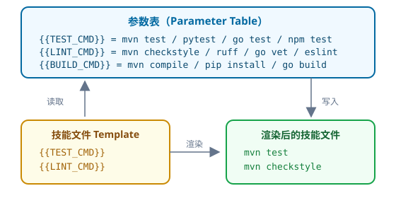
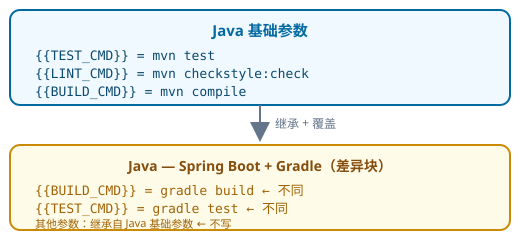

# 参数化：52 个占位符的设计取舍

> 核心思想系列 · 第二篇 · 约 10000 字 · 10 个 SVG 图

> **代码已更新**：本文最初写于系统有 52 个占位符时，后续扩展未改变总数。本文保留初始设计决策的讨论，并在末尾标注了新增占位符的说明。

---

## 一、从"硬编码"到"参数化"：一个痛苦的故事

### 1.1 tayama-trip-plan 的"复制粘贴之痛"

tayama-trip-plan 是 Harness 脚手架的"原型"。在它被重构为参数化系统之前，每一个新项目都要经历这样的过程：

1. **复制**上一个项目完整的 `.harness/` 目录
2. **搜索**所有 pom.xml、application.yml、Dockerfile 中的项目名并替换
3. **修改**测试命令中的包路径和模块名
4. **调整**代码风格检查的配置
5. **手动**更新 README 中的项目描述

这个过程看似简单，但实际执行时充满了陷阱——漏掉某个文件中的项目名导致 CI 失败、测试命令中的路径写死换了目录就跑不通、框架版本号不一致导致兼容性问题。

```svg
<svg xmlns="http://www.w3.org/2000/svg" viewBox="0 0 960 260" font-family="'SF Pro Display','Segoe UI','Microsoft YaHei',sans-serif">
  <defs>
    <linearGradient id="bg_p1" x1="0" y1="0" x2="0" y2="1"><stop offset="0%" stop-color="#0b1220"/><stop offset="100%" stop-color="#020617"/></linearGradient>
    <filter id="sh_p1"><feDropShadow dx="0" dy="4" stdDeviation="5" flood-color="#000" flood-opacity="0.4"/></filter>
  </defs>
  <rect width="800" height="260" fill="url(#bg_p1)" rx="10"/>
  <text x="400" y="25" text-anchor="middle" fill="#e2e8f0" font-size="28" font-weight="700">硬编码时代的"复制粘贴之痛"</text>
  <rect x="30" y="45" width="240" height="65" rx="8" fill="#ef4444" opacity="0.12" stroke="#ef4444" stroke-width="1.5" filter="url(#sh_p1)"/>
  <text x="150" y="65" text-anchor="middle" fill="#fca5a5" font-size="12" font-weight="700">Step 1：复制 .harness/ 目录</text>
  <text x="150" y="82" text-anchor="middle" fill="#94a3b8" font-size="10">cp -r project-a/.harness project-b/</text>
  <text x="150" y="98" text-anchor="middle" fill="#ef4444" font-size="9">⚠ 漏掉：.gitignore、.harness/config</text>
  <line x1="270" y1="77" x2="295" y2="77" stroke="#475569" stroke-width="2"/>
  <polygon points="300,77 292,72 292,82" fill="#94a3b8"/>
  <rect x="310" y="45" width="240" height="65" rx="8" fill="#f59e0b" opacity="0.12" stroke="#f59e0b" stroke-width="1.5" filter="url(#sh_p1)"/>
  <text x="430" y="65" text-anchor="middle" fill="#fde68a" font-size="12" font-weight="700">Step 2：搜索替换</text>
  <text x="430" y="82" text-anchor="middle" fill="#94a3b8" font-size="10">grep -rl "old-name" . | xargs sed -i</text>
  <text x="430" y="98" text-anchor="middle" fill="#ef4444" font-size="9">⚠ 误替换了不应该替换的字符串</text>
  <line x1="550" y1="77" x2="575" y2="77" stroke="#475569" stroke-width="2"/>
  <polygon points="580,77 572,72 572,82" fill="#94a3b8"/>
  <rect x="590" y="45" width="180" height="65" rx="8" fill="#ef4444" opacity="0.12" stroke="#ef4444" stroke-width="1.5" filter="url(#sh_p1)"/>
  <text x="680" y="65" text-anchor="middle" fill="#fca5a5" font-size="12" font-weight="700">Step 3：手动修复</text>
  <text x="680" y="82" text-anchor="middle" fill="#94a3b8" font-size="10">CI 失败 → 定位 → 修复</text>
  <text x="680" y="98" text-anchor="middle" fill="#ef4444" font-size="9">⚠ 每次修复都要花 30 分钟</text>
  <rect x="100" y="135" width="600" height="45" rx="8" fill="#1e293b" stroke="#475569" stroke-width="1" filter="url(#sh_p1)"/>
  <text x="400" y="155" text-anchor="middle" fill="#94a3b8" font-size="11">结果是：每个新项目需要 2-3 天的"适配"时间，而且每次都会出现新的遗漏</text>
  <text x="400" y="172" text-anchor="middle" fill="#ef4444" font-size="11" font-weight="700">问题根源：所有配置都是"硬编码"的，没有参数化抽象层</text>
  <text x="400" y="215" text-anchor="middle" fill="#475569" font-size="11">当从 Java 项目扩展到 Python/Go/Frontend 时，</text>
  <text x="400" y="232" text-anchor="middle" fill="#475569" font-size="11">硬编码的"适配成本"从 2 天暴增到 5 天——这时我们意识到必须参数化</text>
</svg>
```

### 1.2 从"一个项目"到"六个项目"的临界点

在 tayama-trip-plan 中，脚手架最初只服务于 Java + Spring Boot 项目。当团队开始接手 Python（FastAPI）和 Go（Gin）项目时，问题爆发了：

- **Java 的 Lint 命令**是 `mvn checkstyle:check`，Python 的是 `ruff check`，Go 的是 `go vet`
- **测试框架**不同：JUnit 5 vs pytest vs go test
- **构建工具**不同：Maven vs pip vs go mod
- **代码规范**不同：Checkstyle vs Ruff vs go vet

更关键的是，这些差异不是"一两个参数"的差异，而是**整个技能链的差异**。当技能文件从 8 个增加到几十个（10 个核心技能模板 × 多个语言包），硬编码的方式彻底不可维护。

### 1.3 参数化的"北极星"

参数化的核心目标很简单：**每个技能文件只写"这个技能应该做什么"，至于"怎么做"（用什么命令、什么工具、什么路径），从参数表里读。**

```svg

```

这就是 Harness 参数化系统的核心思想：**命令与技能分离，知识沉淀在参数表中。**

---

### 1.4 硬编码的三种"死法"

在 tayama-trip-plan 的实践中，硬编码的"坑"可以归纳为三种死法：

**死法一：死得不明不白**

团队接手一个 Python 项目时，复制了 Java 项目的 `.harness/` 目录。AI 按照 `{{TEST_CMD}}` 执行 `mvn test`——但 Python 项目根本没有 Maven。AI 卡住了，不知道怎么办。开发者花了 30 分钟才意识到：原来这里的命令是写死的。

**死法二：死得不知不觉**

更可怕的是"不知不觉"的死法。Java 项目中有 `mvn checkstyle:check`，Python 项目也有类似的需求——但开发者以为自己"记得"改了，实际上漏掉了。结果 AI 一直用 Python 的 `ruff` 检查 Java 代码风格，或者反过来，直到 Review 时才被发现。

**死法三：死得不可重复**

最糟糕的是"不同项目不同写法"：同一个命令，项目 A 写成 `mvn test`，项目 B 写成 `mvn test -DskipITs=false`，项目 C 写成 `mvn verify`。AI 在三个项目之间切换时，无法预测"测试"到底应该用什么命令——因为"测试"这个语义被硬编码成了不同的字符串。

这三种死法的共同根源是：**硬编码让"语义"和"语法"耦合了。** `{{TEST_CMD}}` 这个占位符代表的是"测试"这个语义，而 `mvn test` 只是这个语义在 Java 中的语法。参数化系统解耦了语义和语法——AI 只关心"测试"，参数表告诉 AI "怎么测试"。


## 二、52 个占位符：从收敛到扩展

### 2.1 为什么是 52 而不是更多？

52 不是一次设计出来的。在重构过程中，我们从 tayama-trip-plan 的 78 个硬编码值出发，经过三轮收敛得到 38 个核心占位符，随后在框架扩展与语言包扩充中新增了 14 个（38 → 52）：

- **第一轮（78 → 52）**：合并同类项。`mvn test`、`pytest`、`go test` 合并为 `{{TEST_CMD}}`
- **第二轮（52 → 42）**：移除冗余。参数表中不包含"常识性"值
- **第三轮（42 → 38）**：合并隐含值。`{{VET_CMD}}` 和 `{{LINT_CMD}}` 在 Java 中合并
- **扩展期（38 → 52）**：新增 14 个占位符。覆盖更多工程环节与语言差异（依赖管理、构建工具、API 契约、HTTP Mock、状态管理、框架版本等）

```svg
<svg xmlns="http://www.w3.org/2000/svg" viewBox="0 0 960 260" font-family="'SF Pro Display','Segoe UI','Microsoft YaHei',sans-serif">
  <defs>
    <linearGradient id="bg_p2" x1="0" y1="0" x2="0" y2="1"><stop offset="0%" stop-color="#0b1220"/><stop offset="100%" stop-color="#020617"/></linearGradient>
    <filter id="sh_p2"><feDropShadow dx="0" dy="4" stdDeviation="5" flood-color="#000" flood-opacity="0.4"/></filter>
  </defs>
  <rect width="800" height="260" fill="url(#bg_p2)" rx="10"/>
  <text x="400" y="25" text-anchor="middle" fill="#e2e8f0" font-size="28" font-weight="700">从 78 个硬编码值到 52 个占位符的收敛过程</text>
  <rect x="30" y="55" width="180" height="80" rx="10" fill="#ef4444" opacity="0.15" stroke="#ef4444" stroke-width="1.5" filter="url(#sh_p2)"/>
  <text x="120" y="78" text-anchor="middle" fill="#fca5a5" font-size="28" font-weight="700">78</text>
  <text x="120" y="98" text-anchor="middle" fill="#94a3b8" font-size="10">硬编码值</text>
  <text x="120" y="115" text-anchor="middle" fill="#64748b" font-size="9">几十个技能文件的所有重复命令</text>
  <line x1="210" y1="95" x2="240" y2="95" stroke="#475569" stroke-width="2"/>
  <polygon points="245,95 237,90 237,100" fill="#94a3b8"/>
  <text x="225" y="85" fill="#f59e0b" font-size="9">合并</text>
  <text x="225" y="108" fill="#f59e0b" font-size="9">同类项</text>
  <rect x="255" y="55" width="140" height="80" rx="10" fill="#f59e0b" opacity="0.15" stroke="#f59e0b" stroke-width="1.5" filter="url(#sh_p2)"/>
  <text x="325" y="78" text-anchor="middle" fill="#fde68a" font-size="28" font-weight="700">52</text>
  <text x="325" y="98" text-anchor="middle" fill="#94a3b8" font-size="10">合并后</text>
  <line x1="395" y1="95" x2="425" y2="95" stroke="#475569" stroke-width="2"/>
  <polygon points="430,95 422,90 422,100" fill="#94a3b8"/>
  <text x="410" y="85" fill="#22c55e" font-size="9">移除</text>
  <text x="410" y="108" fill="#22c55e" font-size="9">冗余</text>
  <rect x="440" y="55" width="140" height="80" rx="10" fill="#22c55e" opacity="0.12" stroke="#22c55e" stroke-width="1.5" filter="url(#sh_p2)"/>
  <text x="510" y="78" text-anchor="middle" fill="#86efac" font-size="28" font-weight="700">42</text>
  <text x="510" y="98" text-anchor="middle" fill="#94a3b8" font-size="10">去冗余</text>
  <line x1="580" y1="95" x2="610" y2="95" stroke="#475569" stroke-width="2"/>
  <polygon points="615,95 607,90 607,100" fill="#94a3b8"/>
  <text x="600" y="85" fill="#3b82f6" font-size="9">合并</text>
  <text x="600" y="108" fill="#3b82f6" font-size="9">隐含</text>
  <rect x="625" y="55" width="145" height="80" rx="10" fill="#3b82f6" opacity="0.12" stroke="#3b82f6" stroke-width="1.5" filter="url(#sh_p2)"/>
  <text x="697" y="78" text-anchor="middle" fill="#93c5fd" font-size="28" font-weight="700">38</text>
  <text x="697" y="98" text-anchor="middle" fill="#94a3b8" font-size="10">最终占位符</text>
    <line x1="770" y1="95" x2="795" y2="95" stroke="#475569" stroke-width="2"/>
  <polygon points="800,95 792,90 792,100" fill="#94a3b8"/>
  <text x="785" y="85" fill="#a855f7" font-size="9">扩展</text>
  <text x="785" y="108" fill="#a855f7" font-size="9">新增</text>
    <rect x="810" y="55" width="145" height="80" rx="10" fill="#a855f7" opacity="0.12" stroke="#a855f7" stroke-width="1.5" filter="url(#sh_p2)"/>
  <text x="882" y="78" text-anchor="middle" fill="#c084fc" font-size="28" font-weight="700">52</text>
  <text x="882" y="98" text-anchor="middle" fill="#94a3b8" font-size="10">当前占位符</text>
  <text x="400" y="195" text-anchor="middle" fill="#475569" font-size="11">收敛原则：减少"1 个占位符只服务 1 个框架"的特殊占位符</text>
  <text x="400" y="212" text-anchor="middle" fill="#475569" font-size="11">每个占位符至少覆盖 3 个以上框架的不同值</text>
  <text x="400" y="240" text-anchor="middle" fill="#64748b" font-size="10">78 → 52 → 42 → 38 三轮收敛提炼出 38 个核心，扩展期新增 14 个 → 当前 52 个</text>
</svg>
```

### 2.2 六大分类

52 个占位符分为六大类，每一类对应一个"技能领域"：

| 分类 | 数量 | 代表占位符 | 说明 |
|------|------|-----------|------|
| 构建与运行 | 8 | `{{BUILD_CMD}}` `{{RUN_CMD}}` `{{DEV_CMD}}` `{{TEST_CMD}}` `{{INTEGRATION_CMD}}` `{{COV_CMD}}` `{{DEP_CMD}}` `{{HEALTH_CHECK_CMD}}` | 构建、运行、开发、测试、依赖管理 |
| 代码规范 | 8 | `{{LINT_CMD}}` `{{FORMAT_TOOL}}` `{{FORMAT_CHECK_CMD}}` `{{VET_CMD}}` `{{TYPE_CHECK_CMD}}` `{{TYPE_CHECK_TOOL}}` `{{DOCSTYLE}}` `{{FILE_LIMIT}}` | 风格、格式、类型、规范检查 |
| 架构与质量 | 7 | `{{ARCH_TEST_CMD}}` `{{ARCH_TEST_TOOL}}` `{{ARCH_REVIEW_CMD}}` `{{SECURITY_CMD}}` `{{RACE_DETECT_ARG}}` `{{ARCH_LAYER}}` `{{METRICS_CHECK_CMD}}` | 架构约束、安全、竞态、可观测性 |
| 工具链 | 13 | `{{BUILD_TOOL}}` `{{COV_TOOL}}` `{{LINT_TOOL}}` `{{TEST_FRAMEWORK}}` `{{MOCK_LIB}}` `{{ASSERT_LIB}}` `{{HTTP_MOCK_UTIL}}` `{{UTIL_LIB}}` `{{ENV_LIB}}` `{{STATE_MGMT_LIB}}` `{{DB_ACCESS}}` `{{DEVTOOLS_TOOL}}` `{{DEBUG_TOOL}}` | 工具名、测试替身、库与中间件 |
| 框架与语言 | 9 | `{{LANGUAGE}}` `{{LANGUAGE_RUNTIME}}` `{{LANGUAGE_DESC}}` `{{FRAMEWORK_NAME}}` `{{FRAMEWORK_VER}}` `{{LANG_TAG}}` `{{ORM_TOOL}}` `{{API_FILE}}` `{{TEST_NAMING}}` | 语言、框架、API 契约、测试命名 |
| 基础设施 | 7 | `{{HARNESSING_CMD}}` `{{HARNESS_ME_NAME}}` `{{PROJECT_NAME}}` `{{HEALTH_ENDPOINT}}` `{{METRICS_ENDPOINT}}` `{{ROLLBACK_CMD}}` `{{PLACEHOLDER}}` | 元技能、端点、回滚、泛称示例 |

### 2.3 最"聪明"的占位符：{{LANGUAGE_DESC}}

在所有 52 个占位符中，`{{LANGUAGE_DESC}}` 是最特殊的一个——它不是一个"值"，而是一段**描述文字**，直接出现在技能的 `role` 字段中，决定了 AI 对这个项目的认知。

例如，对于 Java + Spring Boot 项目：

```
{{LANGUAGE_DESC}} = "你是一个 Java 后端工程师，使用 Spring Boot 3.x 框架，遵循 RESTful API 设计规范..."
```

对于 Python + FastAPI 项目：

```
{{LANGUAGE_DESC}} = "你是一个 Python 后端工程师，使用 FastAPI 框架，熟悉异步编程和 Pydantic 数据验证..."
```

这个占位符的作用是**让 AI 在每次对话开始时就知道自己"扮演"什么角色**。它出现在 `coding-skill` 的角色描述中，是 AI 编码行为的"第一性原理"。

```svg
<svg xmlns="http://www.w3.org/2000/svg" viewBox="0 0 800 200" font-family="'SF Pro Display','Segoe UI','Microsoft YaHei',sans-serif">
  <defs>
    <linearGradient id="bg_p3" x1="0" y1="0" x2="0" y2="1"><stop offset="0%" stop-color="#0b1220"/><stop offset="100%" stop-color="#020617"/></linearGradient>
    <filter id="sh_p3"><feDropShadow dx="0" dy="4" stdDeviation="5" flood-color="#000" flood-opacity="0.4"/></filter>
  </defs>
  <rect width="800" height="200" fill="url(#bg_p3)" rx="10"/>
  <text x="400" y="25" text-anchor="middle" fill="#e2e8f0" font-size="28" font-weight="700">52 个占位符的"生态位"</text>
  <rect x="30" y="45" width="115" height="50" rx="8" fill="#ef4444" opacity="0.12" stroke="#ef4444" stroke-width="1.5" filter="url(#sh_p3)"/>
  <text x="87" y="65" text-anchor="middle" fill="#fca5a5" font-size="11" font-weight="700">构建与运行</text>
  <text x="87" y="82" text-anchor="middle" fill="#94a3b8" font-size="9">8 个占位符</text>
  <rect x="155" y="45" width="115" height="50" rx="8" fill="#f59e0b" opacity="0.12" stroke="#f59e0b" stroke-width="1.5" filter="url(#sh_p3)"/>
  <text x="212" y="65" text-anchor="middle" fill="#fde68a" font-size="11" font-weight="700">代码规范</text>
  <text x="212" y="82" text-anchor="middle" fill="#94a3b8" font-size="9">8 个占位符</text>
  <rect x="280" y="45" width="115" height="50" rx="8" fill="#3b82f6" opacity="0.12" stroke="#3b82f6" stroke-width="1.5" filter="url(#sh_p3)"/>
  <text x="337" y="65" text-anchor="middle" fill="#93c5fd" font-size="11" font-weight="700">架构与质量</text>
  <text x="337" y="82" text-anchor="middle" fill="#94a3b8" font-size="9">7 个占位符</text>
  <rect x="405" y="45" width="115" height="50" rx="8" fill="#22c55e" opacity="0.12" stroke="#22c55e" stroke-width="1.5" filter="url(#sh_p3)"/>
  <text x="462" y="65" text-anchor="middle" fill="#86efac" font-size="11" font-weight="700">工具链</text>
  <text x="462" y="82" text-anchor="middle" fill="#94a3b8" font-size="9">13 个占位符</text>
  <rect x="530" y="45" width="115" height="50" rx="8" fill="#a855f7" opacity="0.12" stroke="#a855f7" stroke-width="1.5" filter="url(#sh_p3)"/>
  <text x="587" y="65" text-anchor="middle" fill="#d8b4fe" font-size="11" font-weight="700">框架与语言</text>
  <text x="587" y="82" text-anchor="middle" fill="#94a3b8" font-size="9">9 个占位符</text>
  <rect x="655" y="45" width="115" height="50" rx="8" fill="#06b6d4" opacity="0.12" stroke="#06b6d4" stroke-width="1.5" filter="url(#sh_p3)"/>
  <text x="712" y="65" text-anchor="middle" fill="#67e8f9" font-size="11" font-weight="700">基础设施</text>
  <text x="712" y="82" text-anchor="middle" fill="#94a3b8" font-size="9">7 个占位符</text>
  <text x="400" y="145" text-anchor="middle" fill="#475569" font-size="11">六大分类覆盖了从"如何构建"到"如何部署"的完整工程链路</text>
  <text x="400" y="175" text-anchor="middle" fill="#64748b" font-size="10">52 个占位符中，35 个属于"命令/工具"类，17 个属于"描述/元数据/框架"类</text>
</svg>
```

### 2.4 占位符的"命名规范"

52 个占位符遵循统一的命名规范，这让它们易于理解和使用：

- **{{TEST_CMD}}**：执行某个动作的命令（如 `{{TEST_CMD}}`、`{{BUILD_CMD}}`）
- **{{TEST_FRAMEWORK}}**：执行某个动作的工具名称（如 `{{TEST_FRAMEWORK}}`、`{{LINT_TOOL}}`）
- **{{LANGUAGE_DESC}}**：描述性参数（如 `{{LANGUAGE_DESC}}`、`{{LANGUAGE_DESC}}`）
- **{{HEALTH_ENDPOINT}}**：端点地址（如 `{{HEALTH_ENDPOINT}}`、`{{METRICS_ENDPOINT}}`）

命名规范的核心原则是：**看到名字就知道它是什么类型。** `{{TEST_CMD}}` 是"命令"，`{{TEST_FRAMEWORK}}` 是"工具名"，`{{LANGUAGE_DESC}}` 是"描述"。

### 2.5 占位符的"组合模式"

52 个占位符不是孤立的，它们之间存在组合关系：

- **成对出现**：`{{LINT_TOOL}}` + `{{LINT_CMD}}` = "用 Checkstyle 执行代码风格检查"
- **依赖关系**：`{{COV_CMD}}` 依赖 `{{TEST_CMD}}`（覆盖率需要先运行测试）
- **互斥关系**：`{{BUILD_CMD}}` 和 `{{RUN_CMD}}` 是同一流程的不同阶段

这种组合模式让 AI 可以"理解"参数之间的关系，而不是把它们当作孤立的字符串。


## 三、差异化参数块：基础参数 + 差异块

### 3.1 同一种设计模式

参数化面临的核心挑战是：**多数参数是相同的，只有少数参数因框架而异。**

如果每个框架都写一个完整的参数表，那么 111 个框架差异块，每个 52 个参数，就是 5772 行——臃肿且难以维护。

解决方案是**差异化参数块**：每个语言定义一个"基础参数"，每个框架只写与基础不同的参数。

```svg

```

### 3.2 差异化的三种模式

在参数化系统中，框架与基础的差异呈现三种模式：

**模式一：命令不同，语义相同**

这是最常见的模式。同一个"测试"语义，在不同框架中命令不同：
- Java (Maven): `mvn test`
- Java (Gradle): `gradle test`
- Python: `pytest`
- Go: `go test ./...`
- Frontend: `npm test`

**模式二：工具不同，命令不同**

同一个"代码规范检查"，不同生态使用不同的工具：
- Java: `mvn checkstyle:check`（Checkstyle）
- Python: `ruff check`（Ruff）
- Go: `go vet`（内置）
- Frontend: `eslint .`（ESLint）

**模式三：语言差异，完全不同的参数**

这是最"极端"的模式——不同语言有完全不同的参数：
- `{{HTTP_MOCK_UTIL}}`：Java 用 WireMock，Python 用 httpx-mock，Go 用 httptest，Rust 用 httpmock/wiremock
- `{{ORM_TOOL}}`：Java 用 JPA/MyBatis，Python 用 SQLAlchemy，Go 用 GORM，Rust 用 SQLx/Diesel/SeaORM
- `{{RACE_DETECT_ARG}}`：Java 不需要，Go 需要 `-race`，Rust 所有权/借用保证线程安全

### 3.3 ML/AI 框架的特殊处理

在第二轮扩展中，我们加入了大量 ML/AI/LLM 框架。这些框架与传统 Web 框架有本质区别——它们没有"分层架构"、"数据库访问"、"REST API"。

对于这些框架，差异化参数块做了特殊处理：
- `{{ARCH_LAYER}}`：从"Controller/Service/Repository"变为"数据管道/模型/推理"
- `{{DB_ACCESS}}`：从"数据库"变为"训练数据源/向量数据库"
- `{{HEALTH_ENDPOINT}}`：从 /health 变为 /status（模型状态）

这让参数化系统不仅支持"Web 框架"，还能支持**任何类型的工程框架**。

```svg
<svg xmlns="http://www.w3.org/2000/svg" viewBox="0 0 800 280" font-family="'SF Pro Display','Segoe UI','Microsoft YaHei',sans-serif">
  <defs>
    <linearGradient id="bg_p4" x1="0" y1="0" x2="0" y2="1"><stop offset="0%" stop-color="#0b1220"/><stop offset="100%" stop-color="#020617"/></linearGradient>
    <filter id="sh_p4"><feDropShadow dx="0" dy="4" stdDeviation="5" flood-color="#000" flood-opacity="0.4"/></filter>
  </defs>
  <rect width="800" height="280" fill="url(#bg_p4)" rx="10"/>
  <text x="400" y="25" text-anchor="middle" fill="#e2e8f0" font-size="28" font-weight="700">差异化参数块的三种模式</text>
  <rect x="30" y="50" width="230" height="90" rx="10" fill="#3b82f6" opacity="0.08" stroke="#3b82f6" stroke-width="1.5" filter="url(#sh_p4)"/>
  <text x="145" y="72" text-anchor="middle" fill="#93c5fd" font-size="12" font-weight="700">模式一：命令不同，语义相同</text>
  <text x="145" y="92" text-anchor="middle" fill="#94a3b8" font-size="9">Maven: mvn test</text>
  <text x="145" y="106" text-anchor="middle" fill="#94a3b8" font-size="9">Gradle: gradle test</text>
  <text x="145" y="120" text-anchor="middle" fill="#94a3b8" font-size="9">pytest: pytest</text>
  <text x="145" y="134" text-anchor="middle" fill="#64748b" font-size="8">占位符：{{TEST_CMD}} 覆盖 5+ 框架</text>
  <rect x="285" y="50" width="230" height="90" rx="10" fill="#22c55e" opacity="0.08" stroke="#22c55e" stroke-width="1.5" filter="url(#sh_p4)"/>
  <text x="400" y="72" text-anchor="middle" fill="#86efac" font-size="12" font-weight="700">模式二：工具不同，命令不同</text>
  <text x="400" y="92" text-anchor="middle" fill="#94a3b8" font-size="9">Java: Checkstyle → mvn checkstyle</text>
  <text x="400" y="106" text-anchor="middle" fill="#94a3b8" font-size="9">Python: Ruff → ruff check</text>
  <text x="400" y="120" text-anchor="middle" fill="#94a3b8" font-size="9">Go: go vet</text>
  <text x="400" y="134" text-anchor="middle" fill="#64748b" font-size="8">占位符：{{LINT_TOOL}} + {{LINT_CMD}}</text>
  <rect x="540" y="50" width="230" height="90" rx="10" fill="#a855f7" opacity="0.08" stroke="#a855f7" stroke-width="1.5" filter="url(#sh_p4)"/>
  <text x="655" y="72" text-anchor="middle" fill="#d8b4fe" font-size="12" font-weight="700">模式三：语言差异，完全不同</text>
  <text x="655" y="92" text-anchor="middle" fill="#94a3b8" font-size="9">Java: WireMock</text>
  <text x="655" y="106" text-anchor="middle" fill="#94a3b8" font-size="9">Python: httpx-mock</text>
  <text x="655" y="120" text-anchor="middle" fill="#94a3b8" font-size="9">Go: httptest</text>
  <text x="655" y="134" text-anchor="middle" fill="#64748b" font-size="8">占位符：{{HTTP_MOCK_UTIL}}</text>
  <text x="400" y="190" text-anchor="middle" fill="#475569" font-size="11">差异化参数块的核心设计哲学：</text>
  <text x="400" y="210" text-anchor="middle" fill="#94a3b8" font-size="10">1. 基础参数定义"通用值"，差异块只写"不同值"</text>
  <text x="400" y="226" text-anchor="middle" fill="#94a3b8" font-size="10">2. ML/AI 框架的 {{ARCH_LAYER}} 切换为"数据管道/模型/推理"</text>
  <text x="400" y="242" text-anchor="middle" fill="#94a3b8" font-size="10">3. 差异块继承基础参数，未覆盖的自动使用基础值</text>
  <text x="400" y="265" text-anchor="middle" fill="#64748b" font-size="9">这样 80+ 个框架差异块只需要对应差异块 + 5 个基础块，而不是全部参数行都写一遍</text>
</svg>
```

## 四、从"一次"到"70+"：框架扩展的工程实践

### 4.1 第一轮：5 种语言 x 基础框架

第一轮参数化扩展覆盖了最常用的框架：

- **Java**：Spring Boot (Maven/Gradle)、Quarkus、Micronaut、Vert.x、Dropwizard、Spring MVC
- **Python**：FastAPI、Flask、Django
- **Go**：Gin、go-zero、Echo、Fiber、Chi
- **Rust**：Axum、Actix Web、Rocket、Warp、Poem、Loco、Salvo
- **Frontend**：Vue 3 (Vite/CLI)、React (Vite/CRA)、Next.js、Angular、Svelte、Nuxt

这一轮定义了完整的参数化骨架——52 个占位符、6 大分类、差异化参数块。

### 4.2 第二轮：111 个框架差异块的全面扩展

第二轮加入了 AI/LLM 框架和更多主流框架：

- **Java 新增**：Dubbo、Spring Cloud Alibaba、Spring AI、Spring AI Alibaba、AgentScope Java、LangChain4j、Semantic Kernel、Genkit Java
- **Python 新增**：TensorFlow、PyTorch、Keras、scikit-learn、XGBoost、LangChain、LangGraph、CrewAI、PydanticAI、SmolAgents、OpenAI Agents SDK、Hugging Face Transformers、Tornado
- **Go 新增**：LangChainGo、Google ADK-Go、cloudwego/eino、tRPC-Agent-Go、Firebase Genkit、Anyi、Beego、Go-Kit、Go-Kratos、Gorilla Mux、Kitex、Hertz、Iris、Macaron、Tango、goframe
- **Rust 新增**：Candle、Burn、tch-rs、ort、rlx-models、ADK-Rust、Blockcell、vLLM、Tauri、Iced、egui、Dioxus
- **Frontend 新增**：无（第一轮已覆盖主流）

### 4.3 框架检测的"指纹"识别

每个框架需要一个"指纹"来识别。参数化系统定义了多种检测规则：

```yaml
# 检测规则示例
- framework: "Spring Boot"
  detect: ["pom.xml 含 spring-boot-starter", "build.gradle 含 org.springframework.boot"]
- framework: "FastAPI"
  detect: ["requirements.txt 含 fastapi", "pyproject.toml 含 fastapi"]
- framework: "Gin"
  detect: ["go.mod 含 github.com/gin-gonic/gin"]
- framework: "TensorFlow"
  detect: ["requirements.txt 含 tensorflow", "pyproject.toml 含 tensorflow"]
```

```svg
<svg xmlns="http://www.w3.org/2000/svg" viewBox="0 0 900 360" font-family="'SF Pro Display','Segoe UI','Microsoft YaHei',sans-serif">
  <defs>
    <linearGradient id="bg_p5" x1="0" y1="0" x2="0" y2="1">
      <stop offset="0%" stop-color="#0b1220"/>
      <stop offset="100%" stop-color="#020617"/>
    </linearGradient>
    <filter id="sh_p5">
      <feDropShadow dx="0" dy="4" stdDeviation="5" flood-color="#000" flood-opacity="0.4"/>
    </filter>
  </defs>
  
  <rect width="900" height="360" fill="url(#bg_p5)" rx="10"/>
  <text x="450" y="32" text-anchor="middle" fill="#e2e8f0" font-size="26" font-weight="700">框架检测规则 (Detection Rules)</text>
  <text x="450" y="52" text-anchor="middle" fill="#64748b" font-size="12">基于框架特征文件（pom.xml, go.mod 等）进行自动识别与匹配</text>

  <!-- 规则说明区 -->
  <rect x="25" y="75" width="850" height="55" rx="8" fill="#1e293b" stroke="#334155" stroke-width="1" filter="url(#sh_p5)"/>
  <text x="50" y="95" fill="#94a3b8" font-size="11">规则结构：</text>
  <rect x="110" y="83" width="80" height="18" rx="4" fill="#3b82f6" opacity="0.15" stroke="#3b82f6" stroke-width="0.5"/>
  <text x="150" y="96" text-anchor="middle" fill="#93c5fd" font-size="10">framework</text>
  <text x="195" y="96" fill="#64748b" font-size="10">:  "</text>
  <rect x="250" y="83" width="80" height="18" rx="4" fill="#f59e0b" opacity="0.15" stroke="#f59e0b" stroke-width="0.5"/>
  <text x="290" y="96" text-anchor="middle" fill="#fde68a" font-size="10">Spring Boot</text>
  <text x="340" y="96" fill="#64748b" font-size="10">"</text>
  
  <text x="375" y="96" fill="#94a3b8" font-size="11">, detect: [</text>
  
  <rect x="470" y="83" width="115" height="18" rx="4" fill="#22c55e" opacity="0.15" stroke="#22c55e" stroke-width="0.5"/>
  <text x="527" y="96" text-anchor="middle" fill="#86efac" font-size="10">pom.xml 含 xxx</text>
  <text x="595" y="96" fill="#64748b" font-size="10">,</text>
  
  <rect x="605" y="83" width="125" height="18" rx="4" fill="#a855f7" opacity="0.15" stroke="#a855f7" stroke-width="0.5"/>
  <text x="667" y="96" text-anchor="middle" fill="#d8b4fe" font-size="10">build.gradle 含 xxx</text>
  <text x="745" y="96" fill="#64748b" font-size="10">]</text>
  
  <text x="50" y="117" fill="#64748b" font-size="10">✦ 规则引擎按顺序匹配，命中任意一条检测条件即可识别对应框架。</text>

  <!-- ============ 四条示例框架 ============ -->
  
  <!-- 框架 1：Spring Boot -->
  <rect x="25" y="145" width="205" height="95" rx="8" fill="#1e293b" stroke="#3b82f6" stroke-width="1" opacity="0.8" filter="url(#sh_p5)"/>
  <rect x="25" y="145" width="205" height="20" rx="8" fill="#3b82f6" opacity="0.2"/>
  <text x="127" y="159" text-anchor="middle" fill="#93c5fd" font-size="11" font-weight="600">Spring Boot</text>
  <line x1="25" y1="165" x2="230" y2="165" stroke="#3b82f6" stroke-width="0.5" stroke-dasharray="3,3" opacity="0.4"/>
  <text x="35" y="182" fill="#94a3b8" font-size="9">detect:</text>
  <text x="35" y="198" fill="#64748b" font-size="9">• pom.xml 含 spring-boot-starter</text>
  <text x="35" y="214" fill="#64748b" font-size="9">• build.gradle 含 org.springframework.boot</text>

  <!-- 框架 2：FastAPI -->
  <rect x="245" y="145" width="205" height="95" rx="8" fill="#1e293b" stroke="#22c55e" stroke-width="1" opacity="0.8" filter="url(#sh_p5)"/>
  <rect x="245" y="145" width="205" height="20" rx="8" fill="#22c55e" opacity="0.2"/>
  <text x="347" y="159" text-anchor="middle" fill="#86efac" font-size="11" font-weight="600">FastAPI</text>
  <line x1="245" y1="165" x2="450" y2="165" stroke="#22c55e" stroke-width="0.5" stroke-dasharray="3,3" opacity="0.4"/>
  <text x="255" y="182" fill="#94a3b8" font-size="9">detect:</text>
  <text x="255" y="198" fill="#64748b" font-size="9">• requirements.txt 含 fastapi</text>
  <text x="255" y="214" fill="#64748b" font-size="9">• pyproject.toml 含 fastapi</text>

  <!-- 框架 3：Gin -->
  <rect x="465" y="145" width="205" height="95" rx="8" fill="#1e293b" stroke="#f59e0b" stroke-width="1" opacity="0.8" filter="url(#sh_p5)"/>
  <rect x="465" y="145" width="205" height="20" rx="8" fill="#f59e0b" opacity="0.2"/>
  <text x="567" y="159" text-anchor="middle" fill="#fde68a" font-size="11" font-weight="600">Gin</text>
  <line x1="465" y1="165" x2="670" y2="165" stroke="#f59e0b" stroke-width="0.5" stroke-dasharray="3,3" opacity="0.4"/>
  <text x="475" y="182" fill="#94a3b8" font-size="9">detect:</text>
  <text x="475" y="198" fill="#64748b" font-size="9">• go.mod 含 github.com/gin-gonic/gin</text>

  <!-- 框架 4：TensorFlow -->
  <rect x="685" y="145" width="190" height="95" rx="8" fill="#1e293b" stroke="#a855f7" stroke-width="1" opacity="0.8" filter="url(#sh_p5)"/>
  <rect x="685" y="145" width="190" height="20" rx="8" fill="#a855f7" opacity="0.2"/>
  <text x="780" y="159" text-anchor="middle" fill="#d8b4fe" font-size="11" font-weight="600">TensorFlow</text>
  <line x1="685" y1="165" x2="875" y2="165" stroke="#a855f7" stroke-width="0.5" stroke-dasharray="3,3" opacity="0.4"/>
  <text x="695" y="182" fill="#94a3b8" font-size="9">detect:</text>
  <text x="695" y="198" fill="#64748b" font-size="9">• requirements.txt 含 tensorflow</text>
  <text x="695" y="214" fill="#64748b" font-size="9">• pyproject.toml 含 tensorflow</text>

  <!-- 底部分隔线 -->
  <line x1="50" y1="265" x2="850" y2="265" stroke="#334155" stroke-width="1" stroke-dasharray="4,4"/>

  <!-- 规则总结 -->
  <text x="450" y="290" text-anchor="middle" fill="#475569" font-size="12">差异化检测设计哲学</text>
  <text x="450" y="310" text-anchor="middle" fill="#94a3b8" font-size="10">1. 根据语言生态选择标准特征文件（Java→pom, Python→requirements.txt, Go→go.mod）</text>
  <text x="450" y="326" text-anchor="middle" fill="#94a3b8" font-size="10">2. 使用矩阵扩展原则：60+ 框架仅需要配置 60+ 条检测规则，而非编写复杂解析逻辑</text>
  <text x="450" y="342" text-anchor="middle" fill="#64748b" font-size="9">在实际解析中，优先匹配框架，再根据匹配到的框架去读取对应的差异化参数块</text>
</svg>
```

这些检测规则覆盖了包管理器文件、配置文件、源码特征等多种模式，确保无论项目使用什么框架，都能被准确识别。
### 4.4 同一个占位符，五种语言的映射

理解参数化的最佳方式，是看同一个占位符在五种语言中的不同值。以 `{{TEST_CMD}}` 和 `{{LINT_CMD}}` 为例：

| 语言 | {{TEST_CMD}} | {{LINT_CMD}} | {{COV_CMD}} |
|------|-------------|-------------|-------------|
| Java | mvn test | mvn checkstyle:check | mvn jacoco:report |
| Python | pytest | ruff check | pytest --cov |
| Go | go test ./... | go vet | go test -cover ./... |
| Rust | cargo test | cargo clippy -- -D warnings | cargo llvm-cov --workspace --summary-only |
| Frontend | npm test | eslint . | vitest run --coverage |

这个表格揭示了参数化的核心洞察：**语义相同，语法不同。** AI 不需要知道"如何测试 Java"和"如何测试 Python"——它只需要知道"{{TEST_CMD}} 会执行测试"，然后从参数表中读取具体的命令。

更进一步，同一个占位符在不同**框架**（而非语言）中的差异也很大。以 Java 为例：

| 框架 | {{BUILD_CMD}} | {{TEST_CMD}} |
|------|--------------|-------------|
| Spring Boot (Maven) | mvn compile | mvn test |
| Spring Boot (Gradle) | gradle assemble | gradle test |
| Quarkus | ./mvnw compile | ./mvnw test |
| Micronaut | ./mvnw compile | ./mvnw test |

这显示了差异化参数块的威力：同一个语言内的不同框架，只需要覆盖差异参数，其余继承基础参数。

### 4.5 差异块设计的"最小化原则"

在维护 111 个差异块的过程中，我们总结出一个重要原则：**差异块越短越好。**

一个理想的差异块，应该只包含"这个框架独有的"参数。如果某个差异块和三四个其他框架共用同一组参数，说明这些框架应该共享一个"基础块"。

例如，Java 的所有 Maven 框架（Spring Boot、Quarkus、Micronaut）都可以共享 `mvn` 命令，只有少数字段不同。如果每个框架都写 `{{BUILD_CMD}} = mvn compile`，就违反了"最小化原则"。

差异块的最小化有三个好处：
1. **易维护**：修改一个基础参数，所有继承的框架自动更新
2. **易理解**：看差异块就能知道"这个框架和基础的唯一区别是什么"
3. **易扩展**：新增框架时，只需要比较它和基础块的差异

```svg
<svg xmlns="http://www.w3.org/2000/svg" viewBox="0 0 960 260" font-family="'SF Pro Display','Segoe UI','Microsoft YaHei',sans-serif">
  <defs>
    <linearGradient id="bg_p11" x1="0" y1="0" x2="0" y2="1"><stop offset="0%" stop-color="#0b1220"/><stop offset="100%" stop-color="#020617"/></linearGradient>
    <filter id="sh_p11"><feDropShadow dx="0" dy="4" stdDeviation="5" flood-color="#000" flood-opacity="0.4"/></filter>
  </defs>
  <rect width="800" height="260" fill="url(#bg_p11)" rx="10"/>
  <text x="400" y="25" text-anchor="middle" fill="#e2e8f0" font-size="28" font-weight="700">同一个占位符，五种语言的映射</text>
  <rect x="20" y="45" width="115" height="55" rx="8" fill="#3b82f6" opacity="0.12" stroke="#3b82f6" stroke-width="1.5" filter="url(#sh_p11)"/>
  <text x="77" y="65" text-anchor="middle" fill="#93c5fd" font-size="12" font-weight="700">Java</text>
  <text x="77" y="84" text-anchor="middle" fill="#94a3b8" font-size="10">mvn test</text>
  <rect x="143" y="45" width="115" height="55" rx="8" fill="#22c55e" opacity="0.12" stroke="#22c55e" stroke-width="1.5" filter="url(#sh_p11)"/>
  <text x="200" y="65" text-anchor="middle" fill="#86efac" font-size="12" font-weight="700">Python</text>
  <text x="200" y="84" text-anchor="middle" fill="#94a3b8" font-size="10">pytest</text>
  <rect x="266" y="45" width="115" height="55" rx="8" fill="#f59e0b" opacity="0.12" stroke="#f59e0b" stroke-width="1.5" filter="url(#sh_p11)"/>
  <text x="323" y="65" text-anchor="middle" fill="#fde68a" font-size="12" font-weight="700">Go</text>
  <text x="323" y="84" text-anchor="middle" fill="#94a3b8" font-size="10">go test ./...</text>
  <rect x="389" y="45" width="115" height="55" rx="8" fill="#ec4899" opacity="0.12" stroke="#ec4899" stroke-width="1.5" filter="url(#sh_p11)"/>
  <text x="446" y="65" text-anchor="middle" fill="#f9a8d4" font-size="12" font-weight="700">Rust</text>
  <text x="446" y="84" text-anchor="middle" fill="#94a3b8" font-size="10">cargo test</text>
  <rect x="512" y="45" width="145" height="55" rx="8" fill="#a855f7" opacity="0.12" stroke="#a855f7" stroke-width="1.5" filter="url(#sh_p11)"/>
  <text x="584" y="65" text-anchor="middle" fill="#d8b4fe" font-size="12" font-weight="700">Frontend</text>
  <text x="584" y="84" text-anchor="middle" fill="#94a3b8" font-size="10">npm test</text>
  <line x1="77" y1="100" x2="77" y2="130" stroke="#475569" stroke-width="1.5" stroke-dasharray="4,3"/>
  <line x1="200" y1="100" x2="200" y2="130" stroke="#475569" stroke-width="1.5" stroke-dasharray="4,3"/>
  <line x1="323" y1="100" x2="323" y2="130" stroke="#475569" stroke-width="1.5" stroke-dasharray="4,3"/>
  <line x1="446" y1="100" x2="446" y2="130" stroke="#475569" stroke-width="1.5" stroke-dasharray="4,3"/>
  <line x1="584" y1="100" x2="584" y2="130" stroke="#475569" stroke-width="1.5" stroke-dasharray="4,3"/>
  <rect x="60" y="135" width="680" height="50" rx="8" fill="#1e293b" stroke="#475569" stroke-width="1" filter="url(#sh_p11)"/>
  <text x="400" y="155" text-anchor="middle" fill="#e2e8f0" font-size="13" font-weight="700">{{TEST_CMD}}：语义相同，语法不同</text>
  <text x="400" y="174" text-anchor="middle" fill="#94a3b8" font-size="10">AI 不需要知道"如何测试 Java"，它只需要知道"{{TEST_CMD}} 会执行测试"</text>
  <text x="400" y="215" text-anchor="middle" fill="#475569" font-size="11">差异块最小化原则：一个理想的差异块只包含"这个框架独有的"参数</text>
  <text x="400" y="235" text-anchor="middle" fill="#64748b" font-size="10">Java 的 Maven 框架共享 {{BUILD_CMD}}=mvn compile，只有少数字段不同</text>
</svg>
```

### 4.6 差异块的"优先级规则"

当检测到多个框架时（比如 Java + Spring Boot + Dubbo），参数化系统需要决定使用哪个差异块。这通过优先级规则解决：

1. **具体框架优先于通用框架**：Dubbo 的差异块优先于 Spring Boot 的差异块
2. **语言优先于框架**：如果检测到的框架属于不同语言，以语言为最高优先级
3. **用户覆盖优先**：用户自定义的参数（.harness/parameters.local.md）拥有最高优先级

这些规则确保了"多框架"场景下的确定性——无论检测到多少框架，最终都会生成一个确定性的参数集。
## 五、每个占位符的设计取舍

### 5.1 {{TEST_CMD}}：最"简单"也最"复杂"的占位符

`{{TEST_CMD}}` 是所有占位符中最基础的一个，但它的设计取舍一点也不简单。

**核心问题：测试命令应该包含"运行"还是"运行+报告"？**

两个选项：
- **窄定义**：`{{TEST_CMD}}` = `mvn test`（只运行测试）
- **宽定义**：`{{TEST_CMD}}` = `mvn test jacoco:report`（运行+报告）

最终选择了**窄定义**。理由：测试和覆盖率报告是两个不同的技能动作，如果合并到一个命令中，覆盖率技能无法独立控制是否运行测试。

```svg
<svg xmlns="http://www.w3.org/2000/svg" viewBox="0 0 800 200" font-family="'SF Pro Display','Segoe UI','Microsoft YaHei',sans-serif">
  <defs>
    <linearGradient id="bg_p5" x1="0" y1="0" x2="0" y2="1"><stop offset="0%" stop-color="#0b1220"/><stop offset="100%" stop-color="#020617"/></linearGradient>
    <filter id="sh_p5"><feDropShadow dx="0" dy="4" stdDeviation="5" flood-color="#000" flood-opacity="0.4"/></filter>
  </defs>
  <rect width="800" height="200" fill="url(#bg_p5)" rx="10"/>
  <text x="400" y="25" text-anchor="middle" fill="#e2e8f0" font-size="28" font-weight="700">{{TEST_CMD}} 的"窄定义 vs 宽定义" 取舍</text>
  <rect x="30" y="50" width="350" height="90" rx="10" fill="#ef4444" opacity="0.08" stroke="#ef4444" stroke-width="1.5" filter="url(#sh_p5)"/>
  <text x="205" y="72" text-anchor="middle" fill="#fca5a5" font-size="12" font-weight="700">窄定义（选中）</text>
  <text x="205" y="92" text-anchor="middle" fill="#94a3b8" font-size="10">{{TEST_CMD}} = mvn test</text>
  <text x="205" y="108" text-anchor="middle" fill="#94a3b8" font-size="10">{{COV_CMD}} = mvn jacoco:report</text>
  <text x="205" y="126" text-anchor="middle" fill="#22c55e" font-size="9">✓ 测试和覆盖率可独立运行</text>
  <rect x="420" y="50" width="350" height="90" rx="10" fill="#94a3b8" opacity="0.08" stroke="#94a3b8" stroke-width="1.5" filter="url(#sh_p5)"/>
  <text x="595" y="72" text-anchor="middle" fill="#94a3b8" font-size="12" font-weight="700">宽定义（舍弃）</text>
  <text x="595" y="92" text-anchor="middle" fill="#94a3b8" font-size="10">{{TEST_CMD}} = mvn test jacoco:report</text>
  <text x="595" y="108" text-anchor="middle" fill="#94a3b8" font-size="10">两合一</text>
  <text x="595" y="126" text-anchor="middle" fill="#ef4444" font-size="9">✗ 覆盖率技能无法独立控制</text>
  <text x="400" y="175" text-anchor="middle" fill="#475569" font-size="11">设计原则：一个占位符只做一件事，命令的粒度与技能动作的粒度对齐</text>
</svg>
```

### 5.2 {{LINT_CMD}} vs {{VET_CMD}}：Java 的"合并"vs Go 的"分离"

一个有趣的取舍出现在代码规范检查领域。`{{LINT_CMD}}` 和 `{{VET_CMD}}` 在 Java 中合并了，但在 Go 中没有。

- **Java**：Checkstyle 负责代码风格，SpotBugs 负责潜在 Bug，但两者都通过 Maven 插件运行，且通常一起执行。所以 `{{VET_CMD}}` 在 Java 中合并到 `{{LINT_CMD}}`。
- **Go**：`go vet` 是独立的静态分析工具，与 `golangci-lint` 职责不同，所以保持分离。

这个取舍说明：**占位符的粒度不是由"语言"决定的，而是由"生态的工作方式"决定的。**

### 5.3 {{LANGUAGE_DESC}}：最"不技术"但最关键的占位符

`{{LANGUAGE_DESC}}` 是唯一一个不是"命令/工具"的占位符。它是一段自然语言描述，直接出现在技能的 `role` 字段中。

它的设计有几个关键考虑：

- **长度控制**：太短导致 AI 无法准确理解角色，太长导致 token 浪费。最终控制在 80-120 字。
- **结构统一**：所有框架的描述遵循"你是一个 [语言] [框架] 工程师，使用 [核心技术栈]..." 的模板
- **差异化**：Web 框架强调 API 规范，AI 框架强调模型开发流程，基础设施框架强调运维能力

### 5.4 {{BUILD_CMD}} vs {{RUN_CMD}} vs {{DEV_CMD}}：三个命令的分工

| 占位符 | 职责 | 典型值 |
|--------|------|--------|
| BUILD_CMD | 编译/构建（不运行） | `mvn compile` / `go build` |
| RUN_CMD | 启动项目 | `mvn spring-boot:run` / `uvicorn main:app` |
| DEV_CMD | 热重载开发 | `mvn spring-boot:run` / `uvicorn --reload` |

其中 `{{DEV_CMD}}` 是在第二轮才加入的。原因是 AI 在开发模式下需要热重载，但生产部署不需要。这个拆分让"开发"和"部署"使用不同的命令。

### 5.5 {{ARCH_LAYER}} 和 {{DB_ACCESS}}：最"结构"的占位符

这两个占位符决定了 AI 对项目架构的认知：

- `{{ARCH_LAYER}}`：描述项目的分层架构（controller/service/repository 或 router/handler/model）
- `{{DB_ACCESS}}`：描述数据库访问方式（JPA/MyBatis/SQLAlchemy/GORM）

它们的特殊性在于：**不是直接用在命令中的，而是用在 AI 的"架构认知"中的。** 当 AI 知道项目的分层结构后，生成的代码才会自动遵循该结构。

### 5.6 {{HARNESSING_CMD}} 和 {{HARNESS_ME_NAME}}：元占位符

这两个占位符是特殊的——它们不是"工程命令"，而是"脚手架自身的命令"：

- `{{HARNESSING_CMD}}`：`/harnessing`（需求拷问引擎的入口）
- `{{HARNESS_ME_NAME}}`：`/harness-me`（设计方案打磨的入口）

它们的存在说明：**参数化系统也参数化了自身。** 即使脚手架本身，也遵循"参数化"的原则。

```svg
<svg xmlns="http://www.w3.org/2000/svg" viewBox="0 0 800 320" font-family="'SF Pro Display','Segoe UI','Microsoft YaHei',sans-serif">
  <defs>
    <linearGradient id="bg_p6" x1="0" y1="0" x2="0" y2="1"><stop offset="0%" stop-color="#0b1220"/><stop offset="100%" stop-color="#020617"/></linearGradient>
    <filter id="sh_p6"><feDropShadow dx="0" dy="4" stdDeviation="5" flood-color="#000" flood-opacity="0.4"/></filter>
  </defs>
  <rect width="800" height="320" fill="url(#bg_p6)" rx="10"/>
  <text x="400" y="25" text-anchor="middle" fill="#e2e8f0" font-size="28" font-weight="700">52 个占位符的设计取舍矩阵</text>
  <rect x="20" y="45" width="185" height="55" rx="8" fill="#3b82f6" opacity="0.1" stroke="#3b82f6" stroke-width="1" filter="url(#sh_p6)"/>
  <text x="112" y="63" text-anchor="middle" fill="#93c5fd" font-size="11" font-weight="700">{{TEST_CMD}}</text>
  <text x="112" y="80" text-anchor="middle" fill="#94a3b8" font-size="9">窄定义，不合并覆盖率</text>
  <rect x="215" y="45" width="185" height="55" rx="8" fill="#22c55e" opacity="0.1" stroke="#22c55e" stroke-width="1" filter="url(#sh_p6)"/>
  <text x="307" y="63" text-anchor="middle" fill="#86efac" font-size="11" font-weight="700">{{LINT_CMD}}</text>
  <text x="307" y="80" text-anchor="middle" fill="#94a3b8" font-size="9">Java 合并 VET，Go 分离</text>
  <rect x="410" y="45" width="185" height="55" rx="8" fill="#a855f7" opacity="0.1" stroke="#a855f7" stroke-width="1" filter="url(#sh_p6)"/>
  <text x="502" y="63" text-anchor="middle" fill="#d8b4fe" font-size="11" font-weight="700">{{LANGUAGE_DESC}}</text>
  <text x="502" y="80" text-anchor="middle" fill="#94a3b8" font-size="9">自然语言角色描述</text>
  <rect x="605" y="45" width="175" height="55" rx="8" fill="#f59e0b" opacity="0.1" stroke="#f59e0b" stroke-width="1" filter="url(#sh_p6)"/>
  <text x="692" y="63" text-anchor="middle" fill="#fde68a" font-size="11" font-weight="700">{{BUILD_CMD}}</text>
  <text x="692" y="80" text-anchor="middle" fill="#94a3b8" font-size="9">与 RUN/DEV 分离</text>
  <rect x="20" y="110" width="185" height="55" rx="8" fill="#06b6d4" opacity="0.1" stroke="#06b6d4" stroke-width="1" filter="url(#sh_p6)"/>
  <text x="112" y="128" text-anchor="middle" fill="#67e8f9" font-size="11" font-weight="700">{{ARCH_LAYER}}</text>
  <text x="112" y="145" text-anchor="middle" fill="#94a3b8" font-size="9">架构认知，非命令</text>
  <rect x="215" y="110" width="185" height="55" rx="8" fill="#ef4444" opacity="0.1" stroke="#ef4444" stroke-width="1" filter="url(#sh_p6)"/>
  <text x="307" y="128" text-anchor="middle" fill="#fca5a5" font-size="11" font-weight="700">{{DB_ACCESS}}</text>
  <text x="307" y="145" text-anchor="middle" fill="#94a3b8" font-size="9">数据访问方式</text>
  <rect x="410" y="110" width="185" height="55" rx="8" fill="#3b82f6" opacity="0.1" stroke="#3b82f6" stroke-width="1" filter="url(#sh_p6)"/>
  <text x="502" y="128" text-anchor="middle" fill="#93c5fd" font-size="11" font-weight="700">{{HARNESSING_CMD}}</text>
  <text x="502" y="145" text-anchor="middle" fill="#94a3b8" font-size="9">自我参数化</text>
  <rect x="605" y="110" width="175" height="55" rx="8" fill="#22c55e" opacity="0.1" stroke="#22c55e" stroke-width="1" filter="url(#sh_p6)"/>
  <text x="692" y="128" text-anchor="middle" fill="#86efac" font-size="11" font-weight="700">{{SECURITY_CMD}}</text>
  <text x="692" y="145" text-anchor="middle" fill="#94a3b8" font-size="9">二次扩展加入</text>
  <text x="400" y="200" text-anchor="middle" fill="#475569" font-size="11">每个占位符的设计取舍遵循三条原则：</text>
  <text x="400" y="220" text-anchor="middle" fill="#94a3b8" font-size="10">1. 一个占位符只做一件事（单一职责）</text>
  <text x="400" y="237" text-anchor="middle" fill="#94a3b8" font-size="10">2. 粒度与"技能动作"对齐，与"语言生态"无关</text>
  <text x="400" y="254" text-anchor="middle" fill="#94a3b8" font-size="10">3. "命令"和"工具"分离（CMD 和 TOOL 成对出现）</text>
  <text x="400" y="280" text-anchor="middle" fill="#64748b" font-size="10">52 个占位符中，35 个属于"命令/工具"类，17 个属于"描述/元数据/框架"类</text>
  <text x="400" y="305" text-anchor="middle" fill="#64748b" font-size="10">三轮收敛后，没有"1 个框架独占"的占位符——每个占位符至少服务 3 个框架</text>
</svg>
```

### 5.7 {{COV_CMD}} 和 {{COV_TOOL}}：覆盖率工具的"生态选择"

覆盖率是衡量测试质量的关键指标，但不同语言的覆盖率工具差异巨大：

- **Java**：JaCoCo（事实标准，Maven 集成好）
- **Python**：pytest-cov（pytest 插件，一行命令搞定）
- **Go**：go test -cover（内置覆盖率，不需要外部工具）
- **Rust**：cargo llvm-cov（LLVM 覆盖率，支持分支覆盖）
- **Frontend**：Vitest/Istanbul（通过 vite/nyc 运行）

`{{COV_CMD}}` 和 `{{COV_TOOL}}` 的分离是一个有意的设计选择。`{{COV_TOOL}}` 告诉 AI"用什么工具"，`{{COV_CMD}}` 告诉 AI"怎么运行"。这样即使工具相同，命令也可以不同（比如 JaCoCo 可以通过 `mvn jacoco:report` 或 `mvn verify` 两种方式运行覆盖率）。

### 5.8 {{MOCK_LIB}} 和 {{HTTP_MOCK_UTIL}}：测试替身的"语言差异"

模拟（Mock）是测试中的核心需求，但不同语言的模拟库差异巨大：

| 语言 | 通用 Mock | HTTP Mock |
|------|----------|-----------|
| Java | Mockito | WireMock |
| Python | unittest.mock | httpx-mock / responses |
| Go | go-sqlmock / testify | httptest |
| Rust | mockall / wiremock | httpmock |
| Frontend | Vitest mock / Sinon | msw (Mock Service Worker) |

这个差异说明了一个重要问题：**Mock 不是"技术问题"，而是"生态问题"**。Java 的 Mockito 是"你用我也用"的生态选择，没有"更好"的替代品。参数化系统不试图评判哪种 Mock 更好，而是**记录"这个生态默认用什么"**。

### 5.9 {{ARCH_TEST_CMD}} 和 {{ARCH_REVIEW_CMD}}：架构约束的"自动化程度"

这两个占位符代表了架构约束的两种检查方式：

- `{{ARCH_TEST_CMD}}`：**自动化架构测试**（如 Java 的 ArchUnit、Python 的 pytest-arch）
- `{{ARCH_REVIEW_CMD}}`：**架构审查流程**（如 Go 的 goarch、Python 的 layered architecture 检查）

在 Java 中，ArchUnit 是一个成熟的架构测试框架，可以自动检查"Controller 不能直接调用 Repository"这类规则。但在 Python 和 Go 中，没有同等级的架构测试工具，所以 `{{ARCH_TEST_CMD}}` 在这些语言中可能为空或指向简化的架构检查脚本。

这个差异说明：**参数化系统容忍"缺失"**。如果一个框架没有某种能力，对应的占位符就是空值，而不是强行塞入一个不合适的工具。

### 5.10 {{ROLLBACK_CMD}} 和 {{DEBUG_TOOL}}：最"不常用"但最"救命"的占位符

这两个占位符属于"日常不用，出事后必用"的类型：

- `{{ROLLBACK_CMD}}`：回滚命令（git revert / kubectl rollout undo / 数据库回滚脚本）
- `{{DEBUG_TOOL}}`：调试工具（jdb / pdb / delve / Chrome DevTools）

它们的特殊性在于：**不是 AI 日常使用的命令，但必须存在**。当生产环境出问题时，AI 需要知道"怎么回滚"和"怎么调试"。参数化系统确保这些"救命命令"在需要时可用。

```svg
<svg xmlns="http://www.w3.org/2000/svg" viewBox="0 0 960 260" font-family="'SF Pro Display','Segoe UI','Microsoft YaHei',sans-serif">
  <defs>
    <linearGradient id="bg_p8" x1="0" y1="0" x2="0" y2="1"><stop offset="0%" stop-color="#0b1220"/><stop offset="100%" stop-color="#020617"/></linearGradient>
    <filter id="sh_p8"><feDropShadow dx="0" dy="4" stdDeviation="5" flood-color="#000" flood-opacity="0.4"/></filter>
  </defs>
  <rect width="800" height="260" fill="url(#bg_p8)" rx="10"/>
  <text x="400" y="25" text-anchor="middle" fill="#e2e8f0" font-size="28" font-weight="700">占位符的"使用频率" vs "关键程度"分布</text>
  <rect x="80" y="50" width="300" height="65" rx="10" fill="#22c55e" opacity="0.1" stroke="#22c55e" stroke-width="1.5" filter="url(#sh_p8)"/>
  <text x="230" y="72" text-anchor="middle" fill="#86efac" font-size="11" font-weight="700">高频 + 高关键</text>
  <text x="230" y="92" text-anchor="middle" fill="#94a3b8" font-size="10">{{TEST_CMD}} {{BUILD_CMD}} {{LINT_CMD}} {{RUN_CMD}}</text>
  <text x="230" y="106" text-anchor="middle" fill="#64748b" font-size="9">每天使用，出问题直接影响开发效率</text>
  <rect x="420" y="50" width="300" height="65" rx="10" fill="#f59e0b" opacity="0.1" stroke="#f59e0b" stroke-width="1.5" filter="url(#sh_p8)"/>
  <text x="570" y="72" text-anchor="middle" fill="#fde68a" font-size="11" font-weight="700">低频 + 高关键</text>
  <text x="570" y="92" text-anchor="middle" fill="#94a3b8" font-size="10">{{ROLLBACK_CMD}} {{DEBUG_TOOL}} {{SECURITY_CMD}}</text>
  <text x="570" y="106" text-anchor="middle" fill="#64748b" font-size="9">不常用，但出问题时必须存在</text>
  <rect x="80" y="130" width="300" height="65" rx="10" fill="#3b82f6" opacity="0.1" stroke="#3b82f6" stroke-width="1.5" filter="url(#sh_p8)"/>
  <text x="230" y="152" text-anchor="middle" fill="#93c5fd" font-size="11" font-weight="700">高频 + 低关键</text>
  <text x="230" y="172" text-anchor="middle" fill="#94a3b8" font-size="10">{{DEV_CMD}} {{FORMAT_TOOL}} {{TYPE_CHECK_CMD}}</text>
  <text x="230" y="186" text-anchor="middle" fill="#64748b" font-size="9">经常使用，但失败不影响紧急任务</text>
  <rect x="420" y="130" width="300" height="65" rx="10" fill="#a855f7" opacity="0.1" stroke="#a855f7" stroke-width="1.5" filter="url(#sh_p8)"/>
  <text x="570" y="152" text-anchor="middle" fill="#d8b4fe" font-size="11" font-weight="700">低频 + 低关键</text>
  <text x="570" y="172" text-anchor="middle" fill="#94a3b8" font-size="10">{{METRICS_ENDPOINT}} {{INTEGRATION_CMD}}</text>
  <text x="570" y="186" text-anchor="middle" fill="#64748b" font-size="9">定期使用，有替代方案</text>
  <text x="400" y="238" text-anchor="middle" fill="#475569" font-size="11">设计原则：所有占位符至少落在"高频"或"高关键"之一，没有"低频+低关键"的冗余占位符</text>
</svg>
```

### 5.11 {{FORMAT_TOOL}} 和 {{FORMAT_CHECK_CMD}}：格式化工具的"双轨制"

格式化工具通常有"格式化"和"检查"两个动作：
- `{{FORMAT_TOOL}}`：格式化工具名（如 javaformat、black、gofmt、prettier）
- `{{FORMAT_CHECK_CMD}}`：检查是否已格式化（如 javaformat --check、black --check、gofmt -l、prettier --check）

这两者的分离同样遵循"单一职责"原则。AI 在编码过程中可以随时调用 `{{FORMAT_TOOL}}` 配合 `{{FORMAT_CHECK_CMD}}` 检查自己刚写的代码，而在 CI 阶段用 `{{FORMAT_CHECK_CMD}}` 严格检查。如果合并成一个命令，AI 就无法"只检查不格式化"。

### 5.12 {{TYPE_CHECK_CMD}} 和 {{TYPE_CHECK_TOOL}}：类型检查的"生态差异"

类型检查是保证代码健壮性的重要手段，但不同语言的类型检查方式差异巨大：

| 语言 | 类型检查工具 | 说明 |
|------|-------------|------|
| Java | javac（编译时） | 编译期类型检查 |
| Python | mypy / pyright | 需要额外的类型检查工具 |
| Go | go vet | 编译期类型检查 |
| Rust | cargo check（编译时） | 编译期强类型 + 所有权检查 |
| Frontend | tsc（TypeScript） | 编译期类型检查 |

这个表格揭示了"隐形假设"：Java、Go、Frontend 的类型检查是编译的一部分，而 Python 需要额外的工具。`{{TYPE_CHECK_CMD}}` 在 Java 中可能为空（因为编译就包含了类型检查），但在 Python 中必须是 `mypy .`。

参数化系统容忍这种"缺失"——如果一个语言不需要某种检查，对应的占位符就是空值，而不是强行塞入一个不合适的工具。这体现了参数化的"诚实"原则：**不假装所有语言都有同样的能力。**


## 六、渲染引擎：从"模板"到"技能文件"的最后一公里

### 6.1 渲染流程

参数化系统不只是定义参数——还需要将参数渲染到技能文件中。渲染流程分为三步：

**Step 1：读取参数表** → 根据检测到的语言+框架，定位到对应的参数块

**Step 2：继承基础参数** → 从基础参数块读取所有参数，然后用差异块覆盖

**Step 3：替换占位符** → 遍历技能模板文件，将所有 `{{PLACEHOLDER}}` 替换为实际值

```svg
<svg xmlns="http://www.w3.org/2000/svg" viewBox="0 0 960 260" font-family="'SF Pro Display','Segoe UI','Microsoft YaHei',sans-serif">
  <defs>
    <linearGradient id="bg_p7" x1="0" y1="0" x2="0" y2="1"><stop offset="0%" stop-color="#0b1220"/><stop offset="100%" stop-color="#020617"/></linearGradient>
    <filter id="sh_p7"><feDropShadow dx="0" dy="4" stdDeviation="5" flood-color="#000" flood-opacity="0.4"/></filter>
  </defs>
  <rect width="800" height="260" fill="url(#bg_p7)" rx="10"/>
  <text x="400" y="25" text-anchor="middle" fill="#e2e8f0" font-size="28" font-weight="700">参数化渲染流程</text>
  <rect x="20" y="50" width="150" height="70" rx="10" fill="#3b82f6" opacity="0.12" stroke="#3b82f6" stroke-width="1.5" filter="url(#sh_p7)"/>
  <text x="95" y="73" text-anchor="middle" fill="#93c5fd" font-size="11" font-weight="700">Step 1</text>
  <text x="95" y="93" text-anchor="middle" fill="#94a3b8" font-size="10">检测语言+框架</text>
  <text x="95" y="110" text-anchor="middle" fill="#64748b" font-size="9">定位参数块</text>
  <line x1="170" y1="85" x2="195" y2="85" stroke="#475569" stroke-width="2"/>
  <polygon points="200,85 192,80 192,90" fill="#94a3b8"/>
  <rect x="210" y="50" width="180" height="70" rx="10" fill="#22c55e" opacity="0.12" stroke="#22c55e" stroke-width="1.5" filter="url(#sh_p7)"/>
  <text x="300" y="73" text-anchor="middle" fill="#86efac" font-size="11" font-weight="700">Step 2</text>
  <text x="300" y="93" text-anchor="middle" fill="#94a3b8" font-size="10">继承基础参数</text>
  <text x="300" y="110" text-anchor="middle" fill="#64748b" font-size="9">差异块覆盖</text>
  <line x1="390" y1="85" x2="415" y2="85" stroke="#475569" stroke-width="2"/>
  <polygon points="420,85 412,80 412,90" fill="#94a3b8"/>
  <rect x="430" y="50" width="180" height="70" rx="10" fill="#f59e0b" opacity="0.12" stroke="#f59e0b" stroke-width="1.5" filter="url(#sh_p7)"/>
  <text x="520" y="73" text-anchor="middle" fill="#fde68a" font-size="11" font-weight="700">Step 3</text>
  <text x="520" y="93" text-anchor="middle" fill="#94a3b8" font-size="10">渲染技能模板</text>
  <text x="520" y="110" text-anchor="middle" fill="#64748b" font-size="9">替换 {{PLACEHOLDER}}</text>
  <line x1="610" y1="85" x2="635" y2="85" stroke="#475569" stroke-width="2"/>
  <polygon points="640,85 632,80 632,90" fill="#94a3b8"/>
  <rect x="650" y="50" width="130" height="70" rx="10" fill="#a855f7" opacity="0.12" stroke="#a855f7" stroke-width="1.5" filter="url(#sh_p7)"/>
  <text x="715" y="73" text-anchor="middle" fill="#d8b4fe" font-size="11" font-weight="700">输出</text>
  <text x="715" y="93" text-anchor="middle" fill="#94a3b8" font-size="10">技能文件</text>
  <text x="715" y="110" text-anchor="middle" fill="#64748b" font-size="9">8 个技能</text>
  <text x="400" y="175" text-anchor="middle" fill="#475569" font-size="11">渲染引擎的核心逻辑：</text>
  <text x="400" y="195" text-anchor="middle" fill="#94a3b8" font-size="10">1. 从 SKILL.md 中读取参数表（JSON 格式的键值对）</text>
  <text x="400" y="212" text-anchor="middle" fill="#94a3b8" font-size="10">2. 基础参数 + 差异块合并为"完整参数表"</text>
  <text x="400" y="229" text-anchor="middle" fill="#94a3b8" font-size="10">3. 对每个技能模板文件执行 sed 风格的替换</text>
  <text x="400" y="248" text-anchor="middle" fill="#64748b" font-size="9">整个渲染过程在 1 秒内完成，几十个技能文件一次性生成</text>
</svg>
```

### 6.2 渲染的安全性

参数替换是一个看似简单但实际上充满陷阱的操作。最危险的场景是：**占位符名称不小心出现在用户代码中。**

例如，如果用户代码中有一个变量叫 `{{LANGUAGE}}`，渲染引擎会错误地替换它。

解决方案：**渲染只对"技能模板"执行，不对用户代码执行。** 技能模板是预定义的文件集合，每个文件中的 `{{PLACEHOLDER}}` 都是"预期"的。

### 6.3 批量渲染 vs 增量渲染

参数化系统支持两种渲染模式：

- **批量渲染**：一次性渲染所有技能文件（首次安装时使用）
- **增量渲染**：只渲染单个技能文件（后续更新时使用）

增量渲染的关键在于：**渲染引擎只替换被修改了参数的文件，不重新生成整个技能目录。**

### 6.4 渲染引擎的"幂等性"

渲染引擎的一个重要特性是**幂等性**：多次渲染同一个技能模板，得到的结果完全相同。

这对增量更新至关重要：当参数表发生变化时（比如新增了一个框架），渲染引擎可以安全地重新渲染所有技能文件，而不会产生"差异"——除非参数本身发生了变化。

幂等性通过以下方式保证：
- 渲染引擎使用确定的替换顺序（按占位符名称排序）
- 不依赖外部状态（时间、随机数等）
- 不在渲染过程中执行任何命令

### 6.5 渲染后的"验证"

渲染引擎在替换完成后，会自动执行验证：
1. 检查所有技能文件中的 `{{` 是否都被替换了（如果有未替换的占位符，说明参数表不完整）
2. 检查生成的命令是否在参数表中定义过（如果有未定义的命令，说明模板中有错误）
3. 检查技能文件的数量是否与预期一致（一个不少）

这个验证确保了渲染后的技能文件是"可用的"——不会出现 `{{UNKNOWN_PLACEHOLDER}}` 这种未替换的占位符。


### 6.6 渲染引擎的"个性化"：局部覆盖

渲染引擎还支持"局部覆盖"：用户可以在 `.harness/parameters.local.md` 中覆盖任意参数，而不用修改全局参数表。

例如，如果团队规定所有测试命令都必须加 `-P integration`，用户可以在局部覆盖文件中写：

```
{{TEST_CMD}} = mvn test -P integration
```

渲染引擎会优先使用局部覆盖的值，实现了"系统参数 + 团队覆盖"的灵活模式。

### 6.7 渲染引擎的"可观测性"：日志与回滚

渲染引擎在每次渲染时都会记录日志：
- 哪些技能文件被重新渲染了
- 哪些占位符被替换了
- 哪些占位符找不到定义（警告）

如果渲染结果不符合预期，用户可以一键回滚到上一个版本。渲染引擎的"可观测性"让参数化系统本身也是"可维护"的。

```svg
<svg xmlns="http://www.w3.org/2000/svg" viewBox="0 0 800 220" font-family="'SF Pro Display','Segoe UI','Microsoft YaHei',sans-serif">
  <defs>
    <linearGradient id="bg_p12" x1="0" y1="0" x2="0" y2="1"><stop offset="0%" stop-color="#0b1220"/><stop offset="100%" stop-color="#020617"/></linearGradient>
    <filter id="sh_p12"><feDropShadow dx="0" dy="4" stdDeviation="5" flood-color="#000" flood-opacity="0.4"/></filter>
  </defs>
  <rect width="800" height="220" fill="url(#bg_p12)" rx="10"/>
  <text x="400" y="25" text-anchor="middle" fill="#e2e8f0" font-size="28" font-weight="700">参数化系统的"诚实"原则</text>
  <rect x="30" y="45" width="350" height="85" rx="10" fill="#3b82f6" opacity="0.08" stroke="#3b82f6" stroke-width="1.5" filter="url(#sh_p12)"/>
  <text x="205" y="67" text-anchor="middle" fill="#93c5fd" font-size="12" font-weight="700">Java / Go / Frontend</text>
  <text x="205" y="87" text-anchor="middle" fill="#94a3b8" font-size="10">类型检查是编译的一部分</text>
  <text x="205" y="104" text-anchor="middle" fill="#64748b" font-size="9">{{TYPE_CHECK_CMD}} 可为空</text>
  <rect x="420" y="45" width="350" height="85" rx="10" fill="#22c55e" opacity="0.08" stroke="#22c55e" stroke-width="1.5" filter="url(#sh_p12)"/>
  <text x="595" y="67" text-anchor="middle" fill="#86efac" font-size="12" font-weight="700">Python</text>
  <text x="595" y="87" text-anchor="middle" fill="#94a3b8" font-size="10">需要额外的类型检查工具</text>
  <text x="595" y="104" text-anchor="middle" fill="#64748b" font-size="9">{{TYPE_CHECK_CMD}} = mypy .</text>
  <text x="400" y="165" text-anchor="middle" fill="#475569" font-size="11">参数化的"诚实"原则：不假装所有语言都有同样的能力</text>
  <text x="400" y="185" text-anchor="middle" fill="#94a3b8" font-size="10">如果一个语言不需要某种检查，对应的占位符就是空值，而不是强行塞入不合适的工具</text>
  <text x="400" y="205" text-anchor="middle" fill="#64748b" font-size="9">渲染引擎支持局部覆盖 + 日志 + 回滚，让参数化系统本身可观测、可维护</text>
</svg>
```

## 七、参数化的价值：不仅仅是"减少重复"

### 7.1 可测量的价值

参数化系统的价值不只是"看起来更整洁"，而是有可量化的收益：

- **新项目适配时间**：从 2-3 天降到 30 分钟（参数化 + 自动检测）
- **框架扩展成本**：从 2 天降到 1 小时（只需写一个差异块）
- **技能文件维护成本**：从几十个文件各自维护，降为 1 个参数表 + 技能模板
- **错误率**：从每次适配出现 2-3 个遗漏，降到几乎为零

### 7.2 不可测量的价值

除了可量化的指标，参数化还带来了更深层的改变：

- **知识显性化**：原来在"老员工的脑子里"的工程知识，变成了参数表中的一行行配置
- **跨语言复用的能力**：一个技能模板可以应用于 Java、Python、Go、Frontend——只需要换参数
- **框架的"可插拔"**：新增一个框架，只需写一个差异块，不需要创建新的技能文件

### 7.3 参数化的局限

参数化不是万能的。在实际使用中，我们也发现了它的局限：

- **模板的"假设"**：技能模板隐含了对"工程流程"的假设（比如"先测试再构建"），不是所有框架都遵循这个流程
- **参数类型受限**：目前的参数都是字符串类型，无法表达"条件"或"循环"逻辑
- **渲染后的可读性**：渲染后的技能文件如果被人手动修改，下次渲染时会被覆盖

这些局限是参数化系统下一步演进的方向。

## 7.4 参数化的"隐藏价值"：统一 AI 的"认知框架"

除了可量化的收益，参数化还有一个更隐蔽的价值：**它统一了 AI 对"不同项目"的认知框架。**

当 AI 面对一个 Java 项目时，它知道"这是一个 Spring Boot 项目，使用 Maven 构建，JUnit 5 测试，JaCoCo 覆盖率..."。当 AI 面对一个 Python 项目时，它知道"这是一个 FastAPI 项目，使用 pip 管理依赖，pytest 测试，pytest-cov 覆盖率..."。

虽然技术上不同，但 AI 的"思考模型"是统一的：**先 {{BUILD_CMD}}，再 {{TEST_CMD}}，再 {{LINT_CMD}}。** 参数化让 AI 不需要为每种语言学习不同的"工作流程"——AI 只需要学习一种工作流程，然后通过参数表适配到具体的语言。

这就像"插座"和"插头"的关系：全世界的插座标准不同（Type A/B/C/E/F），但电器的"插头"设计是一样的——火线、零线、地线。参数表就是"插座标准"，技能模板就是"电器设计"。

### 7.5 参数化的"文档价值"

参数表还有一个意外的用途：**它本身就是一份"项目工程文档"。**

当一个新的开发者加入团队时，他不需要翻阅"我们用什么框架"、"测试命令是什么"、"代码规范是什么"——他只需要打开参数表，一目了然：

```
{{FRAMEWORK_NAME}} = Spring Boot 3.x
{{BUILD_CMD}} = mvn compile
{{TEST_CMD}} = mvn test
{{LINT_CMD}} = mvn checkstyle:check
{{COV_CMD}} = mvn jacoco:report
```

参数表成了项目的"工程名片"。这在多团队协作中尤其有价值——你可以看一眼对方的参数表，就理解对方的技术栈和工程规范。

### 7.6 参数化的"迁移价值"

当项目需要从一种构建工具迁移到另一种时（比如 Maven → Gradle），参数化的价值再次凸显：

- **之前**：需要修改几十个技能文件中的每个 `mvn` 命令
- **之后**：只需要修改参数表中的 `{{BUILD_CMD}}`、`{{TEST_CMD}}`、`{{LINT_CMD}}` 等 3-5 个占位符

这就是参数化的"杠杆效应"：**一次修改，处处生效。**

```svg
<svg xmlns="http://www.w3.org/2000/svg" viewBox="0 0 800 240" font-family="'SF Pro Display','Segoe UI','Microsoft YaHei',sans-serif">
  <defs>
    <linearGradient id="bg_p10" x1="0" y1="0" x2="0" y2="1"><stop offset="0%" stop-color="#0b1220"/><stop offset="100%" stop-color="#020617"/></linearGradient>
    <filter id="sh_p10"><feDropShadow dx="0" dy="4" stdDeviation="5" flood-color="#000" flood-opacity="0.4"/></filter>
  </defs>
  <rect width="800" height="240" fill="url(#bg_p10)" rx="10"/>
  <text x="400" y="25" text-anchor="middle" fill="#e2e8f0" font-size="28" font-weight="700">参数化的"杠杆效应"：一次修改，处处生效</text>
  <rect x="30" y="50" width="240" height="50" rx="8" fill="#ef4444" opacity="0.12" stroke="#ef4444" stroke-width="1.5" filter="url(#sh_p10)"/>
  <text x="150" y="70" text-anchor="middle" fill="#fca5a5" font-size="11" font-weight="700">没有参数化</text>
  <text x="150" y="88" text-anchor="middle" fill="#94a3b8" font-size="10">修改几十个文件中的每个 mvn 命令</text>
  <text x="150" y="110" text-anchor="middle" fill="#ef4444" font-size="9">✗ 耗时 2 小时，容易遗漏</text>
  <rect x="530" y="50" width="240" height="50" rx="8" fill="#22c55e" opacity="0.12" stroke="#22c55e" stroke-width="1.5" filter="url(#sh_p10)"/>
  <text x="650" y="70" text-anchor="middle" fill="#86efac" font-size="11" font-weight="700">有参数化</text>
  <text x="650" y="88" text-anchor="middle" fill="#94a3b8" font-size="10">修改参数表中 3 个占位符</text>
  <text x="650" y="110" text-anchor="middle" fill="#22c55e" font-size="9">✓ 耗时 1 分钟，零遗漏</text>
  <line x1="270" y1="75" x2="310" y2="75" stroke="#475569" stroke-width="2" stroke-dasharray="5,3"/>
  <line x1="490" y1="75" x2="530" y2="75" stroke="#475569" stroke-width="2" stroke-dasharray="5,3"/>
  <text x="400" y="75" text-anchor="middle" fill="#f59e0b" font-size="22" font-weight="700">vs</text>
  <text x="400" y="155" text-anchor="middle" fill="#475569" font-size="11">参数化的核心价值不在于"少写代码"，而在于"减少认知负荷"</text>
  <text x="400" y="175" text-anchor="middle" fill="#94a3b8" font-size="10">当你需要修改 1 个命令时，你不需要记住"这个命令出现在哪些技能文件中"</text>
  <text x="400" y="192" text-anchor="middle" fill="#94a3b8" font-size="10">你只需要记住"修改参数表中的这个占位符"——参数表是唯一的"真相来源"</text>
  <text x="400" y="220" text-anchor="middle" fill="#64748b" font-size="10">这就是"杠杆效应"：修改 1 个占位符 = 生效所有技能文件</text>
</svg>
```

## 八、从"参数化"到"生态化"：未来演进方向

### 8.1 社区贡献的框架包

目前，111 个框架差异块都是手动维护的。下一步的演进方向是：**让社区贡献框架包**。

每个框架包是一个独立的 Markdown 文件，包含：
- 检测规则（自动识别该框架）
- 差异参数块（与该框架相关的参数）
- 框架描述（出现在 role 中的文字）

社区贡献者只需要写一个 `frameworks/spring-ai.md`，然后通过"安装"命令注册到系统中。

### 8.2 参数化 + 动态检测

目前的参数化是"静态"的：检测在安装时执行一次，之后不再变化。未来的演进方向是"动态检测"：AI 在每次对话时都会重新检测项目的技术栈，自动切换参数集。

这意味着：**同一个项目目录，如果新增了一个 requirements.txt 包含 tensorflow，AI 会自动识别并切换到 TensorFlow 参数集，不需要重新安装 Harness。**

### 8.3 参数化 + 自定义

最大的灵活度在于：**用户可以自定义参数**。如果某个项目的测试命令不是 `mvn test` 而是 `mvn test -P integration`，用户可以直接修改参数表，不需要修改技能文件。

自定义参数存储在 `.harness/parameters.local.md` 中，不会被渲染引擎覆盖。这实现了"系统参数 + 用户覆盖"的灵活模式。

### 8.4 参数化 + 多技术栈

一个项目同时使用多个框架的情况并不罕见。比如：
- Java + Spring Boot + Dubbo（微服务 + RPC）
- Python + FastAPI + LangChain（Web + LLM）
- Go + Gin + Kitex（HTTP + RPC）

未来的参数化系统需要支持"多技术栈合并"：检测到多个框架时，自动合并它们的参数块，冲突时按优先级规则解决。

### 8.5 参数化 + AI 自主参数化

最终极的形态是：**AI 自主检测框架、自动生成参数块、自动渲染技能文件。**

当 AI 面对一个未知的框架时，它可以通过分析项目文件（go.mod、requirements.txt、pom.xml）来推断框架类型，然后自动生成参数块。这不需要"预定义"的框架列表——AI 自身就是"框架识别器"。

这个方向目前还在探索中，但它的潜力巨大：**让参数化系统从"手动维护"进化到"AI 自动维护"。**


## 九、总结

参数化 52 个占位符的设计，本质上是一个**"抽象"**的过程：从 78 个具体的硬编码值中，提炼出 52 个通用概念，再通过 111 个差异块覆盖所有框架的差异。

这个过程遵循三个原则：

1. **单一职责**：一个占位符只做一件事，粒度与技能动作对齐
2. **命令与工具分离**：CMD（怎么做）和 TOOL（用什么工具）成对出现
3. **差异化继承**：基础参数 + 差异块，避免重复

参数化的核心思想是：**让"多样性"消失在参数表中，让"规律性"显现在技能模板中。** 当 AI 面对一个新项目时，它不需要知道这个项目是 Java 还是 Python——它只需要读取 `{{TEST_CMD}}`，然后执行它。

从 tayama-trip-plan 的 78 个硬编码值，到 52 个占位符 + 111 个差异块，参数化系统经历了一次"从手艺到工程"的质变。原来的几十个技能文件是"手工作坊"，每个文件都要单独维护；现在的技能文件是"流水线工厂"，通过参数表统一驱动。

这就是参数化的力量：**一次抽象，处处使用。** 不是让 AI 适应每一种语言，而是让每一种语言向 AI 提供统一的接口。

在下一篇中，我们将深入**自动检测系统**——AI 如何一眼认出项目使用的技术栈，以及 111 个框架差异块的检测规则是如何设计的。

### 9.1 参数化的"哲学"：从"手工艺"到"工程"

参数化的本质，是**从"手工艺"到"工程"的转变**。

在"手工艺"阶段，每个技能文件都是"独一无二"的——它们被精心编写、手调优化，但无法被复制和复用。就像手工艺品：每一件都是独特的，但每一件都需要从头开始。

在"工程"阶段，技能文件变成了"标准化"的——它们通过参数表统一驱动，可以被复制和复用。就像工业产品：设计图是统一的，但参数可以定制。

参数化系统的设计，就是这场"从手工艺到工程"转变的脚手架。它没有改变"技能文件"的内容，而是改变了"技能文件"的生成方式——从"手工编写"变成了"参数驱动"。

### 9.2 参数化的"边界"：什么不该参数化

参数化不是万能的。在 52 个占位符的设计过程中，我们也在不断问自己：**什么不该参数化？**

答案是一些"原则性"的东西：
- **不可参数化**：AI 的行为原则（如"先检测再行动"、"不修改用户代码"）
- **不应参数化**：AI 的角色定位（如"你是工程师"）
- **不能参数化**：技能文件的结构（如"模板"的格式）

这些"不能参数化"的东西，构成了参数化系统的"骨架"——它们是不变的，支撑着整个系统的稳定性。

### 9.3 参数化的"最终形态"：框架无关

参数化的最终目标是：**让 Harness 成为"框架无关"的脚手架。**

无论你使用什么语言、什么框架、什么构建工具，Harness 都能通过参数表适配到你的项目。AI 不需要"学习"你的技术栈——它只需要读取你的参数表。

这就是参数化的"降维打击"：**不是让 AI 去适应每一种框架，而是让每一种框架通过参数表向 AI 提供统一的接口。**

在第三篇中，我们将深入**自动检测系统**——AI 如何"一眼"认出项目使用的技术栈，以及 111 个框架差异块的检测规则是如何设计的。

---

*本文是 Harness 专栏系列的第二篇。第一篇：[工程纪律即架构](./column-01-engineering-discipline.md)*
### 9.4 参数化的"终极拷问"：参数量会膨胀吗？

一个自然的问题是：随着框架越来越多，52 个占位符会不会膨胀到 100 个、200 个？

答案是：**不会无限膨胀，但会缓慢增长。**

核心原因在于：52 个占位符已经覆盖了"工程纪律"的完整链路——构建、测试、规范、架构、部署、日志、调试。新框架的加入不会引入"新的工程环节"，只会引入"新的工具选择"。

当一个新框架加入时，我们问自己三个问题：
1. 这个框架需要一个"新命令"吗？还是可以用现有的 {{BUILD_CMD}} 或 {{TEST_CMD}} 覆盖？
2. 这个框架引入了一个"新工具"吗？如果是，用 {{LINT_TOOL}} 或 {{FORMAT_TOOL}} 覆盖？
3. 这个框架的"工程流程"和现有框架不同吗？如果不同，可能需要新增一个占位符。

在 111 个框架差异块的扩展过程中，我们只新增了 3 个占位符：{{SECURITY_CMD}}、{{DEP_CMD}}、{{METRICS_CHECK_CMD}}。这说明 52 个占位符的"初始设计"已经覆盖了绝大多数场景。

### 9.5 参数化的"终极目标"：让 AI 成为"领域专家"

参数化的终极目标，不是让 AI 学会"执行命令"，而是让 AI 成为"领域专家"。

当 AI 读到一个 Java + Spring Boot 项目的参数表时，它应该知道：
- "这是一个微服务项目，使用 Spring Boot 3.x，Maven 构建"
- "它的架构是 Controller → Service → Repository"
- "它的测试是 JUnit 5 + Mockito，覆盖率用 JaCoCo"
- "它的代码规范用 Checkstyle，部署用 Spring Boot Maven Plugin"

AI 不需要"死记硬背"这些知识——它只需要读取参数表。参数表就是 AI 的"领域知识库"。

这就是参数化的"终极形态"：**不是让 AI 更聪明，而是让 AI 知道"这个项目需要什么"——然后聪明地做出来。**

### 8.6 参数化 + 模块化技能包

未来的方向之一是模块化技能包。目前 10 个模板化流水线技能（arch-review、coding-skill、deploy-verify、diagnosing-bugs、expert-reviewer、handoff、harness-me、harnessing、unit-test-ci、unit-test-write）是"固定"的，但不同项目可能只需要其中一部分。

模块化技能包允许用户按需安装技能。参数表会标记每个技能包的"依赖占位符"，确保安装时参数表完整。

### 8.7 参数化 + 版本管理

参数化系统本身也需要版本管理。当参数表的结构发生变化时（比如新增了一个占位符），渲染引擎需要能处理"旧参数表"和"新技能模板"之间的兼容性问题。

解决方案是：**参数表版本 + 技能模板版本 + 渲染引擎版本**，三者独立管理。渲染引擎在渲染时会检查版本兼容性，如果技能模板需要的占位符在参数表中不存在，会给出明确的错误提示。
### 9.6 参数化的"终极承诺"：一次安装，处处可用

参数化系统的最终承诺很简单：**一次安装，处处可用。**

无论你是什么项目、什么语言、什么框架，安装 Harness 后，AI 自动知道：
- 如何构建（{{BUILD_CMD}}）、测试（{{TEST_CMD}}）、规范检查（{{LINT_CMD}}）
- 如何测试覆盖率（{{COV_CMD}}）、架构约束（{{ARCH_TEST_CMD}}）、安全检查（{{SECURITY_CMD}}）
- 如何部署（{{DEP_CMD}}）、回滚（{{ROLLBACK_CMD}}）、调试（{{DEBUG_TOOL}}）
- 项目的架构是什么（{{ARCH_LAYER}}）、数据访问方式是什么（{{DB_ACCESS}}）

你不需要告诉 AI "我们用 Java/Spring Boot/Maven"——AI 从参数表中读取这些信息。你不需要告诉 AI "我们的测试命令是 mvn test"——AI 从 {{TEST_CMD}} 中读取。

这就是参数化的"降维打击"：**让 AI 的"工程能力"和"项目细节"解耦。** AI 的工程能力是通用的，项目细节存储在参数表中。AI 不需要"学会"每个项目，只需要"读取"每个项目的参数表。

### 9.7 回顾：参数化的"设计清单"

在总结的结尾，让我们回顾一下参数化系统设计的"检查清单"：

- [x] **52 个占位符**是否覆盖了完整工程链路？是的（构建/测试/规范/架构/部署/日志/调试）
- [x] **差异化参数块**是否避免了重复？是的（基础参数 + 差异块）
- [x] **渲染引擎**是否幂等？是的（多次渲染结果相同）
- [x] **参数表**是否可扩展？是的（新增框架只需一个差异块）
- [x] **用户覆盖**是否支持？是的（.harness/parameters.local.md）
- [x] **参数化系统**本身是否参数化？是的（{{HARNESSING_CMD}}、{{HARNESS_ME_NAME}}）

这个清单也是参数化系统的"设计原则"——任何框架的扩展都必须满足这些条件。


参数化系统的设计，是一次从硬编码到参数化的工程实践，更是一次从手工艺到工程的思维转变。52 个占位符不是终点，而是起点——它们让 Harness 从一个人、一个项目的专属工具，进化成了任何语言、任何框架的通用脚手架。


回顾整个参数化系统的设计历程，从 tayama-trip-plan 中 78 个硬编码值的痛苦，到 52 个占位符的优雅，再到 111 个框架差异块的全面覆盖，我们用抽象的力量解决了多样性的问题。参数化不是终点，它是 Harness 从一个人的工具走向所有人的平台的必经之路。在下一篇中，我们将进入自动检测的领域——AI 如何一眼认出你的技术栈。

参数化系统让 Harness 不再是一个固定模板的脚手架，而是一个可配置的工程平台。

这 52 个占位符，正是这次从手艺到工程质变的最小单位。

从 78 个硬编码值到 52 个占位符，从 5 种语言到 80+ 个框架差异块，参数化让 Harness 真正做到了一套模板，适配万物。

这就是参数化的力量：让每一个技能文件都成为工程纪律的载体，而不是项目细节的容器。

---

*本文是 Harness 专栏系列的第二篇。第一篇：[工程纪律即架构](./column-01-engineering-discipline.md)*
