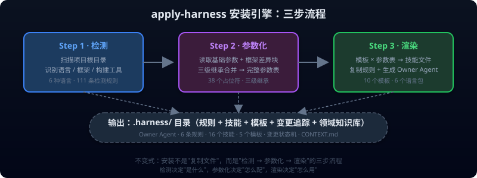
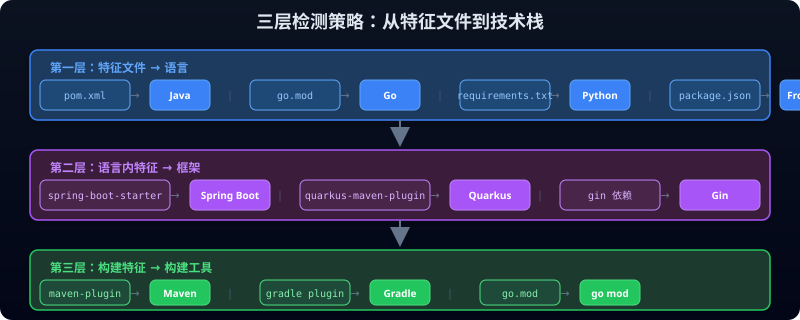
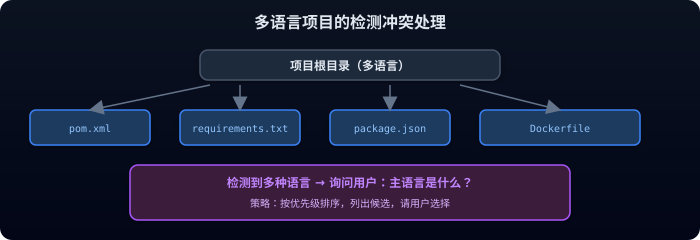
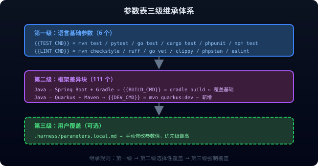
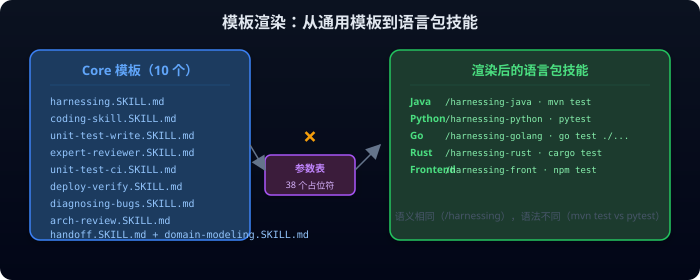
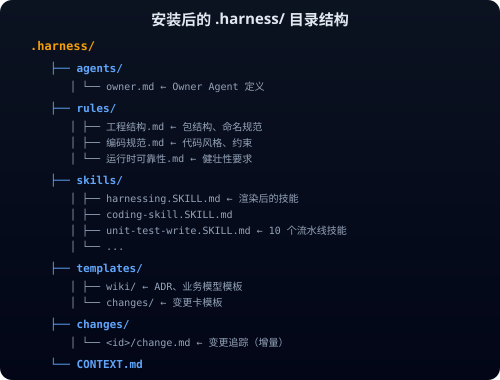

# apply-harness：安装引擎的设计哲学

> 核心思想系列 · 第四篇 · 约 10000 字 · 6 个 SVG 图

---

## 一、引言：脚手架也需要"安装"

在 Harness 专栏的前三篇中，我们讨论了"为什么需要工程纪律"、"参数化怎么解耦语义和语法"、"自动检测怎么识别技术栈"。但有一个问题一直没有回答：**这些能力是怎么装进项目的？**

当你在项目根目录输入 `/apply-harness` 时，发生了什么？

答案藏在一个 130KB 的 SKILL.md 文件中——它是整个 Harness 项目中规模最大的单个文件。它不写代码、不测试、不审查。它只做一件事：**把任意项目变成 Harness 项目**。

这就是"安装引擎"。

你可能会想："安装不就是复制几个文件吗？" 如果只是复制，那 130KB 的 SKILL.md 就太小题大做了。真正的安装引擎要解决三个根本问题：

1. **检测**：项目是什么语言？什么框架？什么构建工具？
2. **参数化**：这个语言/框架对应的命令是什么？约束是什么？
3. **渲染**：如何把通用模板变成针对这个项目的具体技能？

这三个问题，每一个都比外表看起来复杂得多。

---

## 二、安装的困境：从"复制粘贴"到"自动化"

### 2.1 复制粘贴的噩梦

在 Harness 被参数化之前，安装一个新项目是这样做的：

1. 复制上一个项目完整的 `.harness/` 目录
2. 搜索所有 pom.xml、application.yml、Dockerfile 中的项目名并替换
3. 修改测试命令中的包路径和模块名
4. 调整代码风格检查的配置
5. 手动更新 README 中的项目描述

这个过程看似简单，但实际执行时充满了陷阱。漏掉某个文件中的项目名导致 CI 失败、测试命令中的路径写死换了目录就跑不通、框架版本号不一致导致兼容性问题。

更糟糕的是，当团队从 Java 扩展到 Python、Go、Rust、Frontend 时，复制粘贴彻底不可维护了。**复制粘贴只适用于"同质化"的项目，而现实是"异质化"的。**

### 2.2 安装 vs 配置 vs 渲染

`apply-harness` 的设计者做出过一个关键区分：**安装不是配置，配置不是渲染。**

这三个概念经常被混为一谈，但它们解决的是完全不同的问题：

| 概念 | 解决的问题 | 谁来做 | 频率 |
|------|-----------|--------|------|
| **安装** | 把能力装进项目 | 自动化引擎 | 一次（项目初始化） |
| **配置** | 告诉系统项目的特征 | 用户（或自动检测） | 每次框架变更 |
| **渲染** | 把模板变成具体文件 | 参数化引擎 | 每次安装/配置变更 |

`apply-harness` 把这三个阶段串成了一个流水线：**检测（自动配置）→ 参数化（配置结构）→ 渲染（生成文件）**。这个流水线本身就是一个"元技能"——它不生产代码，而是生产生产代码的能力。

### 2.3 130KB 的 SKILL.md 意味着什么？

130KB 的 SKILL.md 不是"代码臃肿"的标志，而是"覆盖度"的体现。它在同一个文件中定义：

- 5 种语言的检测规则（每种语言 10-23 条）
- 111 个框架差异块（每个差异块 3-10 个参数）
- 10 个核心模板的渲染逻辑
- 6 个语言包的完整参数表
- 规则文件的复制策略
- 变更追踪的初始化逻辑
- Owner Agent 的生成逻辑

为什么不分拆成多个文件？因为 **apply-harness 是一个"原子操作"**——要么全部安装成功，要么全部不安装。分拆成多个文件会引入"部分安装"的风险（规则装好了但技能没装好，或者技能装好了但参数表没更新）。

---

```svg

```
**图 1：apply-harness 的三步流程。每一步的输出都是下一步的输入，环环相扣。**

---

## 三、检测引擎：从 5 种语言到 80+ 框架

### 3.1 特征文件扫描策略

检测的第一步是扫描项目根目录，寻找"特征文件"。这些文件是语言的"身份证"：

| 特征文件 | 推断语言 |
|---------|---------|
| `pom.xml` 或 `build.gradle(.kts)` | Java |
| `go.mod` | Go |
| `Cargo.toml` | Rust |
| `requirements.txt` / `pyproject.toml` / `setup.py` / `setup.cfg` / `manage.py` | Python |
| `package.json`（含前端框架依赖） | Frontend |

**匹配顺序**：按表格顺序逐条扫描，精确匹配（特征文件 + 特定框架标识）优先于模糊匹配（仅特征文件无框架标识）。当所有规则均未匹配时，询问用户。

为什么按这个顺序？因为"精确匹配"意味着系统确定地知道项目在用什么框架，不需要用户输入；"模糊匹配"意味着系统知道语言但不确定框架，需要用户确认；"询问用户"是最后手段，因为 `apply-harness` 的设计原则是**零配置优先**。

### 3.2 三层检测：语言 → 框架 → 构建工具

检测不是"一步到位"的，而是**逐层精化**的：

**第一层：特征文件 → 语言**

系统扫描根目录的特征文件。如果发现 `pom.xml`，推断语言为 Java；如果发现 `go.mod`，推断为 Go。如果同时发现多个特征文件（比如一个项目既有 `pom.xml` 又有 `package.json`），系统会检测到"多语言项目"，列出候选清单并询问用户选择主语言。

**第二层：语言内特征 → 框架**

确定语言后，系统深入读取特征文件的内容，寻找框架特征。比如在 Java 的 `pom.xml` 中查找 `spring-boot-starter-parent`（Spring Boot）、`quarkus-maven-plugin`（Quarkus）、`micronaut-parent`（Micronaut）等。

这一层的检测规则最为丰富——仅 Java 就有 19 种框架检测规则，Python 有 23 种，Go 有 22 种，Frontend 有 10 种，Rust 有 20 种。

**第三层：构建特征 → 构建工具**

在框架已确定的基础上，检测构建工具。是 Maven 还是 Gradle？是 pip 还是 poetry？是 npm 还是 pnpm？构建工具决定了 `{{BUILD_CMD}}`、`{{TEST_CMD}}` 等关键参数的值。

---

```svg

```
**图 2：从特征文件到技术栈的三层检测。每一层都在上一层的输出上缩小范围。**

---

### 3.3 框架冲突处理

当项目同时包含多个框架特征时，`apply-harness` 采用"优先级 + 询问"的策略：

1. 按优先级排序所有检测到的框架
2. 如果最高优先级只有一个，自动选择
3. 如果多个框架优先级相同，列出候选清单，询问用户

比如一个 Java 项目同时包含 `pom.xml`（Maven）和 `build.gradle`（Gradle），系统会检测到两种构建工具，询问用户选择哪一个。

```svg

```
**图 3：当检测到多种语言或框架时，系统不猜测，而是列出候选清单请用户选择。**

这种"不猜测"的策略是刻意的。**安装引擎的职责是"准确"而非"智能"**——猜对了用户不会夸奖你，猜错了用户要花 30 分钟排查。与其猜测，不如明确询问。

### 3.4 版本检测

除了框架和构建工具，`apply-harness` 还会检测版本信息。版本信息通过读取特征文件中的版本声明获得：

- Java：读取 `pom.xml` 中的 `<version>` 或 `<parent.version>`
- Python：读取 `pyproject.toml` 中的 `requires-python`
- Go：读取 `go.mod` 中的 `go` 版本声明
- Rust：读取 `Cargo.toml` 中的 `workspace.package.version`

版本信息被写入参数表，供后续的技能使用时参考。比如 `{{JAVA_VERSION}}` 被 `coding-skill` 用于决定使用哪个版本的 Java 语法特性。

---

## 四、参数表：三级继承体系

### 4.1 为什么需要三级继承？

检测完成后，`apply-harness` 拥有了一个"语言 × 框架 × 构建工具"的三元组。接下来要做的，就是**为这个三元组构建完整的参数表**。

但参数表不是扁平的。如果每个框架组合都写一个完整的参数表，那么 60+ 个框架 × 每种 34-36 个参数，就是 2000+ 行——臃肿且难以维护。

解决方案是**三级继承**：

```
第一级：语言基础参数（6 组）
  └─ 第二级：框架差异块（111 个）
       └─ 第三级：用户覆盖（可选）
```

```svg

```
**图 4：参数表的三级继承体系。每一级只写与上一级不同的参数，相同参数自动继承。**

### 4.2 第一级：语言基础参数

每种语言定义一组"基础参数"，包含该语言最通用的默认值。以 Java 为例：

| 参数 | 值 |
|------|-----|
| `{{TEST_CMD}}` | `mvn test` |
| `{{LINT_CMD}}` | `mvn checkstyle:check` |
| `{{BUILD_CMD}}` | `mvn compile` |
| `{{COV_CMD}}` | `mvn jacoco:report` |
| `{{DEV_CMD}}` | `mvn spring-boot:run` |

基础参数假定的是"最常见"的构建工具和框架——Java 默认 Maven（不是 Gradle），Python 默认 pip（不是 poetry），Go 默认 go mod。

### 4.3 第二级：框架差异块

当检测到的框架与基础参数的默认值不同时，框架差异块会**选择性覆盖**基础参数。差异块只写"不同"的部分，相同的参数不写，继承自基础参数。

以 Java 基础参数 + Spring Boot + Gradle 为例：

| 参数 | Java 基础 | Spring Boot + Gradle 差异块 | 合并结果 |
|------|----------|---------------------------|---------|
| `{{TEST_CMD}}` | `mvn test` | `gradle test` | `gradle test` |
| `{{LINT_CMD}}` | `mvn checkstyle:check` | （继承） | `mvn checkstyle:check` |
| `{{BUILD_CMD}}` | `mvn compile` | `gradle build` | `gradle build` |
| `{{COV_CMD}}` | `mvn jacoco:report` | `gradle jacocoTestReport` | `gradle jacocoTestReport` |
| `{{DEV_CMD}}` | `mvn spring-boot:run` | `gradle bootRun` | `gradle bootRun` |

差异块的设计遵循一个关键原则：**只写"不同"，不写"相同"**。这不仅减少了差异块的大小，更重要的是，它让"差异"变得显式——阅读差异块时，你一眼就能看出这个框架与基础参数的区别。

### 4.4 第三级：用户覆盖（设计概念）

参数表的最高优先级本应是用户覆盖——用户可以在本地参数文件中手动修改参数值，覆盖前两级的所有设置。

为什么需要用户覆盖？因为自动检测不可能 100% 准确。总有一些项目有特殊的构建流程、自定义的测试命令、或者组织特有的代码规范。用户覆盖是"最后一公里"的保险。

**但当前实现中，第三级用户覆盖并未实现**。`apply-harness` 目前只支持两级：语言基础参数 → 框架差异块。用户的本地修改需要通过直接编辑 `.harness/` 下的技能文件来实现，未来版本会引入显式的本地参数覆盖机制。

第三级的设计原则是：**显式声明而非隐式修改**——用户必须明确写出要覆盖的参数和值，系统不会静默覆盖。

### 4.5 111 个差异块意味着什么？

`apply-harness` 目前定义了 80+ 个框架差异块，覆盖了 5 种语言的主流框架。这个数字不是"越多越好"，而是"越精确越好"。

每个差异块对应一个"语言 × 框架 × 构建工具"的组合。比如：

- `Java — Spring Boot + Maven`（一个差异块）
- `Java — Spring Boot + Gradle`（另一个差异块）
- `Java — Quarkus + Maven`（又一个差异块）

Maven 和 Gradle 的参数差异决定了必须拆成两个差异块。Spring Boot 和 Quarkus 的 `{{DEV_CMD}}` 不同（`mvn spring-boot:run` vs `mvn quarkus:dev`），也决定了必须拆成两个差异块。

**差异块的粒度由参数差异决定**，而不是由框架数量决定。这是参数化设计的核心原则：**差异驱动拆分，而非分类驱动拆分。**

---

## 五、模板渲染：从通用到具体

### 5.1 10 个核心模板

检测完成、参数表就绪后，`apply-harness` 进入最关键的步骤：**渲染**。

渲染的输入是"core 模板"——10 个通用技能文件，每个文件包含 `{{PLACEHOLDER}}` 占位符。渲染的输出是"语言包技能文件"——10 个被参数表填充后的具体技能。

这 10 个核心模板对应 Harness 的完整流水线：

| 模板 | 对应技能 | 是否跨语言 |
|------|---------|----------|
| `harnessing.SKILL.md` | 需求分析 | ✅ 是 |
| `coding-skill.SKILL.md` | 编码实现 | ✅ 是 |
| `unit-test-write.SKILL.md` | 单元测试 | ✅ 是 |
| `expert-reviewer.SKILL.md` | 专家评审 | ✅ 是 |
| `unit-test-ci.SKILL.md` | CI 门禁 | ✅ 是 |
| `deploy-verify.SKILL.md` | 部署验证 | ✅ 是 |
| `diagnosing-bugs.SKILL.md` | Bug 诊断 | ✅ 是 |
| `arch-review.SKILL.md` | 架构审查 | ✅ 是 |
| `handoff.SKILL.md` | 交接文档 | ✅ 是 |
| `domain-modeling.SKILL.md` | 领域建模 | ✅ 是 |

每个模板都遵循相同的结构：**"这个技能应该做什么"写在模板中，"怎么做"引用参数表中的占位符**。这就是参数化专栏中提到的"语义与语法分离"——模板定义语义，参数表定义语法。

### 5.2 渲染过程：从 {{PLACEHOLDER}} 到具体值

渲染过程本质上是一个"查找替换"操作——在模板中找到所有 `{{PLACEHOLDER}}` 占位符，从参数表中查找对应的值，替换进去。

但这个过程有几个关键细节：

**第一，占位符的命名必须与参数表的键完全匹配。** `{{TEST_CMD}}` 在模板中出现的每一处，都会被替换为参数表中 `TEST_CMD` 的值。如果模板中写的是 `{{TEST_CMD}}` 但参数表中写的是 `{{test_cmd}}`，渲染就会失败。

**第二，渲染是"整文件替换"而非"逐行替换"。** 系统读取整个模板文件，一次性替换所有占位符，然后写入目标文件。这避免了"部分替换"的风险——如果逐行替换，某行替换失败可能导致文件处于不一致状态。

**第三，未匹配的占位符会报错而非静默忽略。** 如果模板中有 `{{UNKNOWN_CMD}}` 但参数表中没有对应值，渲染会报错并停止安装。这保证了"完整性"——所有占位符都必须被赋值，不允许有遗漏。

---

```svg

```
**图 5：10 个 core 模板 × 参数表 → 6 个语言包的具体技能。语义相同，语法不同。**

---

### 5.3 渲染不是"复制"

一个常见的误解是：`apply-harness` 在做"复制"——把模板复制到目标目录，然后替换占位符。

这不是复制，这是**渲染**。

复制的本质是"文件 → 文件"，渲染的本质是"模板 + 数据 → 文件"。这两个概念的区别决定了整个系统的设计：

| 维度 | 复制 | 渲染 |
|------|------|------|
| 输入 | 源文件 | 模板 + 参数表 |
| 输出 | 目标文件 | 具体文件 |
| 可变性 | 源文件变则输出变 | 模板或参数表任一变化则输出变 |
| 幂等性 | 多次复制结果相同 | 相同参数表多次渲染结果相同 |
| 可追溯性 | 无法追溯 | 可从渲染结果反推参数表 |

渲染的"可变性"是一个关键特性。**当参数表更新时，所有技能文件可以重新渲染，而不需要手动修改每个文件。** 这正是参数化的力量——一次修改参数表，所有技能文件自动更新。

### 5.4 语言包的同构化

渲染完成后，6 个语言包拥有**完全同构**的结构：

```
harness-java/         harness-python/       harness-golang/
├── skills/           ├── skills/           ├── skills/
│   ├── harnessing    │   ├── harnessing    │   ├── harnessing
│   ├── coding-skill  │   ├── coding-skill  │   ├── coding-skill
│   └── ...           │   └── ...           │   └── ...
├── rules/            ├── rules/            ├── rules/
└── templates/        └── templates/        └── templates/
```

每个语言包拥有相同的目录结构、相同的技能命名、相同的规则文件。唯一的差异是参数表里的具体命令值。

这种"同构化"设计不是偶然的——它是"参数化"的自然结果。**当所有差异都被压缩到参数表中时，剩下的结构自然就是同构的。** 同构化带来了一个巨大的好处：**维护者只需要理解一个语言包的结构，就能理解所有语言包。**

---

## 六、安装后的世界：.harness/ 目录的诞生

### 6.1 目录结构的总览

渲染完成后，`apply-harness` 在项目根目录下生成 `.harness/` 目录。这个目录包含了 Harness 工程体系的全部基础设施：

```
.harness/
├── agents/
│   └── owner.md              ← Owner Agent 定义
├── rules/
│   ├── 工程结构.md             ← 包结构、命名规范
│   ├── 编码规范.md             ← 代码风格、约束
│   └── 运行时可靠性.md         ← 健壮性要求
├── skills/
│   ├── harnessing.SKILL.md    ← 渲染后的技能（10 个）
│   ├── coding-skill.SKILL.md
│   ├── unit-test-write.SKILL.md
│   ├── expert-reviewer.SKILL.md
│   ├── unit-test-ci.SKILL.md
│   ├── deploy-verify.SKILL.md
│   ├── diagnosing-bugs.SKILL.md
│   ├── arch-review.SKILL.md
│   ├── handoff.SKILL.md
│   └── domain-modeling.SKILL.md
├── templates/
│   ├── wiki/                 ← ADR、业务模型、API 契约模板
│   └── changes/              ← 变更卡、评审报告、验证报告模板
├── changes/                  ← 变更追踪（初始为空）
└── CONTEXT.md                ← 共享语言机制
```

```svg

```
**图 6：安装后的 .harness/ 目录结构。每个子目录对应一个工程管理维度。**

### 6.2 Owner Agent：安装的"灵魂"

`.harness/agents/owner.md` 是安装过程中生成的最重要的文件之一。它定义了"Owner Agent"——应用负责人的 AI 化身。

Owner Agent 的职责包括：

1. **身份持有**：知道项目叫什么、用什么语言、遵守什么规范
2. **规则裁决**：每个阶段对照规则校验输出
3. **流水线编排**：调度 6 阶段流水线
4. **上下文维护**：维护 CONTEXT.md 共享语言机制

`owner.md` 由参数表渲染生成，因此它包含了项目的具体信息——项目名称、语言、框架、构建工具、测试命令等。这些信息让 Owner Agent 能够"认识"这个项目，而不需要在每次对话中重新了解。

### 6.3 规则文件：不变的部分

与技能文件不同，规则文件**不是渲染生成的**，而是直接复制到语言包中的。

为什么规则不渲染？因为规则是**跨语言通用的**。`工程结构.md` 中的"Controller 不得直接访问 Repository"适用于所有语言，不需要参数化。`编码规范.md` 中的"方法不超过 50 行"也适用于所有语言。

规则文件是"不变的部分"，它们不随框架变化而变化。这与技能文件形成鲜明对比——技能文件是"可变的部分"，必须随框架变化而变化。

**不变的部分直接复制，可变的部分渲染生成。** 这是 `apply-harness` 的一个核心设计原则。

### 6.4 变更追踪：初始化的"空状态"

`.harness/changes/` 目录初始为空，但它定义了完整的变更管理框架。每个变更对应 `.harness/changes/<id>/` 下的三个文件：

- `change.md`：规格卡（变更标题、描述、AC、边界情况、设计约束）
- `review.md`：评审报告（评审结果、问题清单）
- `verify.md`：验证报告（验证结果、测试通过率）

变更管理的状态机如下：

```
drafting → reviewing → approved → coding → testing → reviewing → ci → verifying → done
```

这个状态机保证了流水线不可跳步——每个状态对应一个阶段的出口门禁，未经门禁检查不能进入下一状态。

### 6.5 CONTEXT.md：共享语言的基础

`.harness/CONTEXT.md` 是项目的"共享语言机制"。它记录了项目的领域术语、架构决策、技术选型等，供 AI 在多轮对话中保持一致的理解。

CONTEXT.md 不是一次性生成的，而是**持续维护**的。每次对话结束时，AI 会检查是否需要在 CONTEXT.md 中记录新的术语或决策。这种"持续维护"的机制，保证了 CONTEXT.md 始终是项目的"活文档"。

---

## 七、设计哲学：为什么安装引擎是"元技能"？

### 7.1 元技能的概念

`apply-harness` 不是"技能"（skill），而是"元技能"（meta-skill）。

技能的定义是：**"AI 应该做什么"**——比如 `/coding-skill` 告诉 AI "如何写代码"，`/unit-test-write` 告诉 AI "如何写测试"。

元技能的定义是：**"如何生成技能"**——`apply-harness` 告诉系统 "如何生成 /coding-skill、/unit-test-write 等技能"。

这个区别至关重要。技能是"生产代码"的，元技能是"生产能力"的。**如果你把技能比作工厂里的机床，那么元技能就是"制造机床的机床"。**

### 7.2 零配置原则

`apply-harness` 的设计遵循"零配置原则"——在理想情况下，用户只需要输入 `/apply-harness`，不需要任何其他配置。

零配置不是"没有配置"，而是"配置被自动化了"：

- 语言检测：自动扫描特征文件
- 框架识别：自动读取依赖信息
- 参数表构建：自动从检测结果选择差异块
- 技能渲染：自动将模板 × 参数表渲染为具体技能

用户不需要告诉系统"我在用 Java + Spring Boot + Maven"，系统自己就能检测出来。

但零配置不等于"不询问"。当检测结果不明确时（比如多语言项目、未匹配的框架），系统会主动询问用户。**零配置的边界是"确定性"——系统确定时自动执行，不确定时询问用户。**

### 7.3 幂等性

`apply-harness` 是幂等的——多次执行安装，结果相同。

幂等性来自于渲染的确定性：**相同的参数表 + 相同的模板 → 相同的渲染结果**。如果参数表没有变化，多次渲染不会改变任何技能文件。

但幂等性有一个例外：用户已有的定制化修改。如果用户直接修改了 `.harness/` 下的技能文件，重新安装时系统会检测到 `.harness/` 目录已存在，并询问用户是否覆盖现有文件。`apply-harness` 不会静默覆盖——用户修改的参数被系统悄悄改回默认值，这是最糟糕的体验。

### 7.4 失败原子性

`apply-harness` 是一个"原子操作"——要么全部成功，要么全部不成功。

如果安装过程中任何一步失败（检测失败、参数表不完整、渲染失败），系统会回滚所有已做的更改，恢复到安装前的状态。这避免了"部分安装"——项目处于一个既不是 Harness 项目也不是普通项目的中间状态。

失败原子性是通过"先检查后执行"实现的：

1. 先检查所有前提条件（特征文件可读、参数表完整、模板存在）
2. 如果所有条件满足，执行安装
3. 如果任何条件不满足，报错并停止，不修改任何文件

**"先检查后执行"是安装引擎最重要的安全机制。** 它保证了安装要么正确地完成，要么安全地失败。

---

## 八、总结：安装引擎的不可替代性

回到开头的问题：为什么需要"安装引擎"？

因为**安装不是复制，安装是"检测 → 参数化 → 渲染"的三步流程**。

- 没有检测引擎，安装需要用户手动配置
- 没有参数化，安装是"硬编码模板"的复制粘贴
- 没有渲染，安装结果是"静态的"而非"可更新的"

`apply-harness` 的 130KB 不是"代码臃肿"，而是"覆盖度"的体现。它覆盖了 5 种语言、80+ 个框架、10 个核心模板——所有这些都在一个原子操作中完成。

但更重要的是，`apply-harness` 代表的思维模式：**不要把"安装"当作"复制文件"，而要把"安装"当作"生成能力"**。当你安装 Harness 时，你得到的不是一堆文件，而是一个"工程纪律的执行系统"——这个系统知道你的项目用什么语言、用什么框架、怎么测试、怎么构建、怎么部署。

这就是安装引擎的设计哲学：**安装不是终点，而是起点。** `/apply-harness` 的结束，是 `/coding-skill` 的开始。

---

## 附录：关联阅读

| 文章 | 说明 |
|------|------|
| [参数化：38 个占位符的设计取舍](./column-02-parameterization.md) | 参数表的设计原理，占位符的分类体系 |
| [自动检测：让 AI 一眼认出你的技术栈](./column-03-autodetect.md) | 检测引擎的延伸——三层检测策略和框架冲突处理 |
| [脚手架深度剖析](../harness-scaffolding-deep-dive.md) | 五步定律、三级继承、语言包同构化的完整设计 |
| [脚手架架构演进](../harness-scaffolding-evolution.md) | 从 v1.0 到方案 A 的架构演进史 |
| [Owner Agent：脚手架的灵魂](../owner-agent.md) | Owner Agent 的四大职责和设计哲学 |