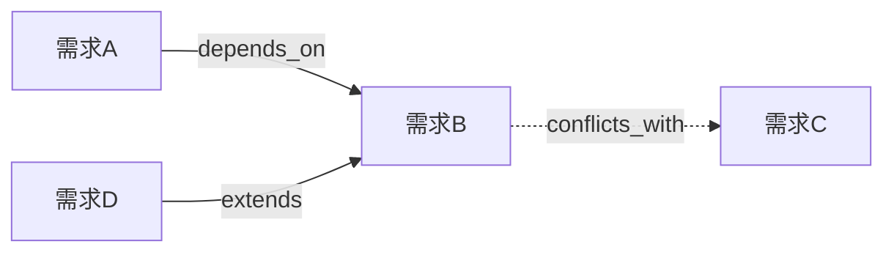

# /harness-relate：改一个，先看它牵连谁

> 命令深度拆解 · 第 29 篇 · 约 9500 字 · 8 个 SVG 图

---

```svg
<svg xmlns="http://www.w3.org/2000/svg" viewBox="0 0 800 300" font-family="'SF Pro Display','Segoe UI','Microsoft YaHei',sans-serif">
  <defs>
    <linearGradient id="bg_r0" x1="0" y1="0" x2="0" y2="1"><stop offset="0%" stop-color="#0b1220"/><stop offset="100%" stop-color="#020617"/></linearGradient>
    <filter id="sh_r0"><feDropShadow dx="0" dy="4" stdDeviation="5" flood-color="#000" flood-opacity="0.4"/></filter>
  </defs>
  <rect width="800" height="300" fill="url(#bg_r0)" rx="10"/>
  <text x="400" y="28" text-anchor="middle" fill="#e2e8f0" font-size="26" font-weight="700">/harness-relate：改一个，先看它牵连谁</text>
  <rect x="60" y="55" width="320" height="95" rx="10" fill="#22c55e" opacity="0.12" stroke="#22c55e" stroke-width="1.5" filter="url(#sh_r0)"/>
  <text x="220" y="80" text-anchor="middle" fill="#86efac" font-size="14" font-weight="700">六类关系，一张关系网</text>
  <text x="220" y="104" text-anchor="middle" fill="#94a3b8" font-size="11">extends · depends_on · supersedes</text>
  <text x="220" y="126" text-anchor="middle" fill="#64748b" font-size="10">resolves · conflicts_with · relates_to</text>
  <rect x="420" y="55" width="320" height="95" rx="10" fill="#f59e0b" opacity="0.12" stroke="#f59e0b" stroke-width="1.5" filter="url(#sh_r0)"/>
  <text x="580" y="80" text-anchor="middle" fill="#fde68a" font-size="14" font-weight="700">核心价值：impact 影响分析</text>
  <text x="580" y="104" text-anchor="middle" fill="#94a3b8" font-size="11">改一个 change 之前</text>
  <text x="580" y="126" text-anchor="middle" fill="#64748b" font-size="10">先知道它牵连哪些 change（🔴/🟡/🟢）</text>
  <text x="400" y="185" text-anchor="middle" fill="#475569" font-size="13">文件体系：三元结构，一条真源</text>
  <rect x="60" y="205" width="220" height="45" rx="8" fill="#3b82f6" opacity="0.10" stroke="#3b82f6" stroke-width="1.5" filter="url(#sh_r0)"/>
  <text x="170" y="234" text-anchor="middle" fill="#93c5fd" font-size="12">change.md 自带 relations</text>
  <rect x="300" y="205" width="220" height="45" rx="8" fill="#a855f7" opacity="0.10" stroke="#a855f7" stroke-width="1.5" filter="url(#sh_r0)"/>
  <text x="410" y="234" text-anchor="middle" fill="#d8b4fe" font-size="12">_relations.json 机器读</text>
  <rect x="540" y="205" width="220" height="45" rx="8" fill="#22c55e" opacity="0.10" stroke="#22c55e" stroke-width="1.5" filter="url(#sh_r0)"/>
  <text x="650" y="234" text-anchor="middle" fill="#86efac" font-size="12">_graph.md 人读</text>
  <text x="400" y="280" text-anchor="middle" fill="#64748b" font-size="10">核心洞察：change 不是孤岛——不画关系网，改动就会\"隔墙伤人\"</text>
</svg>
```

## 一、/harness-relate 解决的是什么问题

### 1.1 change 不是孤岛

在 Harness 流水线里，每个 change 表面上是一张独立的卡：`C-001 订单状态机`、`C-002 退款幂等`、`C-003 消息重试改造`。它们各走各的流水线，各到各的 `done`。

但真实项目里，这些 change 之间**互相牵连**：

- C-002（退款幂等）依赖 C-001（订单状态机）——状态机没改完，退款幂等的实现就是空中楼阁；
- C-003（消息重试改造）和 C-004（消息队列升级）改的是同一块消息消费逻辑——同时上线会互相打架；
- C-005（支付超时自动关单）解决了 C-006 遗留的一个技术债——它上线后 C-006 就不需要单独修了。

如果每个人只盯着自己的 change 卡，改动就会**隔墙伤人**：C-003 上线时破坏了 C-004 的契约，而两边都不知道对方的存在——直到生产环境炸了，排查才发现"哦，他们改的是同一块代码"。

`/harness-relate` 存在的目的：**把 change 之间的牵连画成一张显式的关系网**，让"改一个之前先看它牵连谁"成为流程的强制动作。

```svg
<svg xmlns="http://www.w3.org/2000/svg" viewBox="0 0 800 260" font-family="'SF Pro Display','Segoe UI','Microsoft YaHei',sans-serif">
  <defs>
    <linearGradient id="bg_r1" x1="0" y1="0" x2="0" y2="1"><stop offset="0%" stop-color="#0b1220"/><stop offset="100%" stop-color="#020617"/></linearGradient>
    <filter id="sh_r1"><feDropShadow dx="0" dy="4" stdDeviation="5" flood-color="#000" flood-opacity="0.4"/></filter>
  </defs>
  <rect width="800" height="260" fill="url(#bg_r1)" rx="10"/>
  <text x="400" y="26" text-anchor="middle" fill="#e2e8f0" font-size="22" font-weight="700">无关系网 vs 有关系网</text>
  <rect x="40" y="50" width="350" height="150" rx="10" fill="#ef4444" opacity="0.08" stroke="#ef4444" stroke-width="1.5" filter="url(#sh_r1)"/>
  <text x="215" y="74" text-anchor="middle" fill="#fca5a5" font-size="13" font-weight="700">没有关系网：隔墙伤人</text>
  <text x="215" y="102" text-anchor="middle" fill="#94a3b8" font-size="10">C-003 和 C-004 改同一块代码</text>
  <text x="215" y="124" text-anchor="middle" fill="#94a3b8" font-size="10">两边都不知道对方存在</text>
  <text x="215" y="146" text-anchor="middle" fill="#94a3b8" font-size="10">生产环境炸了才开始排查</text>
  <text x="215" y="172" text-anchor="middle" fill="#64748b" font-size="9">牵连靠记忆，记忆会漏</text>
  <rect x="420" y="50" width="340" height="150" rx="10" fill="#22c55e" opacity="0.08" stroke="#22c55e" stroke-width="1.5" filter="url(#sh_r1)"/>
  <text x="590" y="74" text-anchor="middle" fill="#86efac" font-size="13" font-weight="700">有关系网：生效前即知</text>
  <text x="590" y="102" text-anchor="middle" fill="#94a3b8" font-size="10">C-003 开工前 impact 一查</text>
  <text x="590" y="124" text-anchor="middle" fill="#94a3b8" font-size="10">🔴/🟡/🟢 分级影响清单</text>
  <text x="590" y="146" text-anchor="middle" fill="#94a3b8" font-size="10">先评估牵连再动手</text>
  <text x="590" y="172" text-anchor="middle" fill="#64748b" font-size="9">牵连写入文件，人人可查</text>
  <text x="400" y="228" text-anchor="middle" fill="#475569" font-size="11">关系网的产出不是\"好看\"，是\"改之前的知情权\"</text>
  <text x="400" y="250" text-anchor="middle" fill="#64748b" font-size="10">每一条关系都是一次\"本来要踩的坑，提前看见了\"</text>
</svg>
```

### 1.2 关系是"元数据"，不混进 change 正文

`/harness-relate` 有一个刻意的设计：**关系是 change 的元数据，不写进 change.md 的正文**。

change.md 的正文记录"这个 change 是什么、要做什么、怎么验收"——它是这个 change 自己的故事；而关系是"这个 change 与其他 change 的牵连"——它是**全局的、跨 change 的信息**。

把关系从正文剥离出来的好处：

- **正文保持聚焦**：读 change.md 只看它自己，不被"依赖谁、被谁依赖"干扰；
- **索引可重建**：关系汇集在 `_relations.json`，可以被重新生成、被机器查询；
- **单一事实源**：关系只在索引和 change 的 relations 元数据两处存在，不会散落进正文段落里，靠人肉维护。

```svg
<svg xmlns="http://www.w3.org/2000/svg" viewBox="0 0 800 260" font-family="'SF Pro Display','Segoe UI','Microsoft YaHei',sans-serif">
  <defs>
    <linearGradient id="bg_r2" x1="0" y1="0" x2="0" y2="1"><stop offset="0%" stop-color="#0b1220"/><stop offset="100%" stop-color="#020617"/></linearGradient>
    <filter id="sh_r2"><feDropShadow dx="0" dy="4" stdDeviation="5" flood-color="#000" flood-opacity="0.4"/></filter>
  </defs>
  <rect width="800" height="260" fill="url(#bg_r2)" rx="10"/>
  <text x="400" y="26" text-anchor="middle" fill="#e2e8f0" font-size="22" font-weight="700">文件体系：一元真源，两个视图</text>
  <rect x="40" y="50" width="220" height="70" rx="10" fill="#3b82f6" opacity="0.10" stroke="#3b82f6" stroke-width="1.5" filter="url(#sh_r2)"/>
  <text x="150" y="74" text-anchor="middle" fill="#93c5fd" font-size="12" font-weight="700">change.md relations 元数据</text>
  <text x="150" y="98" text-anchor="middle" fill="#64748b" font-size="9">每个 change 自带关系声明</text>
  <line x1="260" y1="85" x2="290" y2="85" stroke="#475569" stroke-width="2"/>
  <polygon points="296,85 288,80 288,90" fill="#94a3b8"/>
  <rect x="305" y="50" width="220" height="70" rx="10" fill="#a855f7" opacity="0.10" stroke="#a855f7" stroke-width="1.5" filter="url(#sh_r2)"/>
  <text x="415" y="74" text-anchor="middle" fill="#d8b4fe" font-size="12" font-weight="700">_relations.json</text>
  <text x="415" y="98" text-anchor="middle" fill="#64748b" font-size="9">反向索引 · 机器读 · 唯一事实源</text>
  <line x1="525" y1="85" x2="555" y2="85" stroke="#475569" stroke-width="2"/>
  <polygon points="561,85 553,80 553,90" fill="#94a3b8"/>
  <rect x="570" y="50" width="190" height="70" rx="10" fill="#22c55e" opacity="0.10" stroke="#22c55e" stroke-width="1.5" filter="url(#sh_r2)"/>
  <text x="665" y="74" text-anchor="middle" fill="#86efac" font-size="12" font-weight="700">_graph.md</text>
  <text x="665" y="98" text-anchor="middle" fill="#64748b" font-size="9">Mermaid 图 · 人读 · 派生禁止手编</text>
  <text x="400" y="160" text-anchor="middle" fill="#475569" font-size="11">rebuild 从 change.md 元数据重建两个产物</text>
  <text x="400" y="185" text-anchor="middle" fill="#64748b" font-size="10">_relations.json 缺省时由 rebuild 重建——索引永远可恢复</text>
  <text x="400" y="210" text-anchor="middle" fill="#64748b" font-size="10">_graph.md 是派生视图，禁止手工编辑</text>
  <text x="400" y="240" text-anchor="middle" fill="#64748b" font-size="10">写操作只改两个索引文件，不动任何 change.md 正文</text>
</svg>
```

### 1.3 写是谨慎的，读是自由的

`/harness-relate` 把操作分成两类，权限完全不同：

- **只读查询**（`query` / `impact` / `orphans` / `validate`）：不修改任何文件，随时可跑；
- **写操作**（`set` / `rebuild`）：只改 `.harness/changes/_relations.json` 与 `_graph.md` 两个索引文件，**不改动任何 change.md 正文**。

这个设计哲学和 `/harness-status` 一脉相承：**查询是日常，写是审批后的动作**。关系一旦写错（比如把 `depends_on` 写反），整个影响分析都会跟着错——所以写操作要谨慎，且尽量可重建（`rebuild` 能把索引从 change.md 恢复出来）。

## 二、六类关系：一张关系网的词汇表

关系网要表达丰富，需要词汇表。`/harness-relate` 定义了六类关系，每类含义明确、有无向性各有约定：

| 关系类型 | 含义 | 是否对称 |
|---------|------|---------|
| `extends` | B 扩展 A（A 是 B 的基础） | 否 |
| `depends_on` | B 依赖 A（A 必须先完成） | 否 |
| `supersedes` | B 取代 A（A 被 B 替代/废弃） | 否 |
| `resolves` | B 解决 A（A 是 B 解决的 issue/债） | 否 |
| `conflicts_with` | A 与 B 冲突（改动区域/契约重叠） | **是** |
| `relates_to` | A 与 B 相关联（弱关系） | **是** |

**对称关系**（`conflicts_with` / `relates_to`）在写入时**镜像**到对方 change 的反向索引：A conflicts_with B，则 B 的反向索引里自动出现 A。

为什么对称关系要镜像？因为查询时常从任一 change 出发：`impact C-003` 要看 C-003 牵连谁，`impact C-004` 也要看 C-004 牵连谁——如果冲突关系只存在一个方向，从另一边查就漏了。镜像保证了**从网上的任意节点出发，都能看到完整的关系**。

而为什么非对称关系（extends / depends_on / supersedes / resolves）不镜像？因为它们天生有方向——"B 依赖 A"和"A 依赖 B"是完全不同的两件事，镜像会制造语义混乱。方向本身就是信息。

```svg
<svg xmlns="http://www.w3.org/2000/svg" viewBox="0 0 800 300" font-family="'SF Pro Display','Segoe UI','Microsoft YaHei',sans-serif">
  <defs>
    <linearGradient id="bg_r3" x1="0" y1="0" x2="0" y2="1"><stop offset="0%" stop-color="#0b1220"/><stop offset="100%" stop-color="#020617"/></linearGradient>
    <filter id="sh_r3"><feDropShadow dx="0" dy="4" stdDeviation="5" flood-color="#000" flood-opacity="0.4"/></filter>
  </defs>
  <rect width="800" height="300" fill="url(#bg_r3)" rx="10"/>
  <text x="400" y="26" text-anchor="middle" fill="#e2e8f0" font-size="22" font-weight="700">六类关系：四种有向，两种对称</text>
  <rect x="40" y="50" width="170" height="55" rx="8" fill="#3b82f6" opacity="0.10" stroke="#3b82f6" stroke-width="1.5" filter="url(#sh_r3)"/>
  <text x="125" y="72" text-anchor="middle" fill="#93c5fd" font-size="11" font-weight="700">extends</text>
  <text x="125" y="94" text-anchor="middle" fill="#64748b" font-size="9">B 扩展 A（A 是基础）</text>
  <rect x="230" y="50" width="170" height="55" rx="8" fill="#3b82f6" opacity="0.10" stroke="#3b82f6" stroke-width="1.5" filter="url(#sh_r3)"/>
  <text x="315" y="72" text-anchor="middle" fill="#93c5fd" font-size="11" font-weight="700">depends_on</text>
  <text x="315" y="94" text-anchor="middle" fill="#64748b" font-size="9">B 依赖 A（A 先完成）</text>
  <rect x="420" y="50" width="170" height="55" rx="8" fill="#3b82f6" opacity="0.10" stroke="#3b82f6" stroke-width="1.5" filter="url(#sh_r3)"/>
  <text x="505" y="72" text-anchor="middle" fill="#93c5fd" font-size="11" font-weight="700">supersedes</text>
  <text x="505" y="94" text-anchor="middle" fill="#64748b" font-size="9">B 取代 A（A 废弃）</text>
  <rect x="610" y="50" width="150" height="55" rx="8" fill="#3b82f6" opacity="0.10" stroke="#3b82f6" stroke-width="1.5" filter="url(#sh_r3)"/>
  <text x="685" y="72" text-anchor="middle" fill="#93c5fd" font-size="11" font-weight="700">resolves</text>
  <text x="685" y="94" text-anchor="middle" fill="#64748b" font-size="9">B 解决 A（A 是债）</text>
  <rect x="40" y="125" width="170" height="55" rx="8" fill="#f59e0b" opacity="0.10" stroke="#f59e0b" stroke-width="1.5" filter="url(#sh_r3)"/>
  <text x="125" y="147" text-anchor="middle" fill="#fde68a" font-size="11" font-weight="700">conflicts_with 🔄</text>
  <text x="125" y="169" text-anchor="middle" fill="#64748b" font-size="9">改动区域/契约重叠</text>
  <rect x="230" y="125" width="170" height="55" rx="8" fill="#f59e0b" opacity="0.10" stroke="#f59e0b" stroke-width="1.5" filter="url(#sh_r3)"/>
  <text x="315" y="147" text-anchor="middle" fill="#fde68a" font-size="11" font-weight="700">relates_to 🔄</text>
  <text x="315" y="169" text-anchor="middle" fill="#64748b" font-size="9">弱关联</text>
  <text x="400" y="218" text-anchor="middle" fill="#475569" font-size="11">对称关系（🔄）写入时镜像到对方反向索引</text>
  <text x="400" y="244" text-anchor="middle" fill="#64748b" font-size="10">A conflicts_with B → B 的反向索引自动出现 A</text>
  <text x="400" y="266" text-anchor="middle" fill="#64748b" font-size="10">从任意节点出发都能看到完整关系；有向关系天生带方向，不镜像</text>
</svg>
```

## 三、子命令：set / rebuild / query / impact / orphans / validate

### 3.1 set：写一条关系

`set <source> <type> <target> [reason]`

为 source change 添加一条 `<type>` 关系，指向 target（可多个 target）。步骤：

1. 读 source 的 `_relations.json` 条目；`<type>` 为对称类型 → 在 target 上镜像写入；
2. 写回后触发 `rebuild` 刷新 `_relations.json` + `_graph.md`；
3. 附 `reason` 则写入原因（一句话，供 review 追溯）。

**reason 参数**值得一提：它把"为什么 A 和 B 是依赖关系"留在了数据里。六个月后有人疑惑"C-002 为什么依赖 C-001"，一查 reason 就知道当初的权衡。没有 reason 的关系，是一串无法解释的连线。

### 3.2 query：看一个 change 的全部关系

`query <id>` 显示 `<id>` 的全部关系：**出边**（该 change 指向谁）+ **入边**（谁指向该 change，来自反向索引）。

出边 + 入边缺一不可：

- 出边回答"**我要影响谁**"——它依赖谁、扩展谁、和谁冲突；
- 入边回答"**谁受我影响**"——谁依赖我、谁扩展我、谁和我冲突。

只有出边没有入边，你只知道"我依赖别人"，不知道"别人正等着我"——后者才是上线前最需要确认的事。

```svg
<svg xmlns="http://www.w3.org/2000/svg" viewBox="0 0 800 240" font-family="'SF Pro Display','Segoe UI','Microsoft YaHei',sans-serif">
  <defs>
    <linearGradient id="bg_r4" x1="0" y1="0" x2="0" y2="1"><stop offset="0%" stop-color="#0b1220"/><stop offset="100%" stop-color="#020617"/></linearGradient>
    <filter id="sh_r4"><feDropShadow dx="0" dy="4" stdDeviation="5" flood-color="#000" flood-opacity="0.4"/></filter>
  </defs>
  <rect width="800" height="240" fill="url(#bg_r4)" rx="10"/>
  <text x="400" y="26" text-anchor="middle" fill="#e2e8f0" font-size="22" font-weight="700">query：出边 + 入边</text>
  <rect x="60" y="55" width="220" height="60" rx="10" fill="#3b82f6" opacity="0.10" stroke="#3b82f6" stroke-width="1.5" filter="url(#sh_r4)"/>
  <text x="170" y="80" text-anchor="middle" fill="#93c5fd" font-size="12" font-weight="700">C-001 订单状态机</text>
  <text x="170" y="104" text-anchor="middle" fill="#64748b" font-size="9">入边：谁依赖/受它影响</text>
  <rect x="330" y="80" width="140" height="40" rx="8" fill="#f59e0b" opacity="0.10" stroke="#f59e0b" stroke-width="1.5" filter="url(#sh_r4)"/>
  <text x="400" y="100" text-anchor="middle" fill="#fde68a" font-size="11" font-weight="700">C-002 退款幂等</text>
  <text x="400" y="114" text-anchor="middle" fill="#64748b" font-size="8">depends_on C-001 ⬅</text>
  <rect x="330" y="130" width="140" height="40" rx="8" fill="#ef4444" opacity="0.10" stroke="#ef4444" stroke-width="1.5" filter="url(#sh_r4)"/>
  <text x="400" y="150" text-anchor="middle" fill="#fca5a5" font-size="11" font-weight="700">C-004 队列升级</text>
  <text x="400" y="164" text-anchor="middle" fill="#64748b" font-size="8">conflicts_with C-001 ⬅</text>
  <text x="400" y="200" text-anchor="middle" fill="#475569" font-size="11">出边回答"我要影响谁"，入边回答"谁受我影响"</text>
  <text x="400" y="224" text-anchor="middle" fill="#64748b" font-size="10">只有出边没入边，就漏了"别人正等着我"——上线前的关键确认</text>
</svg>
```

### 3.3 impact：分级影响分析（本技能的核心价值）

`impact <id>` 输出被影响 change 的分级清单：🔴看受影响且未完成→红、🟡受影响且已完成→黄、🟢未受影响→绿。

影响分级的心智模型：

- 🔴 **红色**：改这个 change，会连带冲击一堆还没完成的新增——必须优先评估顺序，否则会互相踩脚；
- 🟡 **黄色**：改它会冲击已完成的东西——要评估"改旧"的兼容成本；
- 🟢 **绿色**：无牵连——可以放心动工。

`impact` 是其他技能调用的入口：`harnessing` 分析新需求影响面、`coding-skill` 开工前检查、`expert-reviewer` 评审时防止改 A 破 B。它的输出是"**干活之前的知情权**"——把"我并不知道我在影响别人"变成"我清清楚楚知道我在影响谁"。

### 3.4 orphans：找孤立 change

`orphans` 列出**没有任何关系**的 change（无出边无入边）。

孤立的 change 本身不一定是问题——小改动可能天然独立。但 orphan 列表的价值在于**提醒审视**：

- 它是不是应该和某个 change 建立 `relates_to`（弱关联）但漏了？
- 它是不是个"野 change"——没有依赖任何前置，也没人依赖它，可能游离在体系外？

每个孤儿的出现，都是一次"是否需要关系"的复查机会。`orphans` 不消灭孤立（那需要人判断），它只是让孤立**可见**。

### 3.5 validate：一致性校验

`validate` 检查：

- change.md 中的 relations 元数据 与 `_relations.json` 是否一致（含对称性）；
- 所有引用的 target 是否存在；
- 自引用（A→A）禁止；
- 输出不一致项清单；不一致时建议 `rebuild`。

为什么需要 validate？因为索引是**派生产物**——它由 change.md 的元数据生成，就可能随着手工改动/异常写入而漂移。`validate` 是"索引与真源的对账"：它确保 `_relations.json` 永远忠实反映 change.md 里的声明。这个对账在 `expert-reviewer` 评审流程里被调用——**评审时核一下关系网没坏，比上线后才发现索引漂移强一万倍**。

```svg
<svg xmlns="http://www.w3.org/2000/svg" viewBox="0 0 800 230" font-family="'SF Pro Display','Segoe UI','Microsoft YaHei',sans-serif">
  <defs>
    <linearGradient id="bg_r5" x1="0" y1="0" x2="0" y2="1"><stop offset="0%" stop-color="#0b1220"/><stop offset="100%" stop-color="#020617"/></linearGradient>
    <filter id="sh_r5"><feDropShadow dx="0" dy="4" stdDeviation="5" flood-color="#000" flood-opacity="0.4"/></filter>
  </defs>
  <rect width="800" height="230" fill="url(#bg_r5)" rx="10"/>
  <text x="400" y="26" text-anchor="middle" fill="#e2e8f0" font-size="22" font-weight="700">validate：索引与真源的对账</text>
  <rect x="40" y="50" width="340" height="110" rx="10" fill="#3b82f6" opacity="0.10" stroke="#3b82f6" stroke-width="1.5" filter="url(#sh_r5)"/>
  <text x="210" y="76" text-anchor="middle" fill="#93c5fd" font-size="13" font-weight="700">真源：change.md relations 元数据</text>
  <text x="210" y="102" text-anchor="middle" fill="#94a3b8" font-size="10">每个 change 自己声明的</text>
  <text x="210" y="124" text-anchor="middle" fill="#64748b" font-size="9">声称的关系</text>
  <rect x="420" y="50" width="340" height="110" rx="10" fill="#a855f7" opacity="0.10" stroke="#a855f7" stroke-width="1.5" filter="url(#sh_r5)"/>
  <text x="590" y="76" text-anchor="middle" fill="#d8b4fe" font-size="13" font-weight="700">派生：_relations.json / _graph.md</text>
  <text x="590" y="102" text-anchor="middle" fill="#94a3b8" font-size="10">实际生效的索引</text>
  <text x="590" y="124" text-anchor="middle" fill="#64748b" font-size="9">万一被手工改坏了呢</text>
  <text x="400" y="180" text-anchor="middle" fill="#475569" font-size="11">校验：元数据一致性 · target 存在性 · 禁自引用</text>
  <text x="400" y="204" text-anchor="middle" fill="#64748b" font-size="10">不一致 → 输出清单 + 建议 rebuild（重建是自愈手段）</text>
  <text x="400" y="222" text-anchor="middle" fill="#64748b" font-size="10">评审时顺便 validate 一下，比上线后发现索引漂移强一万倍</text>
</svg>
```

## 四、_graph.md：人读的关系图

`_graph.md` 是 `_relations.json` 的**派生视图**，给人类看，禁止手工编辑（由 `rebuild` 生成）。格式：

```markdown
# 变更关系图


```

（Mermaid 图 + 每对关系的文字说明表）

Mermaid 图让"整体形状"一目了然：谁是谁的前置、哪里有冲突环、哪条链路最长。而文字说明表补上图的不足：带上每对关系的 reason（为什么）。**图给直觉，表给证据**——两者合起来才是一个可审查的关系视图。

禁止手工编辑 `_graph.md` 的原因：它是派生产物，手工编辑会造成"图和索引不一致"，且下次 rebuild 会被覆盖——手工改是无效劳动加误导。**只在真源（change.md 元数据）动手，图自动跟着变**。

## 五、与流水线的联动

| 场景 | 动作 |
|------|------|
| `harnessing` 分析影响面 | 调用 `impact` 评估新需求触碰哪些存量 change |
| `coding-skill` 开工前 | 调用 `impact <id>` 检查被影响的 change 是否已 done |
| `expert-reviewer` 评审 | 校验 `validate`，防止改 A 破坏 B |
| 变更多个并存 | 用 `conflicts_with` 标注重叠区域，评审时重点核对 |

这张联动表揭示了关系网的"消费方"：它不只服务于人的好奇心，而是**嵌进了流水线的关键决策点**——新需求分析时（harnessing）、开工前（coding-skill）、评审时（expert-reviewer）。每个决策点都问同一个问题："**这改动牵连谁，我确认过了吗？**"

```svg
<svg xmlns="http://www.w3.org/2000/svg" viewBox="0 0 800 260" font-family="'SF Pro Display','Segoe UI','Microsoft YaHei',sans-serif">
  <defs>
    <linearGradient id="bg_r6" x1="0" y1="0" x2="0" y2="1"><stop offset="0%" stop-color="#0b1220"/><stop offset="100%" stop-color="#020617"/></linearGradient>
    <filter id="sh_r6"><feDropShadow dx="0" dy="4" stdDeviation="5" flood-color="#000" flood-opacity="0.4"/></filter>
  </defs>
  <rect width="800" height="260" fill="url(#bg_r6)" rx="10"/>
  <text x="400" y="26" text-anchor="middle" fill="#e2e8f0" font-size="22" font-weight="700">关系网消费方：四个关键决策点</text>
  <rect x="40" y="50" width="170" height="70" rx="8" fill="#a855f7" opacity="0.10" stroke="#a855f7" stroke-width="1.5" filter="url(#sh_r6)"/>
  <text x="125" y="74" text-anchor="middle" fill="#d8b4fe" font-size="11" font-weight="700">harnessing</text>
  <text x="125" y="98" text-anchor="middle" fill="#64748b" font-size="9">impact 评估新需求</text>
  <rect x="230" y="50" width="170" height="70" rx="8" fill="#3b82f6" opacity="0.10" stroke="#3b82f6" stroke-width="1.5" filter="url(#sh_r6)"/>
  <text x="315" y="74" text-anchor="middle" fill="#93c5fd" font-size="11" font-weight="700">coding-skill</text>
  <text x="315" y="98" text-anchor="middle" fill="#64748b" font-size="9">impact 查前置 done?</text>
  <rect x="420" y="50" width="170" height="70" rx="8" fill="#f59e0b" opacity="0.10" stroke="#f59e0b" stroke-width="1.5" filter="url(#sh_r6)"/>
  <text x="505" y="74" text-anchor="middle" fill="#fde68a" font-size="11" font-weight="700">expert-reviewer</text>
  <text x="505" y="98" text-anchor="middle" fill="#64748b" font-size="9">validate 防改 A 破 B</text>
  <rect x="610" y="50" width="150" height="70" rx="8" fill="#22c55e" opacity="0.10" stroke="#22c55e" stroke-width="1.5" filter="url(#sh_r6)"/>
  <text x="685" y="74" text-anchor="middle" fill="#86efac" font-size="11" font-weight="700">多 change 并存</text>
  <text x="685" y="98" text-anchor="middle" fill="#64748b" font-size="9">conflicts_with 标重叠</text>
  <text x="400" y="160" text-anchor="middle" fill="#475569" font-size="11">每个决策点问同一个问题："这改动牵连谁，我确认过了吗？"</text>
  <text x="400" y="190" text-anchor="middle" fill="#64748b" font-size="10">关系网不是给人看的装饰，是嵌进流程的检查点</text>
  <text x="400" y="214" text-anchor="middle" fill="#64748b" font-size="10">从"新需求分析"到"评审"，每关都过一遍影响面</text>
  <text x="400" y="240" text-anchor="middle" fill="#64748b" font-size="10">改动前的知情权 = 上线后的安全感</text>
</svg>
```

## 六、完成标志

`/harness-relate` 的完成标志按操作类型区分：

1. **`set` / `rebuild` 后**：`_relations.json` 与 `_graph.md` 已同步（两个产物一致）；
2. **`impact` 已输出分级影响清单**（🔴/🟡/🟢）——核心价值兑现；
3. **`validate` 无一致性错误**（或已提示 rebuild）——关系网是健康的。

"同步"这个完成标志非常重要：写完关系必须触发 rebuild，让索引和图形视图一起刷新。**只写 _relations.json 不重建 _graph.md，人读视图就过期了**——一半的完成不算完成。

## 七、写在最后

`/harness-relate` 的全部设计，浓缩成四句话：

1. **change 不是孤岛**——依赖、扩展、取代、解决、冲突、关联，六类关系织成网；改一个之前先看它牵连谁。
2. **一元真源，两套视图**——change.md 元数据是真源，_relations.json 管机器，_graph.md 管人；写只碰索引，图禁止手编。
3. **对称关系要镜像**——从任意节点出发，都能看到完整的关系；有向关系天生带方向，不镜像。
4. **impact 是灵魂**——🔴/🟡/🟢 分级影响清单，把"干活前的知情权"交给每个开工的人。

一句话记住它：**/harness-relate 是 change 的关系网——它让"改一个之前先看清牵连"从口头提醒变成可查询、可重建、可校验的工程事实。**