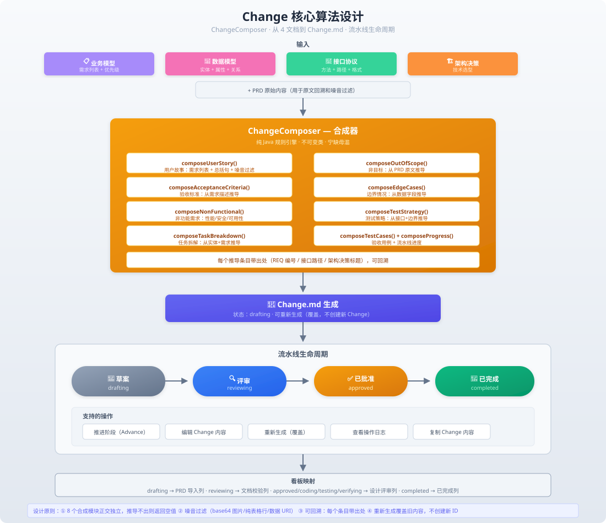

# Change 核心算法

> 本文档详细描述 PRD 智能解析平台的 Change 生成与生命周期管理，涵盖 ChangeComposer 的 8 个合成模块、ChangeService 的创建/重新生成逻辑、PipelineService 的流水线推进机制，以及需求看板的映射关系。

---

## 概述

Change 是 PRD 智能解析平台的核心产出物——一份结构化的变更说明书，包含用户故事、验收标准、边界情况、非功能需求、测试策略、任务拆解等完整内容。它从 4 篇 Wiki 文档（业务模型、数据模型、接口协议、架构决策）合成而来，经过流水线推进，最终在需求看板中追踪。

完整的 Change 算法流程图如下：



---

## 一、输入：4 篇 Wiki 文档

ChangeComposer 从 4 篇 Wiki 文档中读取数据。每篇文档经过 PRD 解析后，数据已经持久化到数据库中的对应表：

| 文档 | 数据表 | 对应的 Java 模型 | 包含的信息 |
|------|-------|-----------------|-----------|
| 📋 **业务模型** | `prd_requirement` | `RequirementEntity` | 需求列表（REQ-xxx）、优先级、描述 |
| 💾 **数据模型** | `prd_data_entity` + `prd_entity_attribute` + `prd_entity_relation` | `DataEntity` | 实体定义、属性列表、字段约束 |
| 🔌 **接口协议** | `prd_interface` | `InterfaceProtocol` | API 路径、HTTP 方法、参数 |
| 🏗️ **架构决策** | `prd_arch_decision` | `ArchitectureDecision` | ADR 标题、决策描述、技术选型 |

此外，ChangeComposer 还会读取**原始 PRD 文本**（在 `prd_ingestion.content` 中），用于非目标提取和边界情况推导。

---

## 二、ChangeComposer 合成器

**文件**：`ChangeComposer.java`（1006 行）

ChangeComposer 是一个**纯工具类**（私有构造器，全部静态方法），包含 8 个正交合成模块。每个模块独立推导，推导不出则返回空值，从不编造。

### 2.1 用户故事（composeUserStory）

**输入**：`List<RequirementEntity>`（业务模型中的需求列表）

**伪代码**：
```
1. 过滤噪音：跳过 base64 图片、数据 URI、纯 URL 段落
2. 如果需求列表为空，返回"暂无用户故事"
3. 从第一条需求提取核心主题
4. 生成总括句：「作为一个{角色}，我希望能够{需求描述}...」
5. 拼接所有需求为 Markdown 列表
```

**输出示例**：
```markdown
作为一个用户，我希望能够通过 OAuth 登录系统，以便安全地访问我的个人数据。

- **REQ-001**: 用户可以使用 Google/GitHub OAuth 登录
- **REQ-002**: 登录后自动跳转到首页
```

### 2.2 非目标（extractOutOfScope）

**输入**：原始 PRD 文本 + `List<RequirementEntity>`

**伪代码**：
```
1. 扫描 PRD 章节标题，查找包含"非目标"、"不做"、"不包含"、"暂不"的标题
2. 如果找到，提取该标题下的段落内容
3. 扫描全文，查找包含"不在本次"、"本次不做"、"暂不实现"的句子
4. 合并所有结果，去重
5. 如果没有找到任何非目标声明，返回"暂无明确的非目标声明"
```

**噪音过滤**：跳过 base64 图片、data URI、纯 URL 等非人类可读内容。

### 2.3 验收标准（composeAcceptanceCriteria）

**输入**：`List<RequirementEntity>`

**伪代码**：
```
1. 遍历每条需求
2. 取需求的标题（shortTitle）作为 AC 标题
3. 取需求的描述作为 AC 说明
4. 生成 AC 编号：AC-1, AC-2, AC-3...
5. 标注出处：`(出处 REQ-x)`
```

**输出示例**：
```markdown
| 编号 | 验收标准 | 说明 |
|------|---------|------|
| AC-1 | OAuth 登录 | 用户可以使用 Google/GitHub 账号登录系统（出处 REQ-001） |
| AC-2 | 自动跳转 | 登录成功后自动跳转到首页（出处 REQ-002） |
```

### 2.4 边界情况（composeEdgeCases）

**输入**：原始 PRD 文本 + `List<RequirementEntity>` + `List<InterfaceProtocol>` + `List<DataEntity>`

**这是最复杂的推导模块**，从多个来源推导边界情况：

**来源 1：PRD 原文中的条件语句**
- 正则匹配包含"如果"、"当"、"若"、"除非"、"假设"等条件词的句子
- 提取句子中的条件 + 结果对

**来源 2：REST 接口语义推导**
- 有分页参数的接口 → 推导"空列表"、"列表只有一页"、"溢出页"边界
- 有 `{id}` 路径参数的接口 → 推导"请求不存在的 ID 返回 404"
- 有 `POST` 写入接口 → 推导"请求体缺少必填字段返回 400"
- 有 `DELETE` 删除接口 → 推导"删除不存在的资源返回 404"
- 有 `PUT/PATCH` 更新接口 → 推导"更新不存在的资源返回 404"

**来源 3：实体约束推导**
- 标记为 `required` 的字段 → 推导"缺少必填字段"边界
- 标记为 `unique` 的字段 → 推导"重复唯一字段"边界
- 有 `maxLength` / `minLength` 的字段 → 推导"超出长度限制"边界

### 2.5 非功能需求（composeNfrTable）

**输入**：`List<ArchitectureDecision>`

**伪代码**：
```
1. 遍历架构决策列表
2. 对每个 ADR，检查标题是否包含以下关键词之一：
   - 性能、响应时间、并发 → 性能需求
   - 可靠性、可用性、容错 → 可靠性需求
   - 安全、认证、授权、加密 → 安全需求
   - 可观测、监控、日志 → 可观测性需求
   - 兼容性、版本 → 兼容性需求
3. 匹配到对应类别后，提取 ADR 的描述作为该类别的内容
4. 输出为 Markdown 表格
```

**输出示例**：
```markdown
| 类别 | 要求 |
|------|------|
| 性能 | 系统响应时间不超过 500ms，支持 1000 并发用户 |
| 安全 | 所有接口需通过 JWT Token 认证 |
```

### 2.6 测试策略（composeTestStrategy）

**输入**：`List<InterfaceProtocol>` + `List<DataEntity>` + `List<ArchitectureDecision>` + 边界情况

**推导逻辑**：
1. 按资源领域（resource domain）分组接口
2. 每个资源领域生成一条测试策略：
   - **先写失败测试**：每个领域至少一个失败路径测试
   - **边界测试覆盖**：引用上一步推导的边界情况
   - **降级测试**：如果架构决策中提到了"降级"、"熔断"、"fallback"，添加降级测试策略

### 2.7 任务拆解（composeTasks）

**输入**：`List<DataEntity>` + `List<InterfaceProtocol>`

**推导逻辑**：
1. 按资源领域分组实体和接口
2. 每个资源领域生成 T-N 编号的任务：
   - **T-N.1**: 数据层——创建实体/表结构
   - **T-N.2**: 服务层——编写业务逻辑
   - **T-N.3**: API 层——暴露 REST 接口
   - **T-N.4**: 测试——编写单元测试
3. 任务之间有依赖关系链（数据层 → 服务层 → API 层 → 测试）

### 2.8 验收用例（composeAcceptanceCases）

**输入**：`List<InterfaceProtocol>`

**推导逻辑**：
1. 按资源领域分组接口
2. 每个资源领域生成 Case-N 编号的用例：
   - **正常路径**: 完整的请求-响应流程
   - **错误路径**: 异常输入、未授权、资源不存在

### 2.9 标题推导回退（deriveFromTitle）

**目标**：当 PRD 解析结果为空或标题匹配已知领域时，从标题直接推导全部内容。

**支持领域**：`oauth-login`, `admin-backend`, `search`, `payment`, `message-push`

**机制**：匹配标题 → 填充领域特定的完整 Change 内容（包括用户故事、AC、边界、任务拆解等全部章节）。

---

## 三、Change 创建与重新生成

### 3.1 创建 Change（`ChangeService.createChange()`）

**文件**：`ChangeService.java`（667 行）

**流程**：

```
1. 生成 Change ID：chg-YYYYMMDDHHMMSS-NNN（基于时间戳，无冲突）
2. 解析 projectId 优先级：请求参数 > Headers > 关联记录 > 默认值
3. 收集文档引用（DocumentSummary）：从请求的 docIds 查询 4 篇文档
4. 构建 Change 内容（buildChangeContent）：
   a. 从数据库查询该 ingestion 的解析结果（需求/实体/接口/ADR）
   b. 尝试模板渲染（renderChangeFromTemplate）：
      - 从 templateRepository 查找 change-model 模板
      - 替换 frontmatter 占位符（标题、作者、状态）
      - 对每个 ## 章节，调用对应的 ChangeComposer 方法填充
      - 追加额外章节（任务拆解、验收用例、流水线进度）
   c. 回退到硬编码构建（buildChangeContentHardcoded）：
      - 直接生成完整骨架（frontmatter + 10 个章节）
      - 调用标题推导回退
5. 插入 prd_change 表
6. 插入 prd_change_document_ref 表（关联文档引用）
7. 调用 pipelineRepo.initStages() 初始化流水线阶段
8. 记录操作日志
```

### 3.2 重新生成 Change（`ChangeService.regenerateChange()`）

**关键特性**：**覆盖，不创建新 Change**

```
1. 验证 Change 存在且状态为 drafting / reviewing
2. 重新查询该 ingestion 的最新解析结果
3. 重新调用 buildChangeContent() 生成内容
4. UPDATE prd_change SET content = ? WHERE change_id = ?
   （不修改 changeId、status、createdAt）
5. 清除并重建 prd_change_document_ref
6. 记录操作日志
7. 不重置流水线阶段和状态
```

### 3.3 编辑 Change（`ChangeService.updateChangeContent()`）

```
1. 验证 Change 状态为 drafting / reviewing
2. 直接更新 content 字段
3. 记录操作日志
```

---

## 四、流水线生命周期

### 4.1 阶段定义

**文件**：`PipelineService.java`（121 行）

流水线包含 4 个阶段，线性推进：

```
drafting ──▶ reviewing ──▶ approved ──▶ completed
```

每个阶段在 `prd_pipeline_stage` 表中有一条记录：

| 字段 | 说明 |
|------|------|
| `change_id` | 关联的 Change ID |
| `stage` | 阶段名称（drafting / reviewing / approved / completed） |
| `status` | 状态（pending / active / completed / failed / skipped） |
| `started_at` | 开始时间 |
| `completed_at` | 完成时间 |

### 4.2 阶段初始化（`initStages()`）

创建 Change 时自动调用，插入 4 条记录：

| stage | status |
|-------|--------|
| drafting | `active` |
| reviewing | `pending` |
| approved | `pending` |
| completed | `pending` |

### 4.3 阶段推进（`advancePipeline()`）

```
1. 验证目标阶段是否在合法集合中（drafting / reviewing / approved / completed）
2. 将当前 active 阶段置为 completed，设置 completed_at = NOW()
3. 将目标阶段置为 active，设置 started_at = NOW()
4. 更新 prd_change.status = 目标阶段
5. 记录操作日志
```

**支持的操作**：
- 从 drafting → reviewing
- 从 reviewing → approved
- 从 approved → completed

### 4.4 操作日志

每次对 Change 的操作都会记录到 `prd_change_log` 表：

| 字段 | 说明 |
|------|------|
| `id` | 自增主键 |
| `change_id` | 关联的 Change ID |
| `log_type` | 操作类型（status_change / approval / rejection / comment / commit / pr） |
| `message` | 操作摘要 |
| `detail` | 详细描述 |
| `actor` | 操作人 |
| `created_at` | 操作时间 |

---

## 五、需求看板映射

### 5.1 看板列与流水线状态的对应关系

```
看板列                         包含的流水线状态
────────────────────────────────────────────────────
📋 PRD 导入                    prd_imported（导入后未生成 Change）
📝 文档校验                    reviewing
🔍 设计评审                    approved + coding + testing + verifying
✅ 已完成                      completed
```

### 5.2 旧数据兼容

`coding` / `testing` / `verifying` 是旧版本流水线中的状态。为兼容旧数据，这些状态被归入"设计评审"列展示，**不会丢失数据**。

### 5.3 看板统计数据

`getKanbanStats()` 按状态分组统计：

```sql
SELECT status, COUNT(*) FROM prd_change GROUP BY status;
```

结果按看板列映射规则归类到 4 列中。

---

## 六、设计原则

| 原则 | 说明 |
|------|------|
| **正交独立** | 8 个合成模块的输出互不依赖，推导不出则返回空值 |
| **噪音过滤** | 自动过滤 base64 图片、数据 URI、纯 URL 等噪音 |
| **可回溯** | 每个推导条目附带出处（REQ 编号 / 接口路径 / ADR 标题） |
| **宁缺毋滥** | 推导不出的内容留空，用"暂无"、"待补充"标记，不编造 |
| **幂等覆盖** | 重新生成覆盖旧内容，不创建新 ChangeId |
| **标题回退** | 当解析结果为空时，从标题匹配已知领域模板 |
| **不重置流水线** | 重新生成不修改流水线阶段和状态 |