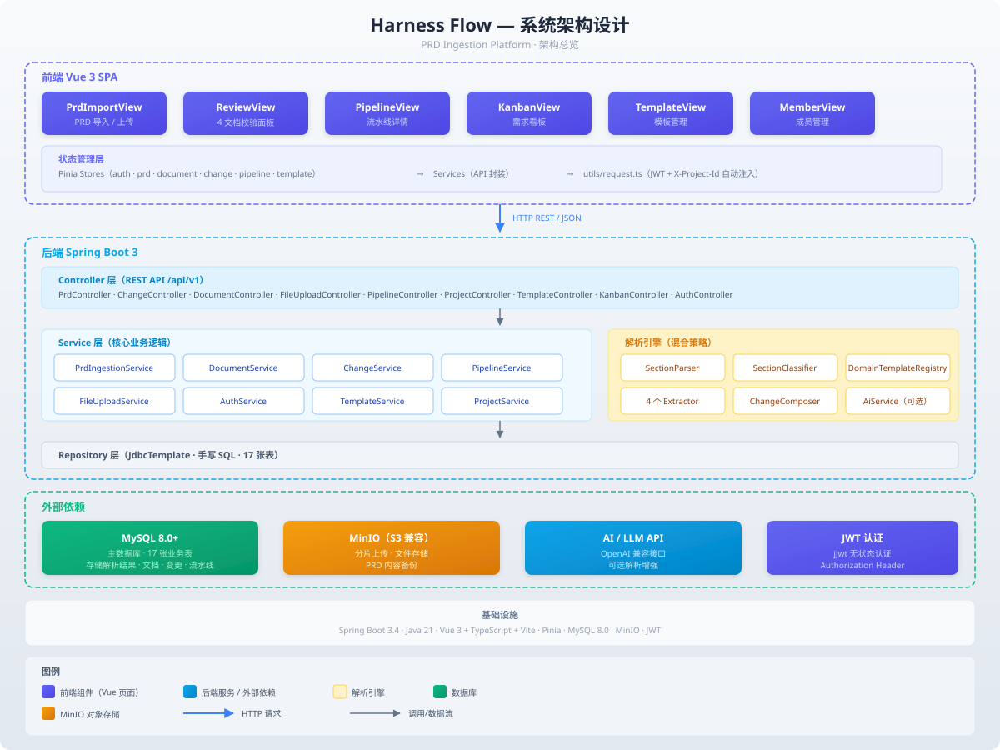

# PRD 智能解析平台架构设计

> 本文档是 PRD 智能解析平台（Harness Flow）的完整架构说明，对应 `docs/arch/01-项目架构设计.svg` 架构图。

## 系统架构总览

> 上图对应的 SVG 文件位于 `docs/arch/01-项目架构设计.svg`，可缩放查看细节。

## 技术栈

| 层级 | 技术 | 版本 |
|------|------|------|
| 前端框架 | Vue 3 + TypeScript | Vue 3.4+ |
| 构建工具 | Vite | 5.x |
| 状态管理 | Pinia | 2.x |
| 路由 | Vue Router | 4.x |
| 后端框架 | Spring Boot | 3.4.x |
| Java 版本 | JDK | 21 LTS |
| 构建工具 | Maven | 3.9+ |
| 数据库 | MySQL | 8.0 |
| 对象存储 | MinIO | 最新 |
| AI 接口 | OpenAI 兼容接口 | 任意 |

## 模块详解

### 前端模块

| 页面 | 路由 | 说明 |
|------|------|------|
| LoginView | `/login` | 登录页面，JWT Token 认证 |
| HomeView | `/` | 首页，PRD 文档上传入口 |
| UploadView | `/upload` | PRD 文档上传页面（大文件分片上传） |
| PipelineView | `/pipeline` | 流水线详情页，展示 Change 内容和阶段 |
| KanbanView | `/kanban` | 需求看板，4 列展示所有 Change |
| WikiView | `/wiki` | Wiki 知识库，展示 4 篇文档 |
| DocDetailView | `/wiki/:id` | 文档详情页 |

### 后端控制器

| 控制器 | 路径 | 说明 |
|--------|------|------|
| AuthController | `/api/v1/auth` | 登录/注册/Token 刷新 |
| PrdIngestionController | `/api/v1/prd/ingest` | PRD 文档导入/解析 |
| DocumentController | `/api/v1/documents` | 4 篇文档 CRUD |
| ChangeController | `/api/v1/changes` | Change CRUD + 重新生成 |
| PipelineController | `/api/v1/pipeline` | 流水线阶段推进/状态查询 |
| KanbanController | `/api/v1/kanban` | 看板统计/卡片数据 |
| WikiController | `/api/v1/wiki` | Wiki 知识库 |
| FileUploadController | `/api/v1/file` | 文件上传（MinIO） |
| ReviewController | `/api/v1/review` | 变更评审 |

### 后端服务

| 服务 | 说明 |
|------|------|
| AiService | AI/LLM 调用封装，支持 OpenAI 兼容接口，可开关 (`ai.enabled`) |
| PrdIngestionService | PRD 文档导入主流程编排 |
| DocumentService | 4 篇文档的 CRUD + 重新解析 |
| ChangeService | Change 的 CRUD + 重新生成 |
| PipelineService | 流水线阶段推进 |
| KanbanService | 看板数据聚合 |
| FileUploadService | 文件上传/分片合并/MinIO 操作，可开关 (`minio.enabled`) |
| WikiService | Wiki 知识库操作 |

### 解析引擎（6 个组件）

| 组件 | 说明 |
|------|------|
| DomainTemplateRegistry | 预设 8 个领域模板，用于模板匹配解析 |
| LlmParserService | LLM 解析服务，调用 AI 接口解析 PRD 文档 |
| PrdSectionParser | 章节层级解析器，构建章节树 |
| SectionTypeClassifier | 章节类型分类器，加权评分判断章节属于哪个文档类型 |
| DocumentExtractor (×4) | 4 个正交提取器（业务模型/数据模型/接口协议/架构决策） |
| ChangeComposer | 8 个合成模块，从 4 文档合成 Change.md 内容 |

### 数据库表

| 表名 | 说明 |
|------|------|
| `prd_ingestion` | PRD 文档导入记录 |
| `prd_wiki_document` | 4 篇 Wiki 文档 |
| `prd_change` | Change 主表 |
| `prd_change_document_ref` | Change 关联文档 |
| `prd_change_acceptance_criteria` | 验收标准 |
| `prd_pipeline_stage` | 流水线阶段记录 |
| `prd_change_log` | 操作日志 |
| `prd_users` | 用户表 |
| `prd_user_token` | 用户 Token 表 |

## 可开关组件

系统支持通过配置开关控制 AI 和 MinIO 组件的启用：

| 配置 | 环境变量 | 默认值 | 说明 |
|------|---------|--------|------|
| `ai.enabled` | `AI_ENABLED` | `true` | 是否启用 AI 解析 |
| `minio.enabled` | `MINIO_ENABLED` | `true` | 是否启用 MinIO 文件存储 |

关闭后，对应组件不会加载，系统以降级模式运行（AI 关闭时 fallback 到模板/章节算法，MinIO 关闭时文件操作返回 503）。