# Harness Flow — PRD 智能解析系统使用教程

> 版本：v1.0 | 适用对象：产品经理、技术负责人、开发人员

Harness Flow 是一套 PRD（产品需求文档）智能解析与变更管理平台。它能够将自然语言编写的 PRD 自动解析为结构化的业务模型、数据模型、接口协议和架构决策，并通过流水线推动变更从草稿到发布的全生命周期管理。

---

## 〇、环境准备与启动

> **最短步骤（PowerShell、端口、`$env`）见 [本地启动](prd-local-start.md)。** 下文为完整环境变量表与可选组件说明。

### 0.1 依赖软件

| 软件 | 版本要求 | 说明 |
|------|---------|------|
| JDK | 21 LTS | 后端运行环境 |
| Maven | 3.9+ | 后端构建工具 |
| MySQL | 8.0 | 数据库（首次启动自动建表） |
| MinIO | 最新 | 对象存储（文件上传可选，通过配置开关） |
| Node.js | 18+ | 前端运行环境 |
| npm / pnpm | 9+ / 8+ | 前端包管理 |

### 0.2 环境变量配置

系统通过环境变量控制所有配置，以下是完整的环境变量列表：

#### 数据库配置

| 环境变量 | 默认值 | 说明 |
|---------|--------|------|
| `DB_HOST` | `127.0.0.1` | MySQL 主机地址 |
| `DB_PORT` | `3306` | MySQL 端口 |
| `DB_NAME` | `harness_prd_ingestion` | 数据库名 |
| `DB_USERNAME` | `root` | 数据库用户名 |
| `DB_PASSWORD` | — | 数据库密码 |
| `DB_POOL_SIZE` | `10` | 连接池大小 |

#### 服务配置

| 环境变量 | 默认值 | 说明 |
|---------|--------|------|
| `SERVER_PORT` | `8080` | 后端服务端口 |
| `SPRING_PROFILES_ACTIVE` | `dev` | Spring 激活配置（dev/prod） |

#### MinIO 对象存储

| 环境变量 | 默认值 | 说明 |
|---------|--------|------|
| `MINIO_ENABLED` | `true` | 是否启用 MinIO（设为 `false` 可跳过文件上传） |
| `MINIO_ENDPOINT` | `http://127.0.0.1:9000` | MinIO 服务地址 |
| `MINIO_ACCESS_KEY` | — | MinIO 访问密钥 |
| `MINIO_SECRET_KEY` | — | MinIO 秘密密钥 |
| `MINIO_BUCKET_UPLOADS` | `prd-uploads` | 上传分片存储桶 |
| `MINIO_BUCKET_MERGED` | `prd-merged` | 合并文件存储桶 |

#### AI / LLM 解析

| 环境变量 | 默认值 | 说明 |
|---------|--------|------|
| `AI_ENABLED` | `false` | 是否启用 LLM 解析（推荐开启以提升解析质量） |
| `AI_MOCK` | `false` | 是否启用 mock 模式（调试用，不真实调用 LLM） |
| `AI_API_URL` | `https://token.sensenova.cn/v1/chat/completions` | LLM API 端点（OpenAI 兼容格式） |
| `AI_API_KEY` | — | LLM API 密钥 |
| `AI_MODEL` | `deepseek-v4-flash` | 模型名称 |
| `AI_TIMEOUT` | `60` | 请求超时（秒） |
| `AI_TEMPERATURE` | `0.0` | 温度参数（0.0 最稳定） |
| `AI_MAX_TOKENS` | `4096` | 最大输出 token 数 |

#### 前端环境变量

在 `prd-ingestion-front/` 目录下创建 `.env` 文件（参考 `.env.example`）：

| 变量 | 默认值 | 说明 |
|------|--------|------|
| `VITE_API_TIMEOUT` | `180000` | API 请求超时（毫秒），需大于后端 `AI_TIMEOUT + 15 秒` |

### 0.3 启动后端

PowerShell 示例（与 `mvn` 同一窗口；Spring **不会**自动读 `.env` 文件）：

```powershell
mysql -u root -p -e "CREATE DATABASE IF NOT EXISTS harness_prd_ingestion DEFAULT CHARSET utf8mb4;"

cd prd-ingestion-server
$env:DB_PASSWORD = "你的MySQL密码"
$env:MINIO_ENABLED = "false"
$env:AI_ENABLED = "false"
mvn spring-boot:run
```

或：`mvn clean package -DskipTests` 后 `java -jar target/prd-ingestion-server-*.jar`。

> 首次启动会执行 `schema.sql` 建表（幂等）。健康检查：`http://localhost:8080/api/v1/actuator/health`。

### 0.4 启动 MinIO（可选）

如果本地没有 MinIO 环境，可以将 `MINIO_ENABLED` 设为 `false` 跳过文件上传功能。

如果需要本地 MinIO：

```bash
# Docker 方式启动（Windows 需先安装 Docker Desktop）
docker run -d -p 9000:9000 -p 9001:9001 ^
  -e MINIO_ROOT_USER=minioadmin ^
  -e MINIO_ROOT_PASSWORD=minioadmin ^
  minio/minio server /data --console-address ":9001"
```

### 0.5 启动前端

```bash
cd prd-ingestion-front

# 安装依赖
npm install

# 开发模式启动（端口 5174，自动代理后端 /api → 8080）
npm run dev
```

> 当前 `useMock` 为 `false`，必须同时启动后端。
> 浏览器打开 `http://localhost:5174`。

### 0.6 验证启动

1. 后端健康检查：`http://localhost:8080/api/v1/actuator/health` → 返回 `{"status":"UP"}`
2. 前端页面：`http://localhost:5174` → 显示登录页面
3. 默认注册第一个用户即为系统管理员

---

## 一、系统概述

### 1.1 核心流程

整个系统的核心链路如下：

```
PRD 导入 → 智能解析 → 校验确认 → 生成 Change → 流水线推进 → 看板追踪
```

对应到左侧菜单的 6 个页面：

| 菜单项 | 功能 | 角色 |
|--------|------|------|
| PRD 导入 | 粘贴/上传 PRD 文档，触发解析 | 产品经理 |
| 校验面板 | 查看、编辑、确认 4 类解析结果 | 产品经理 + 技术负责人 |
| 需求看板 | 全局视图追踪所有变更状态 | 所有人 |
| 模板管理 | 配置 PRD 解析模板 | 技术负责人 |
| 流水线 | 查看/推进单个变更的阶段 | 产品经理 |
| 成员管理 | 管理项目成员与角色 | 项目 Owner |

### 1.2 前置条件

- 拥有一个已创建的项目（见第二章）
- 项目成员已添加并分配角色
- 准备一份 PRD 文档（支持 `.md` / `.docx` / `.txt` / 纯文本粘贴）

---

## 二、项目管理

### 2.1 创建项目

登录后进入项目列表页，点击"创建项目"按钮：

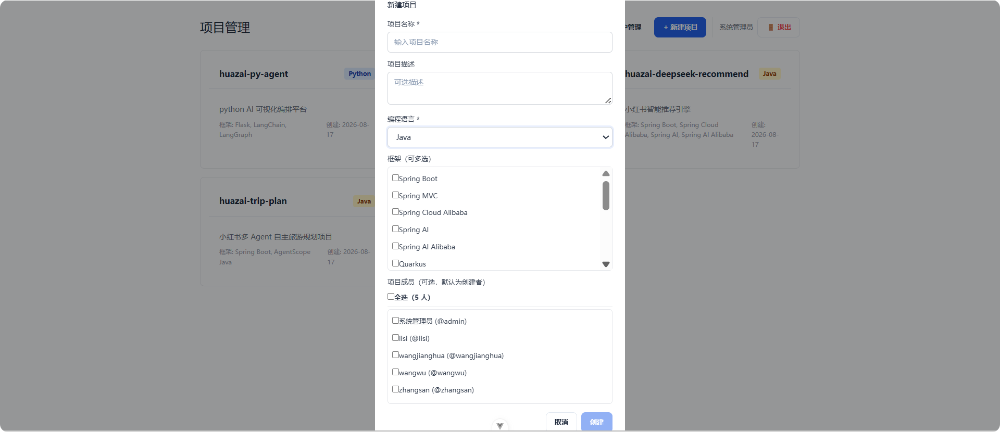

填写项目名称、选择编程语言和框架，添加初始成员后即可创建。创建成功后，系统自动进入该项目的工作空间。

### 2.2 项目管理

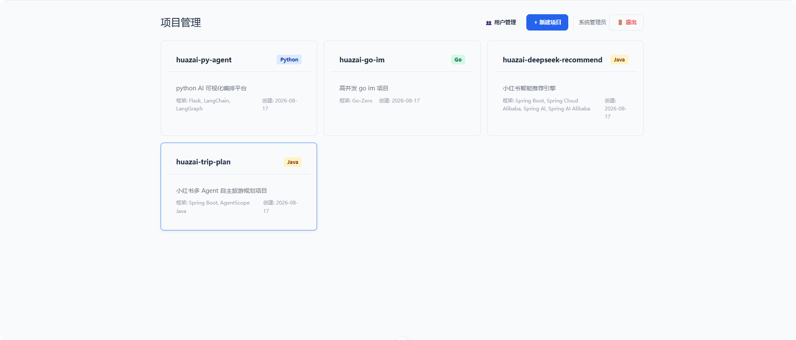

在项目列表中可查看所有项目的信息，包括项目名称、语言、框架、成员数等。点击项目卡片进入该项目的工作区。

### 2.3 成员管理

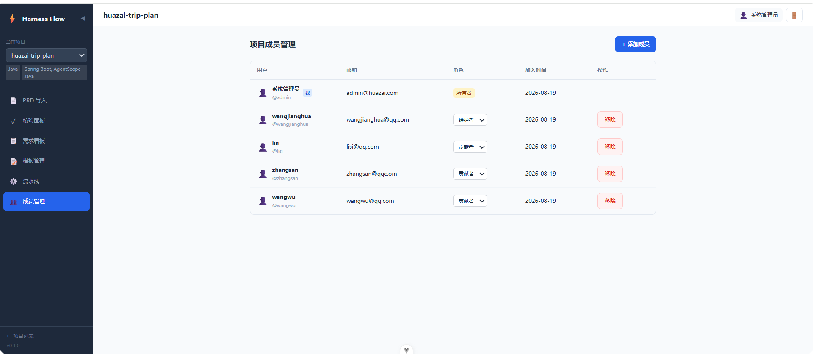

在项目内点击左侧菜单"成员管理"，可查看和管理项目成员。支持四种角色：

| 角色 | 权限 |
|------|------|
| Owner | 全部权限，包括删除项目 |
| Maintainer | 管理成员、编辑模板、推进流水线 |
| Contributor | 导入 PRD、编辑文档、确认提取结果 |
| Reader | 只读查看 |

### 2.4 用户管理（管理员）

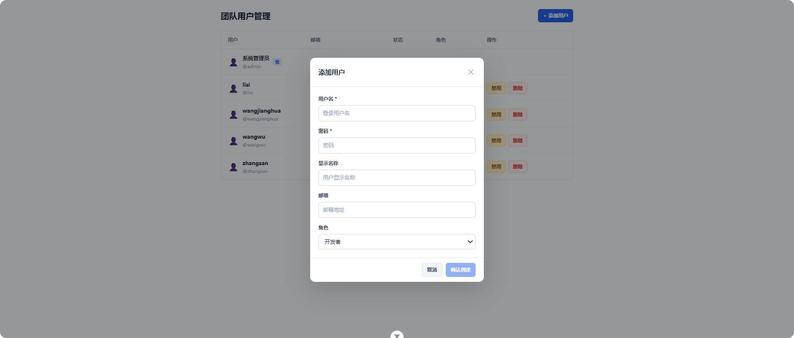

系统管理员可通过 `/users` 页面管理全平台用户，支持启用/禁用、修改角色、删除用户等操作。

---

## 三、PRD 导入与解析

### 3.1 导入 PRD


进入项目后，左侧菜单点击 **"PRD 导入"**，进入导入页面。支持两种方式：

**方式一：粘贴文本**
直接在编辑器中粘贴 PRD 的 Markdown 格式内容，点击"开始解析"。

**方式二：上传文件**
支持 `.docx`、`.md`、`.txt` 格式。文件上传采用分片机制（每片 5MB），大文件也能稳定上传。上传完成后自动触发解析。

### 3.2 解析过程

系统采用 **三层混合解析策略**：

1. **模板匹配** — 优先匹配预设的 PRD 模板结构
2. **LLM 解析** — 可选（由 `ai.enabled` 配置控制），调用大语言模型深度理解
3. **章节层级算法** — 兜底方案，通过章节标题层级提取结构化信息

解析过程会实时轮询进度，完成后自动跳转到校验面板。

---

## 四、校验面板

校验面板是系统最核心的页面，它将 PRD 解析为 4 类结构化文档，每类文档独立展示，支持编辑、确认和审批。

### 4.1 业务模型

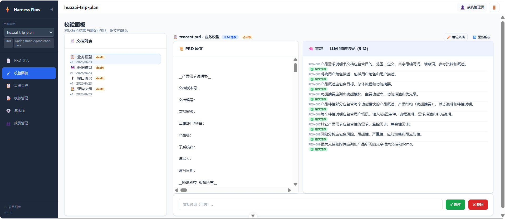

业务模型将 PRD 中的功能需求提炼为**用户故事**（User Story），每条包含：

- **一句话需求**：简洁描述用户诉求
- **验收标准**：明确的可验证条件
- **优先级**：P0/P1/P2 分级

**一句话需求视图：**

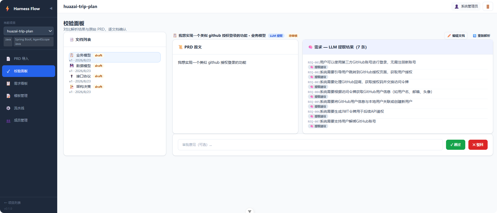

在此视图中，每行展示一条需求，右侧显示提取来源（LLM/模板/算法）和确认状态。点击"确认"按钮可将该条目标记为确认状态。

### 4.2 数据模型

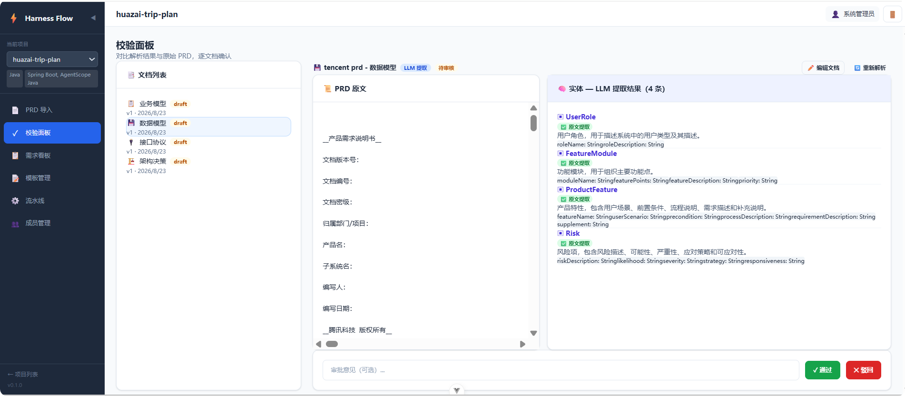

数据模型展示 PRD 中涉及的**数据实体**，每个实体包含：

- 实体名称与描述
- 属性列表（名称、类型、说明）
- 实体间关系

**一句话需求视图：**

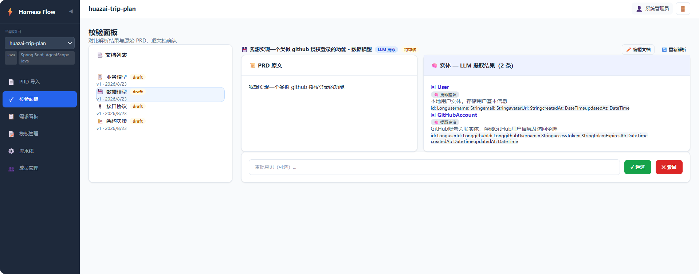

### 4.3 接口协议

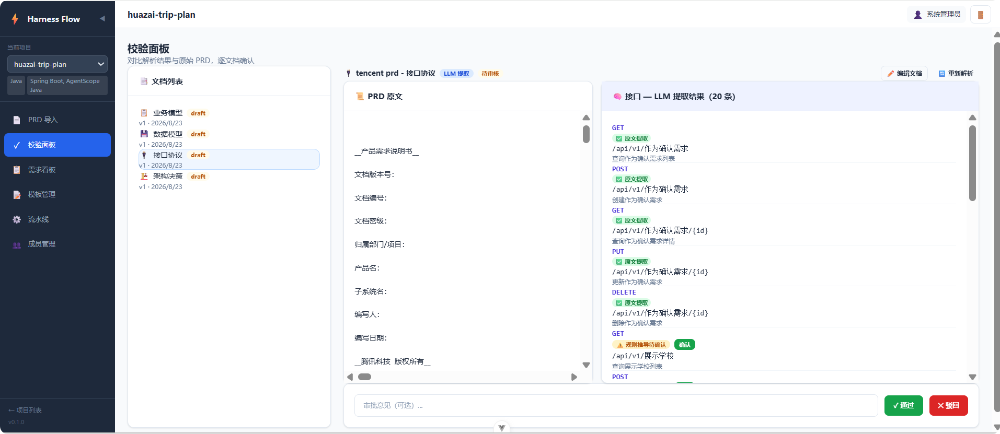

接口协议展示 PRD 中定义的**API 接口**，每条接口包含：

- HTTP 方法（GET/POST/PUT/DELETE）
- 路径（如 `/api/v1/users`）
- 请求/响应格式
- 接口说明

**一句话需求视图：**

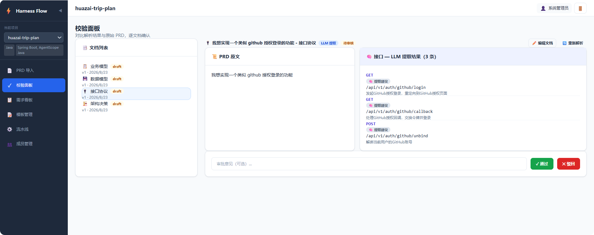

### 4.4 架构决策

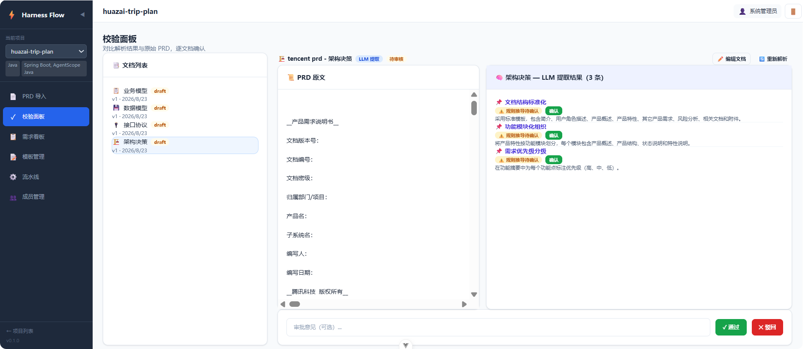

架构决策记录 PRD 中涉及的关键技术选型，例如：

- 采用微服务架构
- 选用 Redis 作为缓存
- 使用 JWT 进行身份认证

每条决策包含决策内容、理由和状态（已接受/已提议）。

**一句话需求视图：**

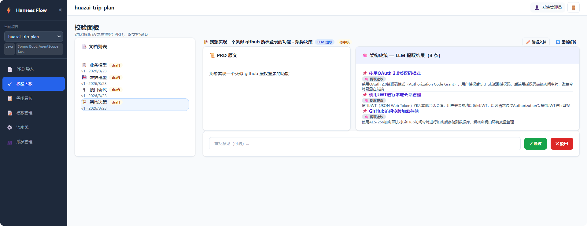

### 4.5 操作流程

在每种文档的校验面板中，您可以：

1. **编辑** — 点击文档内容区域，直接修改 Markdown 内容
2. **保存** — 编辑完成后保存修改
3. **审批** — 对文档做出"通过"或"驳回"的审批意见
4. **确认条目** — 逐条确认提取结果的准确性
5. **生成 Change** — 4 类文档全部确认后，点击"生成 Change"，系统将生成一份结构化的变更 Markdown 文档

---

## 五、模板管理

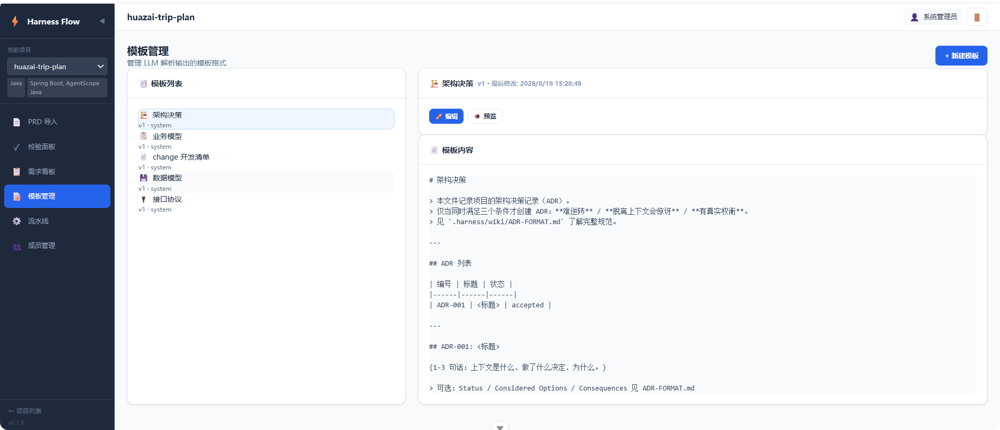

模板管理页面用于配置 PRD 解析的模板规则。支持 4 种文档类型：

- 业务模型模板
- 数据模型模板
- 接口协议模板
- 架构决策模板

**功能：**
- 创建新模板（Markdown 格式）
- 编辑已有模板
- 版本历史管理（每次编辑保存为新版本）
- 预览渲染效果

模板的作用是提高解析准确率：当 PRD 结构与模板匹配时，系统优先使用模板解析，结果更精确。

---

## 六、需求看板

### 6.1 看板视图

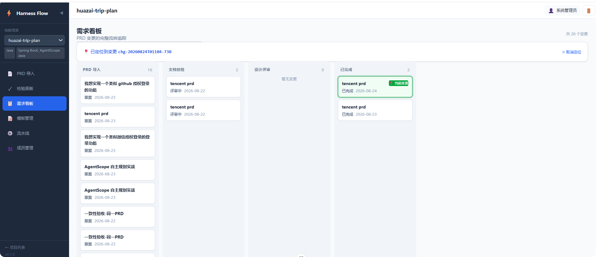

需求看板以 **看板（Kanban）** 形式展示所有变更的流转状态，分为 4 列：

| 列 | 对应状态 | 说明 |
|----|----------|------|
| PRD 导入 | drafting | PRD 已导入，正在解析或等待处理 |
| 文档校验 | reviewing | 4 类文档正在校验确认 |
| 设计评审 | approved / coding / testing / verifying | 已通过评审，进入开发阶段 |
| 已完成 | completed | 变更已完结 |

每列支持分页，默认每页展示 10 张卡片。顶部统计栏展示各列的数量。

### 6.2 详情弹窗

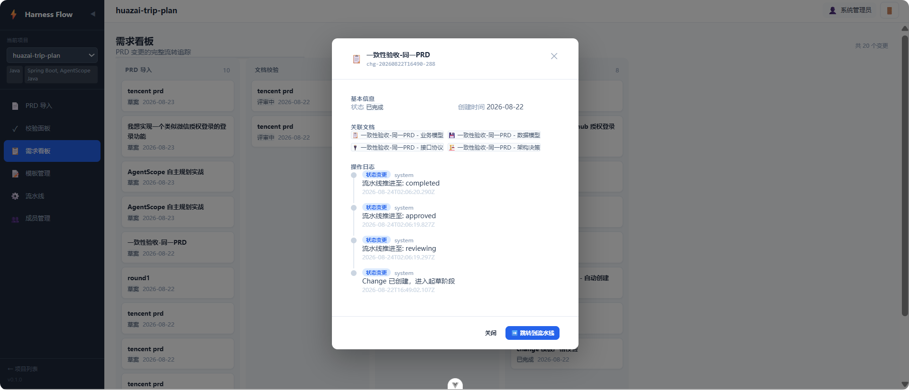

点击任意卡片弹出详情弹窗，包含：

- **基本信息**：标题、Change ID、状态、创建时间
- **关联文档**：4 类文档的链接，点击可查看详情
- **操作日志**：时间线形式展示该变更的所有操作记录
- **跳转流水线**：点击进入该变更的流水线详情页

---

## 七、流水线

### 7.1 流水线视图

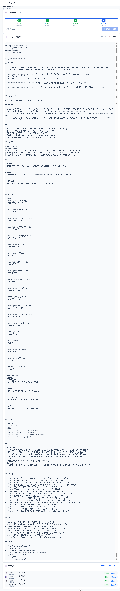

流水线页面展示单个变更的完整生命周期，分为 3 个有效阶段：

```
📝 草案 → 🔍 评审 → ✅ 已批准 → 🎉 已完成
```

**核心操作：**

1. **查看 Change 内容** — 页面中央展示完整的 change.md Markdown 文档，包含需求摘要、验收标准、技术依赖等
2. **复制内容** — 一键复制到剪贴板
3. **编辑内容** — 直接在线编辑 change.md
4. **重新生成** — 重新生成 Change 内容（覆盖之前的内容，不生成新的 Change）
5. **推进阶段** — 点击"推进到下一阶段"按钮，将变更流转到下一个阶段（每次推进都会在操作日志中记录）

### 7.2 操作日志

流水线页面底部展示操作日志时间线，记录了该变更的所有关键操作，包括：

- PRD 导入完成
- 文档解析结果
- 文档审批通过/驳回
- Change 生成
- Change 内容重新生成
- 阶段推进
- 各阶段出入时间

---

## 八、常见问题

### Q1: 解析结果不准确怎么办？

**答：** 可以采取以下措施：
1. 在模板管理页面配置更匹配的 PRD 模板
2. 在"一句话需求"视图中逐条确认/修正
3. 直接编辑文档内容后保存
4. 开启 LLM 解析（需配置 AI 服务）

### Q2: 如何重新解析 PRD？

**答：** 在 PRD 导入页面，重新粘贴或上传 PRD 文档再次解析即可。**重新解析会覆盖之前的解析结果**，不会生成新记录。

### Q3: 重新生成 Change 会怎样？

**答：** 在流水线页面点击"重新生成"，系统会基于最新的 4 类文档内容重新生成 change.md。**覆盖之前的 Change 内容**，不会生成新的 Change ID。

### Q4: 变更的流转顺序是怎样的？

**答：** 一个变更的完整生命周期为：`drafting（草案）` → `reviewing（评审）` → `approved（已批准）` → `completed（已完成）`。在流水线页面通过"推进阶段"按钮手动流转。

### Q5: 看板中看不到我的变更？

**答：** 请检查：
1. 是否在正确的项目下
2. 变更是否已创建（生成 Change 后才会出现在看板中）
3. 每列支持分页，点击"下一页"查看

---

## 九、最佳实践

### 9.1 PRD 编写建议

- 使用 Markdown 格式编写 PRD，使用 `#` / `##` / `###` 标题层级
- 保持章节结构清晰（如：背景 → 功能需求 → 数据模型 → 接口定义 → 架构决策）
- 关键术语首次出现时给出定义

### 9.2 团队协作流程

```
产品经理 → 导入 PRD → 校验 4 类文档 → 生成 Change
     ↓
技术负责人 → 评审 Change → 推进到"评审"阶段 → 分配开发任务
     ↓
开发人员 → 查看流水线 → 开发完成后 → 推进到"已批准"
     ↓
测试人员 → 验证 → 推进到"已完成"
```

### 9.3 模板管理

- 项目初期花 30 分钟配置模板，后续 PRD 解析准确率显著提升
- 模板版本历史可追溯，方便回滚
- 不同项目类型可配置不同的模板集

---

*本教程覆盖了 Harness Flow 系统的全部核心功能。如有疑问，请联系系统管理员或参考项目文档。*