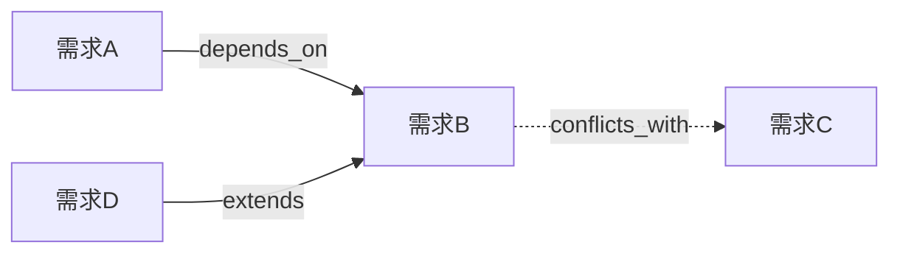

# Harness Relate — 变更关系链管理

管理 `.harness/changes/` 下各 change 之间的关系，维护反向索引 `_relations.json` 与可视化 `_graph.md`。核心价值：**改一个 change 之前，先知道它牵连哪些 change**（`impact`）。

> **定位**: 只读查询（query/impact/orphans/validate）不修改文件；写操作（set/rebuild）只改 `.harness/changes/_relations.json` 与 `_graph.md` 两个索引文件，不改动任何 change.md 正文。

---

## 1. 六类关系

| 关系类型 | 含义 | 是否对称 |
|---------|------|---------|
| `extends` | B 扩展 A（A 是 B 的基础） | 否 |
| `depends_on` | B 依赖 A（A 必须先完成） | 否 |
| `supersedes` | B 取代 A（A 被 B 替代/废弃） | 否 |
| `resolves` | B 解决 A（A 是 B 解决的 issue/债） | 否 |
| `conflicts_with` | A 与 B 冲突（改动区域/契约重叠） | **是** |
| `relates_to` | A 与 B 相关联（弱关系） | **是** |

对称关系在写入时**镜像**到对方 change 的反向索引。

## 2. 文件

```
.harness/changes/
├── <id>/change.md        # 每个 change 自带 relations 元数据（见模板）
├── _relations.json       # 关系反向索引（唯一事实源，机器读）
└── _graph.md             # 关系图（人读，由 _relations.json 生成）
```

- `_relations.json` 缺省时由 `rebuild` 从各 change.md 的 `relations` 元数据重建。
- `_graph.md` 为派生产物，禁止手工编辑（由 `rebuild` 生成）。

## 3. 子命令

### `set <source> <type> <target> [reason]`
为 source change 添加一条 `<type>` 关系，指向 target（可多个 target）。
1. 读 source 的 `_relations.json` 条目；`<type>` 为对称类型 → 在 target 上镜像写入。
2. 写回后触发 `rebuild` 刷新 `_relations.json` + `_graph.md`。
3. 附 `reason` 则写入原因（一句话，供 review 追溯）。

### `query <id>`
显示 `<id>` 的全部关系：出边（该 change 指向谁）+ 入边（谁指向该 change，来自 `_relations.json`）。

### `impact <id>` ⭐ 杀手锏
评估"改动 `<id>` 会影响哪些别的 change / 哪些 change 依赖它"，输出影响面清单：
1. 从 `_relations.json` 找所有**指向** `<id>` 的关系（入边：`depends_on`、`extends`、`resolves`、`supersedes`、对称关系的对方）。
2. 递归一层展开受影响 change（列出其 id + 标题 + 受影响方向）。
3. 按严重度排序输出：
   - 🔴 **阻断**：`depends_on <id>` 的 change（依赖它，先动会崩）
   - 🟡 **冲突**：`conflicts_with` 的 change（改动区域重叠）
   - 🟢 **关联**：`relates_to` / `extends` / `resolves` 的 change（弱影响）
4. 无关系 → 输出"无其他 change 受影响，可独立推进"。
5. 提示：修改 `<id>` 前先处理所有 🔴 阻断项（或与人类确认顺序）。

### `orphans`
列出没有任何关系、且状态非 `done` 的孤立 change（提示可能遗漏依赖标注）。

### `rebuild`
扫描所有 change.md 的 `relations` 元数据 → 重建 `_relations.json`（含对称镜像）→ 重新生成 `_graph.md`。用于手动改过 change.md 后的一致性恢复。

### `validate`
校验一致性：
- change.md 中的 relations 元数据 与 `_relations.json` 是否一致（含对称性）
- 所有引用的 target 是否存在
- 自引用（A→A）禁止
- 输出不一致项清单；不一致时建议 `rebuild`

## 4. _graph.md 格式

```markdown
# 变更关系图


```
（Mermaid 图 + 每对关系的文字说明表）

## 5. 与流水线的联动

| 场景 | 动作 |
|------|------|
| `harnessing` 分析影响面 | 调用 `impact` 评估新需求触碰哪些存量 change |
| `coding-skill` 开工前 | 调用 `impact <id>` 检查被影响的 change 是否已 done |
| `expert-reviewer` 评审 | 校验 `validate`，防止改 A 破坏 B |
| 变更多个并存 | 用 `conflicts_with` 标注重叠区域，评审时重点核对 |

## 完成标志

- `set`/`rebuild` 后 `_relations.json` 与 `_graph.md` 已同步
- `impact` 已输出分级影响清单（🔴/🟡/🟢）
- `validate` 无一致性错误（或已提示 rebuild）
---

> **来源 & 作者**
> - 公众号：华仔聊技术
> - 知识星球：华仔·AI高并发全栈训练营
> - 作者：王江华@huazai
