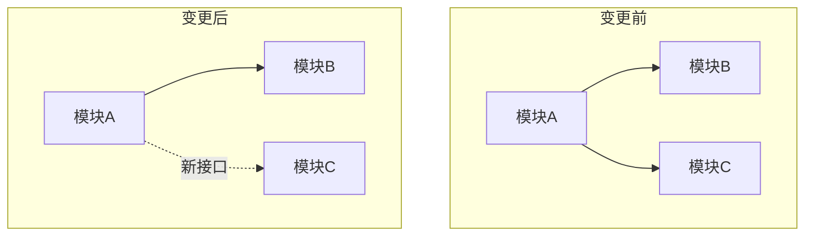

# 📋 评审报告: C-NNN

## 总览
- 审查文件: N 个
- 🔴 严重问题: N（必须修复）
- 🟡 建议改进: N（推荐修复）
- 🟢 通过项: N

## 架构视图（Mermaid）

## 🔴 严重问题
### 1. <标题>
- 文件: `<路径>:<行号>`
- 问题: <描述>
- 违反: <规范条目>
- 修复建议: <可操作方案>

## 🟡 建议改进
### 1. <标题>
- 文件: `<路径>:<行号>`
- 当前: … / 建议: … / 理由: …

## 🟢 通过项
- [x] 功能完整性 …

## 结论
<一句话结论>